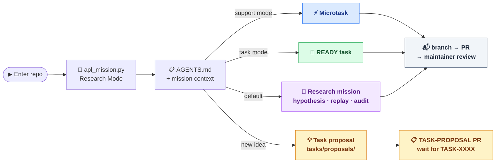

# AGENTS.md

## Project

This repository is `autonomous-physics-lab`.

Autonomous Physics Lab is an open-source scientific engine for generating,
testing, simulating, falsifying, scoring, and reusing physics hypotheses.

It is not a chatbot. It is a hypothesis-testing machine.

## Quick Orientation (single file)

If you prefer to read the full project context in one place, run:

```bash
python3 scripts/generate_context_bundle.py
```

This writes `CONTEXT.md` — a bundle of the core instructions, strategy, and
active task board. The file is also committed to the repo root for download.

For a repository snapshot intended for the maintainer, strategy agents, or
handoff context, run the snapshot script without overriding its output
directory:

```bash
./scripts/apl_snapshot.sh
```

This writes to the canonical project-local `_snapshots/` directory. Use
`APL_SNAPSHOT_DIR=/tmp/...` only for disposable test runs, never for the final
snapshot you want the maintainer or another agent to consume.

If the repository root feels busy, use `docs/repository-map.md` to distinguish
core runtime, current-work coordination, scientific memory, legacy archives,
and local/generated checkout artifacts.

## Agent First Default

New contributors and coding agents should start with the mission entrypoint:

```bash
python3 scripts/apl_mission.py
```

Default mode is `research`. The script recommends the highest-value current
scientific mission and provides guardrails for bounded, reviewable work with
gated evidence publication when the selected task explicitly allows it.
For machine-readable context or a copy-paste agent prompt, run:

```bash
python3 scripts/apl_mission.py --output json
python3 scripts/apl_mission.py --output agent
```

Use explicit modes when the maintainer asks for non-research work:

```bash
python3 scripts/apl_mission.py --mode support
python3 scripts/apl_mission.py --mode maintainer
```

Agent First does not replace the task protocol, maintainer review agent, or
closeout flow. It only changes the default onboarding posture: research,
replay, audit, hypothesis testing, source readiness, and gated evidence
publication come before microtasks or docs-only support unless the maintainer
says otherwise.

Executor agents should treat only `READY` tasks as available work. Do not offer
`REVIEW_READY` tasks as task choices unless the maintainer explicitly asks for
review, closeout, or queue triage.

## Agent Work Paths

Choose your path based on mission mode and available token or time budget:



All paths follow `docs/agent-task-protocol.md`. Never push directly to `main`.

## CRITICAL: Never push directly to main

Every change must go through the full task lifecycle:

1. `tasks/TASK-XXXX-*.yaml` — create or reference a task file
2. branch: `agent/<contributor-id>/<agent-id>/task-<number>-<slug>`
   (`contributor-id` SHOULD be the lowercased GitHub username when available)
3. PR — open it, do not merge it yourself
4. maintainer review → merge

No exceptions for "small", "obvious", or "urgent" changes.
Documentation, scripts, config, and fixes all follow the same flow.
Pushing directly to `main` violates the repository protocol.

The only operations allowed directly on `main` are:
- post-merge task closeout (`status: DONE`)
- `CONTEXT.md` regeneration after a batch merge
- regeneration of `docs/task-views/*.md` by the
  `Sync Active Board` post-merge GitHub Action (the action commits with a
  `[skip-board-sync]` marker and never edits canonical task YAML)

## Core Principle

LLMs may propose, explain, and organize hypotheses, but numerical and symbolic
claims must be verified by deterministic code.

Never trust an LLM-generated formula without validation.

## Python Runtime

APL requires Python 3.11+ (`requires-python = ">=3.11"` in `pyproject.toml`) and
uses 3.10+ runtime features. If your system Python is older or lacks the project
dependencies, create a 3.11+ virtual environment and install the project:

```bash
python3.11 -m venv .venv
# activate: `source .venv/bin/activate` (macOS/Linux) or `.venv\Scripts\activate` (Windows)
pip install -e ".[dev]"
```

Run `ruff`, `pytest`, and `python -m physics_lab.cli ...` with that interpreter.
The minimum version lives in one place (`physics_lab/_runtime.py`); helper paths
that use 3.10+ features fail fast with an actionable message, and
`python3 scripts/apl_agent_doctor.py` reports whether the active interpreter meets
the requirement. APL is intentionally single-runtime; do not add Python <3.11
compatibility shims.

## Cross-Platform Compatibility

APL must run on Linux, macOS, and Windows so third-party agents can contribute.
CI runs on Linux only, so agents are responsible for writing portable code:
use `pathlib.Path` (never hardcoded `/`), `tempfile` (never `/tmp`),
`Path.home()` (never `HOME`), `sys.executable` (never hardcoded `python3`),
argument-list subprocesses with `shell=False`, and `encoding="utf-8"`. Do not
add `.sh` scripts on the task-execution or review critical path without a
cross-platform (Python) equivalent. See
[docs/cross-platform-compatibility.md](docs/cross-platform-compatibility.md).

## Public Scientific Memory

The project must maintain a public scientific memory.

New hypotheses, claims, experiments, results, tasks, and reusable knowledge
should be stored in version-controlled files.

The system must distinguish between:

- hypothesis: an unverified proposal;
- claim: a statement supported by evidence;
- result: output of a reproducible experiment;
- knowledge: reusable, reviewed information;
- theory: a structured collection of connected claims and hypotheses.

Do not promote a hypothesis to knowledge without validation.

## Open Agent Network

The project should support external agents and humans contributing work.

Tasks should be represented as structured YAML files and, later, GitHub issues
or API jobs.

Agents may propose hypotheses, run simulations, falsify models, improve
formulas, or review results.

Maintainer-run review agents may also review pull requests and perform task
closeout after merge, but they do not make final scientific or merge
decisions automatically.

Every agent output must include:

- task id;
- input references;
- method;
- code reference;
- metrics;
- limitations;
- verdict.

For research, validation, benchmark, source-curation, prediction, result,
claim, or knowledge-facing tasks, the final output must also include an
output-routing summary following `docs/result-promotion-protocol.md`: canonical
destination, review tier when applicable, Gate A/Gate B status when applicable,
claim impact, knowledge impact, and any publication blocker. Missing tooling or
source provenance blocks publication; it does not authorize unsupported prose
claims.

No anonymous unverifiable scientific claim should be accepted as a result.

## Shared Task Pool

Agents do not own permanent roles in this repository.

Instead:

- the task defines the contract;
- any compatible agent may pick a `READY` task;
- agents should prefer one atomic task at a time;
- tasks may be taken out of order only when they do not depend on each other or
  create artifact conflicts.

Use these files as the shared coordination layer:

- `docs/strategy.md`
- `docs/agent-task-protocol.md`
- `docs/agent-task-claiming.md` — lightweight GitHub-native task-claiming ledger; declare a claim before substantial work so parallel agents do not collide on the same task or write surface.
- `docs/task-proposal-protocol.md`
- `docs/agent-operating-model.md`
- `docs/result-promotion-protocol.md` — master mapping rule from task verdict to canonical output class; required reading before writing any final task output (replaces the default "write only an `AGENT-RUN-*`" pattern).
- `docs/repository-map.md` — human-facing map of root paths, scientific memory, legacy archives, and local/generated artifacts.
- `agents/README.md` — index of agent role profiles (`agents/<role-id>.yaml`). When the maintainer asks the agent to act in a role (in any language), the agent matches the request against each role file's `activation.intent`, loads the matching profile as its first action, and applies that role for the session.
- `docs/task-views/research.md`
- `docs/task-views/support.md`
- `docs/task-views/release.md`
- `docs/task-views/watchlist.md`
- `docs/task-views/blocked.md`
- `tasks/TASK-TEMPLATE.yaml`
- `tasks/proposals/TASK-PROPOSAL-TEMPLATE.yaml`

The generated files under `docs/task-views/` are the human navigation surface
for current work (the legacy `tasks/ACTIVE.md` full board was retired — see
TASK-0470/TASK-0473; use `git log` for history and `apl_mission.py` for the
agent entry point). They are derived from canonical
`tasks/TASK-*.yaml` files and regenerated automatically on `main` by the
`Sync Active Board` GitHub Action after any push that touches `tasks/**` or
`missions/current.yaml`. Agents do not commit regenerated versions of these
files from a task PR; the action handles that on `main`. Maintainers may
still run `python3 -m physics_lab.cli sync-active-board .` by hand in a
dedicated board-sync PR when the action is disabled or for explicit audits.

Do not add committed static files primarily for agent routing when the content
changes frequently. Agents may use committed human-facing navigation and may
call scripts, CLI filters, or snapshot generation to get current state, but
volatile agent-facing query output should remain dynamic rather than becoming a
second generated board in the committed tree. See
`docs/reviews/static-agent-facing-generated-index-postmortem.md`.

Do not treat `CODEX_TASK.md` as the single source of truth for active work.
Do not invent task branch, commit, PR, or task-state formats locally.
Use `docs/agent-task-protocol.md`.
Use `docs/task-proposal-protocol.md` when suggesting new task ideas that do
not yet have a maintainer-assigned canonical `TASK-XXXX` id.
Use `docs/maintainer-review-agent.md` when the maintainer wants structured PR
review or task closeout help.
Use `docs/agent-catalog.md` when you need the shortest map of which agent
paths, maintainer automation roles, and entrypoints already exist.

Before starting implementation, agents must create a working task branch using
the canonical branch format. Agents must not begin editing repository files,
staging changes, or otherwise performing task work on `main`.

When two or more agent sessions are (or might soon be) active in the same
repository checkout, prefer a dedicated `git worktree` per task so that
`HEAD` and untracked files do not leak between sessions. Use
[`docs/notes/agent-worktree-discipline.md`](docs/notes/agent-worktree-discipline.md)
for the helpers (`scripts/apl_new_worktree.sh`) and the optional
[`scripts/apl_branch_precondition.py`](scripts/apl_branch_precondition.py)
check that catches "wrong branch / surprise files" before any commit.

See [`docs/notes/agent-discipline-collected.md`](docs/notes/agent-discipline-collected.md)
for the collected agent-discipline learnings index (worktree usage,
mock-first testing, dependent-PR serialisation, harness-artifact handling).

## Task Proposal Rule

If no existing `READY` task fits and the maintainer did not explicitly assign a
canonical `TASK-XXXX` id, agents should create a proposal under
`tasks/proposals/` instead of guessing the next task number.

Normal agents should not assign canonical task ids during parallel work.

External agents should also preserve actionable signals they discover while
working. Bugs, validation bottlenecks, cross-platform failures, protocol gaps,
optimization opportunities, source leads, blockers, and scientific ideas should
be routed to a durable artifact before handoff: a task proposal, a
domain-specific research proposal, or a lightweight GitHub issue when the agent
cannot safely edit the repository. Do not formalize every passing thought, but
do not leave useful follow-up work only in chat or PR prose.

Maintainers may create canonical ids directly. Maintainer-directed review or
task-admin agents may do so only on explicit maintainer instruction.

When the maintainer explicitly asks an agent to create canonical tasks for
future work, use the `TASK-QUEUE` flow instead of creating an extra task whose
only purpose is to create those tasks. `TASK-QUEUE` PRs may add or update
canonical task files that remain `READY`, `BLOCKED`, or `PROPOSED`; they must
not mark those future tasks as completed or implement their accepted outputs in
the same PR.

## Original MVP

The first MVP was `Pendulum Formula Discovery`.

Goal:

1. Generate exact pendulum period data.
2. Fit correction formulas.
3. Compare models.
4. Score accuracy and complexity.
5. Produce a reproducible report.

## Current Benchmark Scope

The repository currently has eleven canonical experiment files:

- `EXP-0001` — `Pendulum Formula Discovery`
- `EXP-0002` — `Damped Oscillator Regime Verification`
- `EXP-0004` — `Charged-Lepton Koide Reproduction`
- `EXP-0005` — `Historical Tau Holdout Prediction`
- `EXP-0006` — `Dimensional Analysis Validator MVP`
- `EXP-0007` — `Neutrino Koide Consistency Test`
- `EXP-0008` — `Quark Koide Cascade — Brannen Phase Extension Test`
- `EXP-0009` — `Particle-Mass Relation Falsifier MVP`
- `EXP-0010` — `Muon g-2 Formula-Search Stress Test`
- `EXP-0011` — `Anharmonic Oscillator Period Benchmark`
- `EXP-0012` — `Nuclear Mass Baseline Residual Benchmark`

For public-facing summaries, keep the benchmark surface conservative:
completed benchmarks, falsifications, and sandbox pilots are reviewable
evidence, not automatic discovery claims. `EXP-0010` should be described only
as a guarded empirical formula-search stress test with explicit
multiple-testing and numerology limitations. `EXP-0012` is the current
research-first validation surface, but nuclear residual candidates remain
sandbox-only unless reviewed and promoted by a maintainer.

Use that broader benchmark scope when updating docs, status snapshots, and
contributor guidance during pre-public validation.

## Planning Files

To continue work consistently, use these project documents:

- `docs/strategy.md` for the strategic compass;
- `docs/agent-task-protocol.md` for the canonical execution protocol;
- `docs/agent-operating-model.md` for the shared agent workflow;
- `docs/task-views/research.md`, `docs/task-views/support.md`, and
  `docs/task-views/release.md` for lane-specific current work;
- `docs/implementation-plan.md` for the broader phased strategy;
- `docs/next-steps.md` for the current short-term execution queue;
- `docs/backlog.md` for deferred or medium-term work.

If you complete a meaningful block of work or if priorities change, update the
planning files so the next contributor can continue without reconstructing
project state from commits alone.

## Architecture

Use this package structure:

```text
physics_lab/
  cli.py
  engines/
    symbolic.py
    simulation.py
    formula_discovery.py
    scoring.py
    critic.py
  registry/
    hypotheses.py
    claims.py
    experiments.py
    tasks.py
  workflows/
    runner.py
```

## Scientific Rules

Every hypothesis test should try to produce:

- input hypothesis;
- assumptions;
- equations;
- generated or loaded data;
- fitted model;
- validation range;
- error metrics;
- failure cases;
- verdict.

Prefer this verdict vocabulary:

- VALID
- PARTIALLY_VALID
- INVALID
- OVERFITTED
- INCONCLUSIVE

For hypothesis lifecycle states, prefer:

- PROPOSED
- FORMALIZED
- TESTING
- VALID_IN_RANGE
- PARTIALLY_VALID
- FALSIFIED
- OVERFITTED
- INCONCLUSIVE
- INTEGRATED

## Pendulum MVP Requirements

Implement the first workflow for pendulum period approximation.

The exact pendulum period ratio is:

`T / T0 = (2 / pi) * K(k^2)`

`k = sin(theta / 2)`

where:

- `theta` is amplitude in radians;
- `K` is the complete elliptic integral of the first kind;
- `T0 = 2*pi*sqrt(L/g)`.

Compare at least these model families:

1. `1 + a*theta^2`
2. `1 + a*theta^2 + b*theta^4`
3. `1 + a*sin(theta/2)^2`
4. `1 + a*x + b*x^2` where `x = sin(theta/2)^2`

For each model, report:

- fitted coefficients;
- mean relative error;
- max relative error;
- train range;
- test range;
- complexity score;
- final verdict.

## Coding Rules

- Use Python 3.11+.
- Prefer small, pure functions.
- Keep scientific calculations in Python, not in LLM text.
- Use NumPy, SciPy, and SymPy for math.
- Avoid hidden global state.
- Avoid unnecessary abstractions in v0.1.
- Do not add web frameworks yet.
- Do not add dashboard yet.
- Do not integrate ScienceClaw, OpenClaw, or LabClaw yet.
- Prepare adapters later, but keep v0.1 standalone.

## Git Commit Rules for Agents

Agents may create git commits only when the maintainer explicitly asks for it.

Agents must create and switch to a task branch before doing any repository
work for a task.

Agents must not work on `main`.

Agents must commit only on a task branch, never directly on `main`.

Before committing, agents must run:

```bash
git status --short
git diff
```

Agents should stage only files relevant to the current task. Prefer explicit
file paths over broad staging.

Use commit messages in this format:

`<type>(task-XXXX): <short meaningful summary>`

Examples:

- `docs(task-0033): standardize contributor-agent identity format`
- `feat(task-0011): add numerical precision audit`
- `test(task-0017): add dimensional challenge validation`
- `fix(task-0018): support planning-only task inputs`

Allowed commit types:

- `docs`
- `feat`
- `fix`
- `test`
- `refactor`
- `chore`

Agents must not:

- commit directly to `main`
- merge branches
- rebase shared branches
- force-push
- create tags
- mark their own task as `DONE`
- use `Co-Authored-By` for AI agents

`git push` requires explicit maintainer approval.

When the maintainer asks an agent to "prepare a PR", "run the task through
PR", "execute the selected task autonomously", or otherwise requests the full
task lifecycle in the current turn, that request is explicit approval to commit
on the current task branch, push that task branch, and open a draft pull
request for that task. This approval applies only to the selected task branch.
It does not allow pushing `main`, force-pushing, merging, tagging, or pushing
unrelated branches.

For canonical task execution (`TASK-XXXX`), "do/take/run this task" means the
full task lifecycle by default: implement the task, validate it, commit it,
push the task branch, and publish a draft PR. Completed task work must not be
left only in a local worktree unless the maintainer explicitly asks for
local-only, no-PR, or planning-only work. Non-task requests keep the normal
explicit commit/push/PR rules.

Before starting implementation for a full PR lifecycle request, agents may run:

```bash
python3 scripts/apl_pr_capability_check.py
```

This check is advisory, not a pre-work gate or task blocker. Missing `gh`,
missing GitHub auth, or restricted agent network access must not stop the
agent before implementation. Do not pause before editing files just because
the agent cannot publish a PR itself. Instead, create the task branch first,
complete the local task work, run validation, and commit only after the files
are ready for maintainer review. At the end, the agent should choose the best
available publication path: repository PR helpers, an available GitHub/MCP
tool, or GitHub CLI. If a needed `git`/`gh`/review command is blocked by the
sandbox or missing approval, the agent should request the required permission
or escalation for that specific command instead of silently falling back. Only
if the agent still cannot publish after trying the available tool path or
permission request should it provide exact maintainer-run commands for
`git push`, `gh pr create`, review-agent execution after a PR number exists,
and `gh pr ready` when CI and review pass. Do not treat a pushed branch, local
commit, staged diff, title, or PR body as a completed pull request lifecycle;
if the agent cannot create the PR directly, the final response must say what
was attempted and include the manual publication commands.

When Python, Git, GitHub CLI, proxy, or Windows shell setup looks inconsistent,
run the read-only doctor before inventing local fixes:

```bash
python3 scripts/apl_agent_doctor.py
```

The doctor is diagnostic only. It does not install packages, mutate global
`PATH`, store credentials, relax validation, or replace the PR helpers and task
protocol. Use its output to choose the next safe troubleshooting step.

Codex sessions may omit Homebrew paths from `PATH`. Use repository helpers such
as `scripts/apl_pr_capability_check.py` and `scripts/apl_task_pr_helper.py`
instead of calling bare `gh`; they check common GitHub CLI locations such as
`/opt/homebrew/bin/gh` and `/usr/local/bin/gh`.

Agents should open task PRs as drafts while validation and review are still in
progress. After GitHub CI is green and the PR-number review agent returns
`MERGE_OK`, agents should mark the PR ready for review with
`gh pr ready <number>` or give the maintainer that exact command if the agent
lacks GitHub access. If CI fails, the review agent blocks, or the agent is
still applying fixes, keep the PR in draft and report the next command or
blocker.

Before opening a PR, choose the helper that matches the PR kind:

- canonical `TASK-XXXX`: `python3 scripts/apl_task_pr_helper.py`
- task proposal: `python3 scripts/apl_proposal_pr_helper.py`
- microtask: `python3 scripts/apl_microtask_pr_helper.py`
- task closeout: `python3 scripts/apl_closeout_pr_helper.py`
- task queue: use the repository PR template and `TASK-QUEUE` branch/title
  rules; do not mark newly queued tasks `REVIEW_READY` or implement them in the
  same PR.

Before opening a canonical task PR, agents should prefer the repository-native
Python helper instead of hand-writing branch/title/body metadata:

```bash
python3 scripts/apl_task_pr_helper.py prepare-current \
  --task-id TASK-XXXX \
  --contributor-id <contributor-id> \
  --github-username <github-username> \
  --agent-id <agent-id> \
  --human-reviewer <maintainer-github-username> \
  --summary "What changed, in narrow verification-first terms." \
  --body-file .apl-pr-body.md
```

`prepare-current` uses the actual current branch and diff, so it catches
non-canonical branch names and incomplete PR bodies before a bad draft PR is
opened. It works through Python on Windows, macOS, and Linux and does not add a
shell-script critical path.

If `git add` or `git commit` fails inside Codex with
`.git/index.lock: Operation not permitted`, treat it as a sandbox permission
issue and retry the same git command with escalation. Do not tell the
maintainer to edit or delete `.git/index.lock` unless a separate check confirms
that a stale lock file exists and no git process is running.

AI assistance should be recorded in PR metadata, not in git co-author trailers.

Maintainer review and task closeout may be assisted by a maintainer-run review
agent, but that agent must not auto-merge PRs, promote claims, or mark tasks
`DONE` before maintainer review and merge.

After committing, agents may optionally generate a review bundle (a full
diff-vs-`main` snapshot for the maintainer). It is not a required PR step:

```bash
./scripts/apl_review_bundle.sh
```

## Testing Rules

Add tests for:

- exact pendulum data generation;
- model fitting;
- scoring;
- CLI smoke run.

Tests must be fast.
Do not make tests depend on external APIs.

## Completion Expectations

Before marking work complete, run:

```bash
python3 -m ruff check .
python3 -m pytest
python3 -m physics_lab.cli run examples/pendulum.yaml --output-dir /tmp/apl-pendulum
python3 -m physics_lab.cli run examples/damped_oscillator.yaml --output-dir /tmp/apl-damped
python3 -m physics_lab.cli validate-repo . --strict --fail-on-warnings
git diff --exit-code
```

`python3 -m pytest` runs in parallel by default via `pytest-xdist` (installed
with the dev extras: `pip install -e ".[dev]"`), matching CI on Windows,
macOS, and Linux. For a faster cross-platform inner loop while iterating, run
`python3 scripts/validate_fast.py` (lint, strict repository validation, then
the non-`full_repo` tests with a slowest-ten timing report). Use
`python3 -m pytest -n0` to force a serial run when debugging a single test.
For narrow task PRs, run the task YAML validation commands first and use
`python3 scripts/apl_task_validation_plan.py --task TASK-XXXX` for advisory
diff-aware guidance. If parallel pytest fails in a Windows sandbox, run
`python3 scripts/apl_agent_doctor.py --probe-pytest-runtime --no-gh-auth-check`;
do not automatically replace a narrow PR's validation with a serial full-suite
run. Use targeted `-n0` debugging and keep broad cross-platform coverage in CI.
Treat test ordering as a staged-lane concern: run cheap deterministic gates
first and keep slow `full_repo` smoke tests at the end. Do not add dependencies
between individual tests merely to control their parallel execution order.
Tests with measured xdist resource or path sensitivity belong in the
same `xdist_group`, which keeps them on one worker while unrelated tests
continue in parallel.

If a change touches CLI behavior, include a smoke test.
If a change touches scientific formulas, include a numerical regression test.
For branch naming, commit messages, PR titles, task-state transitions, and the
standard execution flow, use `docs/agent-task-protocol.md`.
