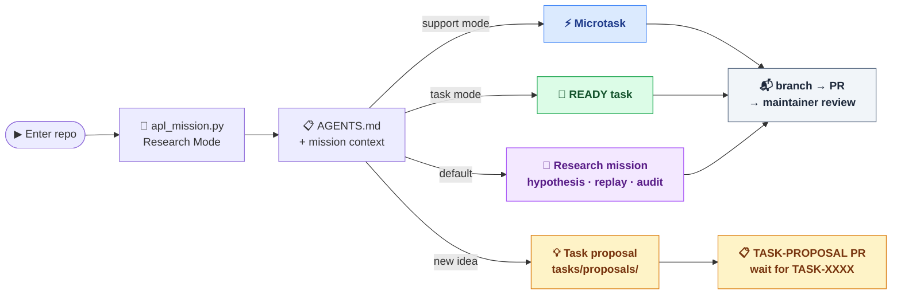

# Autonomous Physics Lab — Context Bundle

Generated: 2026-05-20 17:52 UTC
Mode: core
Repo: gladunrv/autonomous-physics-lab

This file bundles the core project instructions, strategy, and current
task board into one document for use with chat-based LLMs or as a
quick agent orientation file.

For the live repository see: https://github.com/gladunrv/autonomous-physics-lab


────────────────────────────────────────────────────────────────────────

# Agent & Contributor Rules
<!-- source: AGENTS.md -->

# AGENTS.md

## Project

This repository is `autonomous-physics-lab`.

Autonomous Physics Lab is an open-source scientific engine for generating,
testing, simulating, falsifying, scoring, and reusing physics hypotheses.

It is not a chatbot. It is a hypothesis-testing machine.

## Quick Orientation (single file)

If you prefer to read the full project context in one place, run:

```bash
python3 scripts/generate_context_bundle.py
```

This writes `CONTEXT.md` — a bundle of the core instructions, strategy, and
active task board. The file is also committed to the repo root for download.

## Agent First Default

New contributors and coding agents should start with the mission entrypoint:

```bash
python3 scripts/apl_mission.py
```

Default mode is `research`. The script recommends the highest-value current
scientific mission and provides guardrails for sandbox-only, reviewable work.
For machine-readable context or a copy-paste agent prompt, run:

```bash
python3 scripts/apl_mission.py --json
python3 scripts/apl_mission.py --agent-prompt
```

Use explicit modes when the maintainer asks for non-research work:

```bash
python3 scripts/apl_mission.py --mode support
python3 scripts/apl_mission.py --mode maintainer
```

Agent First does not replace the task protocol, maintainer review agent, or
closeout flow. It only changes the default onboarding posture: research,
replay, audit, hypothesis testing, and sandbox result drafts come before
microtasks or docs-only support unless the maintainer says otherwise.

Executor agents should treat only `READY` tasks as available work. Do not offer
`REVIEW_READY` tasks as task choices unless the maintainer explicitly asks for
review, closeout, or queue triage.

## Agent Work Paths

Choose your path based on mission mode and available token or time budget:



All paths follow `docs/agent-task-protocol.md`. Never push directly to `main`.

## CRITICAL: Never push directly to main

Every change must go through the full task lifecycle:

1. `tasks/TASK-XXXX-*.yaml` — create or reference a task file
2. branch: `agent/<contributor-id>/<agent-id>/task-<number>-<slug>`
3. PR — open it, do not merge it yourself
4. maintainer review → merge

No exceptions for "small", "obvious", or "urgent" changes.
Documentation, scripts, config, and fixes all follow the same flow.
Pushing directly to `main` violates the repository protocol.

The only operations allowed directly on `main` are:
- post-merge task closeout (`status: DONE` + `sync-active-board`)
- `CONTEXT.md` regeneration after a batch merge

## Core Principle

LLMs may propose, explain, and organize hypotheses, but numerical and symbolic
claims must be verified by deterministic code.

Never trust an LLM-generated formula without validation.

## Public Scientific Memory

The project must maintain a public scientific memory.

New hypotheses, claims, experiments, results, tasks, and reusable knowledge
should be stored in version-controlled files.

The system must distinguish between:

- hypothesis: an unverified proposal;
- claim: a statement supported by evidence;
- result: output of a reproducible experiment;
- knowledge: reusable, reviewed information;
- theory: a structured collection of connected claims and hypotheses.

Do not promote a hypothesis to knowledge without validation.

## Open Agent Network

The project should support external agents and humans contributing work.

Tasks should be represented as structured YAML files and, later, GitHub issues
or API jobs.

Agents may propose hypotheses, run simulations, falsify models, improve
formulas, or review results.

Maintainer-run review agents may also review pull requests and perform task
closeout after merge, but they do not make final scientific or merge
decisions automatically.

Every agent output must include:

- task id;
- input references;
- method;
- code reference;
- metrics;
- limitations;
- verdict.

No anonymous unverifiable scientific claim should be accepted as a result.

## Shared Task Pool

Agents do not own permanent roles in this repository.

Instead:

- the task defines the contract;
- any compatible agent may pick a `READY` task;
- agents should prefer one atomic task at a time;
- tasks may be taken out of order only when they do not depend on each other or
  create artifact conflicts.

Use these files as the shared coordination layer:

- `docs/strategy.md`
- `docs/agent-task-protocol.md`
- `docs/task-proposal-protocol.md`
- `docs/agent-operating-model.md`
- `docs/task-views/research.md`
- `docs/task-views/support.md`
- `docs/task-views/release.md`
- `docs/task-views/watchlist.md`
- `docs/task-views/blocked.md`
- `tasks/ACTIVE.md`
- `tasks/TASK-TEMPLATE.yaml`
- `tasks/proposals/TASK-PROPOSAL-TEMPLATE.yaml`

`tasks/ACTIVE.md` remains the generated full-status board, including DONE
history. The generated files under `docs/task-views/` are the lighter
navigation surface for current work; they are synchronized from canonical
`tasks/TASK-*.yaml` files through `python3 -m physics_lab.cli sync-active-board .`.

Do not treat `CODEX_TASK.md` as the single source of truth for active work.
Do not invent task branch, commit, PR, or task-state formats locally.
Use `docs/agent-task-protocol.md`.
Use `docs/task-proposal-protocol.md` when suggesting new task ideas that do
not yet have a maintainer-assigned canonical `TASK-XXXX` id.
Use `docs/maintainer-review-agent.md` when the maintainer wants structured PR
review or task closeout help.
Use `docs/agent-catalog.md` when you need the shortest map of which agent
paths, maintainer automation roles, and entrypoints already exist.

Before starting implementation, agents must create a working task branch using
the canonical branch format. Agents must not begin editing repository files,
staging changes, or otherwise performing task work on `main`.

When two or more agent sessions are (or might soon be) active in the same
repository checkout, prefer a dedicated `git worktree` per task so that
`HEAD` and untracked files do not leak between sessions. Use
[`docs/notes/agent-worktree-discipline.md`](docs/notes/agent-worktree-discipline.md)
for the helpers (`scripts/apl_new_worktree.sh`) and the optional
[`scripts/apl_branch_precondition.py`](scripts/apl_branch_precondition.py)
check that catches "wrong branch / surprise files" before any commit.

## Task Proposal Rule

If no existing `READY` task fits and the maintainer did not explicitly assign a
canonical `TASK-XXXX` id, agents should create a proposal under
`tasks/proposals/` instead of guessing the next task number.

Normal agents should not assign canonical task ids during parallel work.

Maintainers may create canonical ids directly. Maintainer-directed review or
task-admin agents may do so only on explicit maintainer instruction.

When the maintainer explicitly asks an agent to create canonical tasks for
future work, use the `TASK-QUEUE` flow instead of creating an extra task whose
only purpose is to create those tasks. `TASK-QUEUE` PRs may add or update
canonical task files that remain `READY`, `BLOCKED`, or `PROPOSED`; they must
not mark those future tasks as completed or implement their accepted outputs in
the same PR.

## Original MVP

The first MVP was `Pendulum Formula Discovery`.

Goal:

1. Generate exact pendulum period data.
2. Fit correction formulas.
3. Compare models.
4. Score accuracy and complexity.
5. Produce a reproducible report.

## Current Benchmark Scope

The repository currently has eleven canonical experiment files:

- `EXP-0001` — `Pendulum Formula Discovery`
- `EXP-0002` — `Damped Oscillator Regime Verification`
- `EXP-0004` — `Charged-Lepton Koide Reproduction`
- `EXP-0005` — `Historical Tau Holdout Prediction`
- `EXP-0006` — `Dimensional Analysis Validator MVP`
- `EXP-0007` — `Neutrino Koide Consistency Test`
- `EXP-0008` — `Quark Koide Cascade — Brannen Phase Extension Test`
- `EXP-0009` — `Particle-Mass Relation Falsifier MVP`
- `EXP-0010` — `Muon g-2 Formula-Search Stress Test`
- `EXP-0011` — `Anharmonic Oscillator Period Benchmark`
- `EXP-0012` — `Nuclear Mass Baseline Residual Benchmark`

For public-facing summaries, keep the benchmark surface conservative:
completed benchmarks, falsifications, and sandbox pilots are reviewable
evidence, not automatic discovery claims. `EXP-0010` should be described only
as a guarded empirical formula-search stress test with explicit
multiple-testing and numerology limitations. `EXP-0012` is the current
research-first validation surface, but nuclear residual candidates remain
sandbox-only unless reviewed and promoted by a maintainer.

Use that broader benchmark scope when updating docs, status snapshots, and
contributor guidance during pre-public validation.

## Planning Files

To continue work consistently, use these project documents:

- `docs/strategy.md` for the strategic compass;
- `docs/agent-task-protocol.md` for the canonical execution protocol;
- `docs/agent-operating-model.md` for the shared agent workflow;
- `docs/task-views/research.md`, `docs/task-views/support.md`, and
  `docs/task-views/release.md` for lane-specific current work;
- `tasks/ACTIVE.md` for the full generated task-status board;
- `docs/implementation-plan.md` for the broader phased strategy;
- `docs/next-steps.md` for the current short-term execution queue;
- `docs/backlog.md` for deferred or medium-term work.

If you complete a meaningful block of work or if priorities change, update the
planning files so the next contributor can continue without reconstructing
project state from commits alone.

## Architecture

Use this package structure:

```text
physics_lab/
  cli.py
  engines/
    symbolic.py
    simulation.py
    formula_discovery.py
    scoring.py
    critic.py
  registry/
    hypotheses.py
    claims.py
    experiments.py
    tasks.py
  workflows/
    runner.py
```

## Scientific Rules

Every hypothesis test should try to produce:

- input hypothesis;
- assumptions;
- equations;
- generated or loaded data;
- fitted model;
- validation range;
- error metrics;
- failure cases;
- verdict.

Prefer this verdict vocabulary:

- VALID
- PARTIALLY_VALID
- INVALID
- OVERFITTED
- INCONCLUSIVE

For hypothesis lifecycle states, prefer:

- PROPOSED
- FORMALIZED
- TESTING
- VALID_IN_RANGE
- PARTIALLY_VALID
- FALSIFIED
- OVERFITTED
- INCONCLUSIVE
- INTEGRATED

## Pendulum MVP Requirements

Implement the first workflow for pendulum period approximation.

The exact pendulum period ratio is:

`T / T0 = (2 / pi) * K(k^2)`

`k = sin(theta / 2)`

where:

- `theta` is amplitude in radians;
- `K` is the complete elliptic integral of the first kind;
- `T0 = 2*pi*sqrt(L/g)`.

Compare at least these model families:

1. `1 + a*theta^2`
2. `1 + a*theta^2 + b*theta^4`
3. `1 + a*sin(theta/2)^2`
4. `1 + a*x + b*x^2` where `x = sin(theta/2)^2`

For each model, report:

- fitted coefficients;
- mean relative error;
- max relative error;
- train range;
- test range;
- complexity score;
- final verdict.

## Coding Rules

- Use Python 3.11+.
- Prefer small, pure functions.
- Keep scientific calculations in Python, not in LLM text.
- Use NumPy, SciPy, and SymPy for math.
- Avoid hidden global state.
- Avoid unnecessary abstractions in v0.1.
- Do not add web frameworks yet.
- Do not add dashboard yet.
- Do not integrate ScienceClaw, OpenClaw, or LabClaw yet.
- Prepare adapters later, but keep v0.1 standalone.

## Git Commit Rules for Agents

Agents may create git commits only when the maintainer explicitly asks for it.

Agents must create and switch to a task branch before doing any repository
work for a task.

Agents must not work on `main`.

Agents must commit only on a task branch, never directly on `main`.

Before committing, agents must run:

```bash
git status --short
git diff
```

Agents should stage only files relevant to the current task. Prefer explicit
file paths over broad staging.

Use commit messages in this format:

`<type>(task-XXXX): <short meaningful summary>`

Examples:

- `docs(task-0033): standardize contributor-agent identity format`
- `feat(task-0011): add numerical precision audit`
- `test(task-0017): add dimensional challenge validation`
- `fix(task-0018): support planning-only task inputs`

Allowed commit types:

- `docs`
- `feat`
- `fix`
- `test`
- `refactor`
- `chore`

Agents must not:

- commit directly to `main`
- merge branches
- rebase shared branches
- force-push
- create tags
- mark their own task as `DONE`
- use `Co-Authored-By` for AI agents

`git push` requires explicit maintainer approval.

When the maintainer asks an agent to "prepare a PR", "run the task through
PR", "execute the selected task autonomously", or otherwise requests the full
task lifecycle in the current turn, that request is explicit approval to commit
on the current task branch, push that task branch, and open a draft pull
request for that task. This approval applies only to the selected task branch.
It does not allow pushing `main`, force-pushing, merging, tagging, or pushing
unrelated branches.

Before starting implementation for a full PR lifecycle request, agents may run:

```bash
python3 scripts/apl_pr_capability_check.py
```

This check is advisory, not a pre-work gate or task blocker. Missing `gh`,
missing GitHub auth, or restricted agent network access must not stop the
agent before implementation. Do not pause before editing files just because
the agent cannot publish a PR itself. Instead, create the task branch first,
complete the local task work, run validation, and commit only after the files
are ready for maintainer review. At the end, the agent should choose the best
available publication path: repository PR helpers, an available GitHub/MCP
tool, or GitHub CLI. If a needed `git`/`gh`/review command is blocked by the
sandbox or missing approval, the agent should request the required permission
or escalation for that specific command instead of silently falling back. Only
if the agent still cannot publish after trying the available tool path or
permission request should it provide exact maintainer-run commands for
`git push`, `gh pr create`, review-agent execution after a PR number exists,
and `gh pr ready` when CI and review pass. Do not treat a pushed branch, local
commit, staged diff, title, or PR body as a completed pull request lifecycle;
if the agent cannot create the PR directly, the final response must say what
was attempted and include the manual publication commands.

Codex sessions may omit Homebrew paths from `PATH`. Use repository helpers such
as `scripts/apl_pr_capability_check.py` and `scripts/apl_task_pr_helper.py`
instead of calling bare `gh`; they check common GitHub CLI locations such as
`/opt/homebrew/bin/gh` and `/usr/local/bin/gh`.

Agents should open task PRs as drafts while validation and review are still in
progress. After GitHub CI is green and the PR-number review agent returns
`MERGE_OK`, agents should mark the PR ready for review with
`gh pr ready <number>` or give the maintainer that exact command if the agent
lacks GitHub access. If CI fails, the review agent blocks, or the agent is
still applying fixes, keep the PR in draft and report the next command or
blocker.

If `git add` or `git commit` fails inside Codex with
`.git/index.lock: Operation not permitted`, treat it as a sandbox permission
issue and retry the same git command with escalation. Do not tell the
maintainer to edit or delete `.git/index.lock` unless a separate check confirms
that a stale lock file exists and no git process is running.

AI assistance should be recorded in PR metadata, not in git co-author trailers.

Maintainer review and task closeout may be assisted by a maintainer-run review
agent, but that agent must not auto-merge PRs, promote claims, or mark tasks
`DONE` before maintainer review and merge.

After committing, agents should generate a review bundle:

```bash
./scripts/apl_review_bundle.sh
```

## Testing Rules

Add tests for:

- exact pendulum data generation;
- model fitting;
- scoring;
- CLI smoke run.

Tests must be fast.
Do not make tests depend on external APIs.

## Completion Expectations

Before marking work complete, run:

```bash
python3 -m ruff check .
python3 -m pytest
python3 -m physics_lab.cli run examples/pendulum.yaml --output-dir /tmp/apl-pendulum
python3 -m physics_lab.cli run examples/damped_oscillator.yaml --output-dir /tmp/apl-damped
python3 -m physics_lab.cli validate-repo . --strict --fail-on-warnings
git diff --exit-code
```

If a change touches CLI behavior, include a smoke test.
If a change touches scientific formulas, include a numerical regression test.
For branch naming, commit messages, PR titles, task-state transitions, and the
standard execution flow, use `docs/agent-task-protocol.md`.


────────────────────────────────────────────────────────────────────────

# Claude Code Entry Point
<!-- source: CLAUDE.md -->

# Claude Entry Point

## First Action in Any New Worktree

If `.claude/settings.local.json` does not exist in this directory, run:

```bash
./scripts/apl_setup_worktree.sh
```

This copies the project permission allowlist from the main repository directory
so that subsequent commands run without repeated approval prompts. Safe to
re-run; exits immediately if the file already exists.

## Onboarding

Read these files first:

1. `AGENTS.md`
2. Run `python3 scripts/apl_mission.py --json`
3. `docs/agent-task-protocol.md`
4. `docs/current-missions.md`
5. `tasks/ACTIVE.md`
6. `docs/strategy.md`

Default to the recommended research mission unless the maintainer explicitly
assigns a support, review, closeout, or specific `TASK-XXXX` workflow.
For support work, run `python3 scripts/apl_mission.py --mode support`.
For maintainer review or closeout assistance, run
`python3 scripts/apl_mission.py --mode maintainer`.

Do not invent branch, PR, or commit formats.
Use `docs/agent-task-protocol.md`.
Use branch format `agent/<contributor-id>/<agent-id>/task-<task-number>-<short-slug>`.
If the maintainer did not assign a canonical `TASK-XXXX` id, use
`docs/task-proposal-protocol.md` and branch format
`agent/<contributor-id>/<agent-id>/propose-task-<short-slug>` for new task
ideas.
Claude is a tool identifier, not a substitute for the human contributor id.

## CRITICAL: Never push directly to main

**Every change — no exceptions — must follow this flow:**

1. Create or reference a `TASK-XXXX` yaml file in `tasks/`.
2. Work on a branch: `agent/<contributor-id>/<agent-id>/task-<number>-<slug>`.
3. Open a PR. Do not merge it yourself.
4. Wait for maintainer review and merge.

This applies to ALL changes: documentation, scripts, config, fixes, and
features. "Small", "obvious", or "urgent" are not exceptions.
Pushing directly to `main` is a protocol violation.


────────────────────────────────────────────────────────────────────────

# Project Strategy
<!-- source: docs/strategy.md -->

# Strategy

## Current Phase

`v0.1-private-alpha — scientific campaign and contributor workflow validation`

Near-term packaging target:

`v0.2` public-facing material preparation, still gated behind private review
and release discipline.

## Mission

Build verification-first scientific infrastructure for testing, falsifying,
scoring, and reusing physics hypotheses.

APL is not trying to generate dramatic claims on demand. It is trying to make
scientific work reproducible, reviewable, and reusable through deterministic
code and version-controlled evidence.

APL is also being shaped as an open agent network for science: many humans can
connect their AI agents to shared campaigns, while the repository coordinates
tasks, sandbox evidence, negative results, prediction registries, review gates,
and public scientific memory.

## Strategic Shift

The repository is no longer focused mainly on bootstrap infrastructure work.
That base now exists well enough to support a new emphasis:

- curate active scientific campaigns with clear scope and honest limitations;
- validate private contributors and their agents through a branch-based,
  reviewable workflow before any public opening;
- improve project-level orientation so results, tasks, and risks stay legible;
- keep public-launch work gated behind validation and review discipline.

## Current Priorities

1. Curate scientific campaigns rather than broadening into many unfinished
   benchmark ideas at once.
2. Elevate a nuclear mass surface campaign as the next flagship science track,
   using baseline residual maps, shell-closure diagnostics, holdout discipline,
   post-AME2020 time-split validation, and conservative correction-term framing
   instead of broad discovery claims.
3. Validate the private contributor and agent workflow with measurable gates:
   task-based PRs, scientific sandbox PRs, independent replay or audit PRs,
   clean review-helper behavior, closeout, and zero automatic claim promotion.
4. Prepare and maintain a clear Mission Control and campaign-map layer so new
   contributors can see what APL is trying to do and where evidence already
   exists.
5. Treat open-agent-network coordination as a first-class design goal: many
   agents may work in parallel, but only through task contracts, disjoint
   branches or worktrees, sandbox-first evidence, and maintainer review.
6. Keep Koide and particle-mass work falsification-first, narrow in scope, and
   resistant to numerology overclaim.
7. Improve visual result summaries, campaign summaries, and contributor-facing
   navigation around the strongest current evidence, including negative-result
   surfaces.
8. Package the current result layer into a coherent v0.2 story without
   relaxing scope or limitation wording.
9. Use [blind-holdout-benchmark-protocol.md](./blind-holdout-benchmark-protocol.md)
   for future prediction-style benchmarks that need a visible before/after
   target reveal boundary.
10. Distinguish retrospective time-split benchmarks from prospective prediction:
   post-AME2020 nuclear-mass evaluation is a stronger holdout surface, while
   true future predictions require a pre-registered prediction artifact.
11. Prepare public launch only after the explicit gates in
   [public-release-gates.md](./public-release-gates.md) are satisfied.

Future research direction is curated through
[future-research-portfolio.md](./future-research-portfolio.md). The current
portfolio keeps Nuclear Mass Surface in `NOW`, scoped quantum-size,
thought-experiment, and electromagnetic-invariance work in `NEXT`, and keeps
Hubble tension, muon g-2 follow-up, broad constants derivation, and broad
mass-relation searches in `WATCHLIST`.

## Current Goal

Demonstrate that APL can run honest scientific campaigns and a disciplined
private contributor validation phase at the same time, without relaxing
verification standards or overstating benchmark results.

## Current North-Star Outcomes

- campaign-oriented scientific work with explicit boundaries, current evidence,
  and next-safe-task surfaces;
- reproducible results that preserve failure modes and limitation wording;
- contributor onboarding that does not require tribal knowledge to understand
  tasks, review expectations, or release posture.

Current visible evidence includes:

- the pendulum gauntlet result package from `EXP-0001/RUN-0003`;
- charged-lepton Koide reproduction from `EXP-0004/RUN-0004`;
- the tau holdout benchmark from `EXP-0005/RUN-0005`;
- the dimensional-analysis validator MVP result from `EXP-0006/RUN-0006`;
- the neutrino and quark Koide falsification results from `EXP-0007/RUN-0001`
  and `EXP-0008/RUN-0001`;
- the negative-results registry as a maintained output surface;
- the nuclear-mass baseline and sandbox autonomy surface, including split
  sensitivity replay, as a flagship validation track that still requires
  stronger time-split evidence before any broader scientific claim.

These results are useful because they are reviewable and reproducible, not
because they justify expansive scientific claims.

## Current Execution Model

The repository uses a shared task pool with branch-based execution.

- a task defines the contract;
- an agent or human picks one atomic task;
- multiple agents can work in parallel when branches, worktrees, and artifact
  surfaces stay disjoint;
- validation runs before handoff;
- task files and board state remain the coordination layer;
- maintainer review stays the decision point for merge and closeout.

The repository remains private until the release gates are satisfied and a
maintainer decides the v0.2 narrative matches the evidence.

## Non-Goals

- Do not frame narrow benchmark outputs as discovery-level physics.
- Do not describe particle-mass results as explanations of mass generation.
- Do not collapse scoped reproductions and scoped falsifications into a single
  global statement about all Koide-like ideas.
- Do not claim universal validity from configured-range validation.
- Do not add dashboard, public API, literature ingestion, or public task
  network before current campaign and workflow gates are met.
- Do not turn `WATCHLIST` topics from
  [future-research-portfolio.md](./future-research-portfolio.md) into
  implementation work without a new maintainer task and stronger guardrails.
- Do not use LLM prose as a substitute for deterministic validation.

## Decision Rule

When choosing between faster expansion and stronger verification, choose
stronger verification.


────────────────────────────────────────────────────────────────────────

# Current Missions
<!-- source: docs/current-missions.md -->

# Current Missions

APL now uses an **Agent First / Research First / Parallel Work** entrypoint.

The default path for a new coding agent is no longer "scan every task and pick
something small." The default path is:

```bash
python3 scripts/apl_mission.py
```

That command starts **Research Mode** and recommends the highest-value
reviewable scientific mission. When multiple agents are available, the default
operating model is to run several bounded research lanes in parallel through
separate branches or worktrees. Those lanes may be in different campaigns, or
inside the same campaign when the hypothesis families and write surfaces are
disjoint. Support, microtask, review, and closeout work still exists, but it is
explicit:

```bash
python3 scripts/apl_mission.py --mode support
python3 scripts/apl_mission.py --mode maintainer
```

Mission policy and campaign guardrails live in
[`../missions/current.yaml`](../missions/current.yaml). Live task candidates
come from canonical `tasks/TASK-*.yaml` files through the mission script, so the
mission YAML does not need to be edited just to rotate the next task after every
merge. For lighter navigation than the full generated board, use the generated
task views:
[`research.md`](./task-views/research.md),
[`support.md`](./task-views/support.md),
[`release.md`](./task-views/release.md),
[`watchlist.md`](./task-views/watchlist.md), and
[`blocked.md`](./task-views/blocked.md).

## Default Mode

Default mode: `research`

Research Mode is for:

- hypothesis testing;
- replay and split-sensitivity checks;
- adversarial audits of sandbox evidence;
- bounded sandbox experiments;
- negative result preservation;
- PR-ready result drafts.

It is not a claim-promotion lane. Canonical claims, knowledge, and result
artifacts still require maintainer review.

## Recommended Mission Now

**Nuclear Mass Surface** is the current flagship validation mission.

Recommended direction:

1. Use `python3 scripts/apl_mission.py --json` to choose among live task
   candidates from the task registry.
2. Prefer nuclear validation, adversarial review, evidence packaging,
   post-AME2020 time-split review, prediction-registry expansion, or guarded
   follow-up tasks before opening any additional broad second-batch expansion.
3. Keep `AGENT-RUN-0006` split-sensitivity evidence visible in any follow-up.
4. Use the nuclear robustness gate, row-level time-split evidence, and
   maintainer-approved adversarial review outcomes before any sandbox lane
   expands a candidate family further.

Why:

- it uses a real data surface;
- the frozen baseline and holdout protocol already exist;
- the first autonomous nuclear pilot exists;
- the strongest candidate is still sandbox-only evidence;
- split-sensitivity replay now exists as review-ready sandbox evidence;
- a review-ready robustness gate now defines what counts as allowed follow-up,
  negative-control-only evidence, or promotion-blocking instability;
- active retrospective post-AME2020 time-split evidence now exists as
  `AGENT-RUN-0008` and is intentionally inconclusive;
- the next scientific value comes from validation, time-split evidence, and
  prediction discipline, not from broadening claims.

Guardrails:

- do not promote `HYP-PROPOSAL-0021` to a claim automatically;
- do not describe the residual candidate as breakthrough physics;
- do not run unbounded nuclear formula search;
- do not rewrite canonical result artifacts casually.
- do not call post-AME2020 evaluation strict blind prediction; it is
  retrospective time-split evidence unless predictions were registered before
  measurement.
- do not use internal split wins as claim promotion unless the robustness gate
  and external-style validation both allow it.

## Alternatives

The mission script also exposes secondary research directions and several live
task candidates from the task registry:

- **Anharmonic Oscillator Period Benchmark** — a safe nonlinear methodology
  benchmark with perturbative and numerical baselines.
- **Dimensional Analysis Validator** — a quality-floor track for formula sanity
  checks and adversarial edge cases.

These are good alternatives when the maintainer wants breadth, but the default
recommendation remains the current top-ranked mission.

## Parallel Agent Work

`python3 scripts/apl_mission.py --json` includes `live_task_candidates` and a
small `parallel_work_policy` section. In default Research Mode, research,
replay, audit, and validation tasks are ranked before support tasks; support
items are secondary options when they are useful or when a maintainer assigns
them. Use those candidates as parallel options, not as a single global lock.

Rules:

- one local checkout should usually run one task at a time;
- multiple local agents may work in parallel only through separate branches or
  git worktrees;
- prefer bounded parallel science lanes with disjoint hypothesis families over
  one broad catch-all task;
- same-campaign parallel work is allowed when each agent owns a distinct lane,
  such as shell-aware, pairing/odd-even, neutron-rich, audit, or packaging;
- parallel tasks should avoid the same artifact surfaces, especially
  `tasks/ACTIVE.md`, `CONTEXT.md`, canonical `results/`, and the same docs page;
- agents should not guess new canonical task ids during parallel work.

## Support And Maintainer Modes

Support Mode is for docs, tests, packaging, task hygiene, and microtasks:

```bash
python3 scripts/apl_mission.py --mode support
```

Maintainer Mode is for review and closeout assistance:

```bash
python3 scripts/apl_mission.py --mode maintainer
```

This preserves the existing maintainer review agent and closeout workflow.
Agent First means research-first onboarding for new contributors; it does not
mean bypassing maintainer authority.

## Copy-Paste Agent Prompt

Generate the current prompt with:

```bash
python3 scripts/apl_mission.py --agent-prompt
```

Short version:

```text
You are working in Autonomous Physics Lab.

Start in Agent First Research Mode. Read AGENTS.md and docs/agent-task-protocol.md,
then run `python3 scripts/apl_mission.py --json`. Choose the recommended
research mission unless the maintainer gave a stricter task. Use the
recommended `task_id` to create a canonical task branch before editing files.
Execute the full loop autonomously: inspect
evidence, test or audit the hypothesis, preserve negative results, update
sandbox/review artifacts, run validation, generate a review bundle, and prepare
a PR. Keep outputs sandbox-only unless a canonical task explicitly allows
promotion. Do not promote claims, rewrite canonical results, or use
breakthrough-style wording.
```


────────────────────────────────────────────────────────────────────────

# Machine-Readable Missions
<!-- source: missions/current.yaml -->

default_mode: research
updated: "2026-05-12"

curator_cycle:
  decision: updated
  updated: "2026-05-14"
  source: "TASK-0243"
  note: >
    Mission metadata and generated task navigation were refreshed after adding
    docs/task-views and freshness validation. The flagship mission did not
    change; support recommendations now reference only actionable READY tasks.

policy:
  name: "Agent First, Research First, Parallel Work"
  summary: >
    New contributors and coding agents should start from the highest-value
    reviewable research mission by default. Support, microtask, review, and
    closeout lanes remain available as explicit modes. Multiple agents are
    encouraged to work in parallel across different campaigns, or within the
    same campaign when they use separate branches/worktrees and disjoint
    hypothesis families, datasets, or artifact surfaces.
  defaults:
    - "Start in research mode unless the maintainer explicitly asks for support, review, or closeout."
    - "Prefer hypothesis testing, replay, falsification, or sandbox result drafts over docs-only work."
    - "Keep all research outputs reviewable and sandbox-only until maintainer review."
    - "Prefer several bounded parallel science lanes over one oversized catch-all task when multiple agents are available."
    - "Parallel agents may work inside the same campaign when their hypothesis lanes and write surfaces are disjoint."
    - "Never promote claims, rewrite canonical results, or use breakthrough-style wording automatically."
  maintainer_modes_preserved:
    - review
    - closeout
    - support

global_forbidden:
  - "no automatic claim promotion"
  - "no direct pushes to main"
  - "no canonical result rewrites unless the task explicitly requires it"
  - "no breakthrough, proof-style, or unlimited-scope wording"
  - "no speculative Hubble, g-2, or constants formula-search flagship work"

modes:
  research:
    label: "Research Mode"
    description: "Default lane for autonomous scientific work: audit, replay, hypothesis testing, sandbox runs, and reviewable PR artifacts."
  audit:
    label: "Research Audit Mode"
    description: "Adversarial validation of existing sandbox evidence before follow-up work expands the surface."
  support:
    label: "Support Mode"
    description: "Infrastructure, docs, test, packaging, and microtask work. Useful, but not the default for scientific contributors."
  maintainer:
    label: "Maintainer Mode"
    description: "Review, merge recommendation, closeout, board sync, and context-refresh assistance. Advisory only."

missions:
  - id: nuclear-mass-surface
    title: "Nuclear Mass Surface"
    rank: 1
    status: flagship_validation
    scientific_value: high
    risk: medium
    recommendation: "Main direction now: protect the frozen shell-axis mini-wave and prepare a concrete source manifest before any scoring."
    why_now:
      - "real AME-style nuclear-mass dataset surface exists"
      - "frozen baseline and holdout protocol exist"
      - "AGENT-RUN-0005 and HYP-PROPOSAL-0021 exist as sandbox-only evidence"
      - "independent audit exists and AGENT-RUN-0006 now captures split-sensitivity replay evidence"
      - "a review-ready robustness gate defines allowed follow-up, negative controls, and promotion blockers"
      - "AGENT-RUN-0007 now records a conservative source-manifest-only guard with INCONCLUSIVE verdict"
      - "AGENT-RUN-0008 now records active retrospective post-AME2020 time-split evidence with INCONCLUSIVE verdict"
      - "PRED-0063 through PRED-0068 now freeze the shell-axis-balanced-001 prospective mini-wave"
      - "source preflight and synthetic reveal mechanics are done; the next scientific step is a source-manifest candidate before real scoring"
    forbidden:
      - "do not promote HYP-PROPOSAL-0021 to a claim automatically"
      - "do not describe the residual candidate as breakthrough physics"
      - "do not run additional second-batch expansions before adversarially reviewing the completed narrow lanes"
      - "do not call retrospective post-AME2020 evaluation strict blind prediction"
      - "do not promote internal split wins unless the robustness gate and external-style validation both allow it"
      - "do not run active post-AME2020 metrics without a committed row-level holdout dataset"
      - "do not promote any second-batch sandbox candidate after TASK-0204 without a maintainer-approved follow-up task"
      - "do not score PRED-0063 through PRED-0068 before source preflight, no-peek review, and explicit maintainer approval"
      - "do not add more shell-axis PRED entries before the mini-wave reveal-readiness implications are reviewed"
    actions:
      - id: row-level-post-ame2020-holdout
        label: "Add reviewed row-level post-AME2020 holdout dataset before active time-split metrics"
        task_id: TASK-0196
        mode: research
        status: done
        priority: high
        difficulty: high
        recommended: false
        expected_outputs:
          - "data/nuclear_masses/post_ame2020_holdout.yaml"
          - "tests/test_post_ame2020_holdout_dataset.py"
          - "docs/notes/post-ame2020-holdout-dataset-review.md"
      - id: post-ame2020-time-split-benchmark
        label: "Review active retrospective post-AME2020 time-split evidence before any second nuclear batch"
        task_id: TASK-0197
        mode: research
        status: done
        priority: high
        difficulty: high
        recommended: false
        expected_outputs:
          - "agent_runs/AGENT-RUN-0008/metrics.json"
          - "agent_runs/AGENT-RUN-0008/report.md"
          - "docs/reviews/post-ame2020-time-split-benchmark-result.md"
      - id: nuclear-validation-queue
        label: "Prefer TASK-0307 for nuclear reveal source-manifest preparation before any scoring"
        mode: research
        priority: high
        difficulty: medium
        recommended: true
        expected_outputs:
          - "Use live_task_candidates from python3 scripts/apl_mission.py --json"
          - "Keep outputs sandbox-only or documentation-only unless the selected task explicitly allows promotion"
        validation:
          - "python3 -m ruff check ."
          - "python3 -m pytest"
          - "python3 -m physics_lab.cli validate-repo . --strict --fail-on-warnings"
      - id: audit-agent-run-0005
        label: "Adversarially audit AGENT-RUN-0005 / HYP-PROPOSAL-0021"
        mode: audit
        priority: high
        difficulty: medium
        expected_outputs:
          - "docs/reviews/adversarial-review-AGENT-RUN-0005.md"
      - id: second-bounded-nuclear-batch
        label: "Second bounded nuclear sandbox lanes completed; adversarially review them before more expansion"
        mode: future
        status: review_required
        priority: medium
        difficulty: high
        gated_by:
          - maintainer-reviewed-split-sensitivity-replay
          - audit-agent-run-0005
          - nuclear-robustness-gate-review
          - reviewed-row-level-post-ame2020-holdout-dataset
          - reviewed-post-ame2020-time-split-benchmark
          - use-narrow-task-0200-0201-0202-lanes-before-unblocking-umbrella
          - adversarial-review-task-0204
      - id: nuclear-prediction-variant-expansion
        label: "Completed historical PRED-0021+ variant expansion; do not expand registry again before reveal-readiness review"
        task_id: null
        mode: research
        status: done
        priority: high
        difficulty: medium
        recommended: false
        gated_by:
          - prediction-registry-policy-task-0189
          - first-prediction-slate-task-0205
        expected_outputs:
          - "use READY TASK-0228 through TASK-0237 as parallel lanes"
          - "each lane adds two frozen PRED-0021+ entries plus pre-reveal validation"
          - "no live external fetch, reveal comparison, claim promotion, or retrospective metric framing"

  - id: anharmonic-oscillator
    title: "Anharmonic Oscillator Period Benchmark"
    rank: 2
    status: methodology_validation
    scientific_value: high
    risk: low
    recommendation: "Use as the safest nonlinear benchmark for new autonomous hypothesis loops."
    why_now:
      - "nonlinear but controlled physics surface"
      - "perturbative baseline and numerical reference are available"
      - "low numerology risk compared with particle-physics formula search"
    forbidden:
      - "do not call approximation candidates exact or globally valid"
      - "do not skip harmonic-limit or holdout checks"
    actions:
      - id: anharmonic-replay-and-compare
        label: "Replay anharmonic benchmark and compare candidate limits"
        mode: research
        priority: high
        difficulty: medium
        expected_outputs:
          - "docs/reviews/anharmonic-replay-comparison.md"
      - id: anharmonic-autonomous-followup
        label: "Generate and filter new bounded anharmonic candidate hypotheses"
        mode: research
        priority: medium
        difficulty: high

  - id: dimensional-validator
    title: "Dimensional Analysis Validator"
    rank: 3
    status: quality_floor
    scientific_value: medium
    risk: low
    recommendation: "Use as a broad quality-floor track for formula sanity checks and adversarial edge cases."
    why_now:
      - "canonical MVP benchmark exists"
      - "new challenge items are easy to review"
      - "validator failures improve future research gates"
    forbidden:
      - "do not treat dimensional validity as physical truth"
      - "do not mix many unrelated challenge families in one PR"
    actions:
      - id: dimensional-boundary-cases
        label: "Generate hard dimensional boundary cases and validator limitations"
        mode: research
        priority: medium
        difficulty: medium
        expected_outputs:
          - "knowledge/challenge_sets/dimensional_analysis_challenge_set.yaml"
          - "docs/notes/dimensional-validator-boundary-cases.md"

support_actions:
  - id: release-signoff
    label: "Review the release validation and public wording signoff artifact"
    task_id: null
    priority: high
  - id: private-agent-challenge-pack
    label: "Use the private agent challenge pack for invited-contributor onboarding"
    command: "Read docs/private-agent-challenge-pack.md"
    priority: medium
  - id: coverage-helper
    label: "Run the report-only coverage helper"
    command: "python3 scripts/apl_coverage_report.py"
    priority: medium

maintainer_actions:
  - id: review-pr
    label: "Review a PR with the deterministic maintainer review helper"
    command: "python3 scripts/apl_review_pr.py --pr <number> --task TASK-XXXX"
  - id: closeout-task
    label: "Prepare post-merge task closeout after maintainer merge"
    command: "python3 scripts/apl_closeout_task.py --task TASK-XXXX --pr <number> --apply --sync-board"
  - id: closeout-sweep
    label: "Find merged tasks that are ready for closeout"
    command: "python3 scripts/apl_closeout_sweep.py"


────────────────────────────────────────────────────────────────────────

# Mission Control (Current Phase)
<!-- source: docs/mission-control.md -->

# Mission Control

## What APL Is Trying To Do

Autonomous Physics Lab (APL) is verification-first scientific infrastructure.
Its job is to make physics hypotheses testable, falsifiable, reproducible, and
reviewable through deterministic code and version-controlled evidence.

APL is also an open agent network for science: many contributors can connect
their AI agents to shared scientific campaigns, and accepted outputs become
public scientific memory rather than isolated local chat artifacts.

APL is currently in:

`v0.1-private-alpha — scientific campaign and contributor workflow validation`

The repository stays private while current campaigns, contributor workflow, and
public-release gates are still being validated.

## Agent First Entry Point

New contributors and coding agents should start from the mission script:

```bash
python3 scripts/apl_mission.py
```

Default mode is `research`. It recommends a current scientific mission,
guardrails, and PR-ready outputs before showing support work.

Explicit non-default lanes:

```bash
python3 scripts/apl_mission.py --mode support
python3 scripts/apl_mission.py --mode maintainer
```

This keeps maintainer review and closeout automation intact while making the
normal contributor path research-first.

## What APL Is Not Trying To Do

- It is not a chatbot for speculative physics claims.
- It is not treating numerically interesting fits as discovery-level evidence.
- It is not presenting benchmark fits as complete explanations of particle masses.
- It is not presenting range-limited benchmarks as globally valid theories.
- It is not public-launch ready yet.

## Active Campaigns

APL currently organizes work around five contributor-facing campaign surfaces:

| Campaign | Status | Why it exists | Best starting point |
| --- | --- | --- | --- |
| [Pendulum Formula Falsification](./campaigns/pendulum-formula-falsification.md) | Active with canonical results | Stress-test approximation discovery against an exact reference with explicit failure modes | [pendulum-gauntlet-100-summary.md](./results/pendulum-gauntlet-100-summary.md) |
| [Particle Mass Relations](./campaigns/particle-mass-relations.md) | Active with scoped reproductions and falsifications | Test whether impressive mass relations survive disciplined, falsification-first handling | [koide-neutrino-falsification.md](./results/koide-neutrino-falsification.md) |
| [Dimensional Analysis Validator](./campaigns/dimensional-analysis-validator.md) | Active with canonical MVP result | Build a quality floor for future formula and benchmark work | [RUN-0006 report](../results/EXP-0006/RUN-0006/report.md) |
| [Thought-Experiment Consistency](./campaigns/thought-experiment-consistency.md) | Planning active, no canonical run yet | Extend APL into consistency checks that do not depend on curve fitting alone | [thought-experiment-consistency-suite.md](./notes/thought-experiment-consistency-suite.md) |
| [Nuclear Mass Surface](./campaigns/nuclear-mass-surface.md) | Flagship validation campaign, sandbox-only candidates | Test nuclear residual candidates with frozen baselines, robustness gates, and post-AME2020 time-split discipline | [nuclear-mass-pilot-summary.md](./results/nuclear-mass-pilot-summary.md) |

## Current Results

The clearest current repository-level results are:

1. [Pendulum Gauntlet 100](./results/pendulum-gauntlet-100-summary.md) —
   100 deterministic pendulum candidate formulas evaluated with stored
   leaderboard, diagnostics, and precision audit.
2. [Dimensional Analysis Validator MVP](../results/EXP-0006/RUN-0006/report.md)
   — a canonical 50-item validator benchmark with 49/50 agreement under
   explicit MVP limits.
3. [Koide charged-lepton reproduction](./results/koide-charged-lepton-reproduction.md)
   — a narrow dataset-based reproduction benchmark with uncertainty-aware
   comparison.
4. [Koide tau holdout](./results/koide-tau-holdout.md) — a historical
   holdout-style benchmark associated with `RESULT-0006`, kept narrow and
   explicitly non-explanatory.
5. [Koide neutrino falsification](./results/koide-neutrino-falsification.md)
   and [Negative Results Registry](./negative-results-registry.md) — clean
   falsification surfaces for the original neutrino extension and related
   particle-mass follow-ups.
6. [`RESULT-0010` quark cascade falsification](./notes/koide-quark-cascade.md)
   — the current quark-sector falsification result under stored dataset and
   scale assumptions.
7. [`RESULT-0011` particle-mass relation falsifier MVP](../results/EXP-0009/RUN-0001/report.md)
   — fixed-target Koide family-survival falsification with uncertainty,
   baseline, and complexity-penalty reporting.
8. [Anharmonic Oscillator Period Benchmark](./results/anharmonic-oscillator-summary.md)
   — `EXP-0011` nonlinear mechanics benchmark with perturbative and empirical
   baselines, kept range-limited.
9. [Nuclear Mass Baseline](./results/nuclear-mass-baseline-summary.md) and
   [Nuclear Mass Pilot Summary](./results/nuclear-mass-pilot-summary.md) —
   `EXP-0012` baseline evidence plus sandbox-only autonomous pilot and
   retrospective post-AME2020 checks. `AGENT-RUN-0007` is only an
   `INCONCLUSIVE` source-manifest guard, while `AGENT-RUN-0008` remains
   sandbox-only retrospective time-split evidence.

The nuclear prediction registry is a prospective forecast surface, not a
result surface: `PRED-0001` through `PRED-0020` are frozen entries awaiting
future maintainer-reviewed reveal data, and `TASK-0228` through `TASK-0237`
split follow-up variants into bounded parallel lanes.

These results matter because they are reproducible and reviewable. They do not
authorize exact symbolic proof, universal scope, or deeper physical
explanation by themselves.

## Current Packaging Focus

The near-term documentation goal is a cautious `v0.2` packaging pass:

- top-level docs should reflect the actual benchmark and falsification surface;
- Koide work should read as one falsification-first campaign, not a handful of
  disconnected notes;
- negative results should stay as visible as successful reproductions;
- `EXP-0010` should remain a guarded stress-test surface rather than a flagship
  public result;
- Nuclear Mass Surface should be described as benchmark and sandbox
  validation evidence: `AGENT-RUN-0007` is not an active benchmark result,
  and post-AME2020 scoring is retrospective rather than strict blind
  prediction;
- prediction-registry entries should read as frozen prospective forecasts
  awaiting future comparison, not as evidence of predictive success;
- public-opening decisions should remain gated behind wording discipline and
  release checks.

## How Contributors Can Plug In

The current contributor workflow is branch-based and task-driven.

Operational entry points:

- [docs/open-agent-network.md](./open-agent-network.md) for the coordination
  model behind shared campaign work;
- [docs/current-missions.md](./current-missions.md) and
  `python3 scripts/apl_mission.py` for the Agent First mission menu;
- [docs/external-reviewer-replication-guide.md](./external-reviewer-replication-guide.md)
  for outside reviewers who want to replay or sanity-check the strongest
  evidence before learning the contributor workflow;
- [docs/agent-work-menu.md](./agent-work-menu.md) for a fast time-budgeted
  menu of safe, reviewable work (30 min / 1 h / 2 h);
- [tasks/ACTIVE.md](../tasks/ACTIVE.md) for the live board of canonical tasks;
- [tasks/microtasks/README.md](../tasks/microtasks/README.md) for campaign-specific scientific microtask queues;
- [docs/negative-results-registry.md](./negative-results-registry.md) for the
  current falsification index;
- [docs/agent-task-protocol.md](./agent-task-protocol.md) for branch, task,
  PR, validation, and task-state rules;
- [docs/agent-scientific-work-mode.md](./agent-scientific-work-mode.md) for
  spare-budget scientific work mode;
- [docs/scientific-micro-task-protocol.md](./scientific-micro-task-protocol.md)
  for queue and batching rules;
- [tasks/proposals/README.md](../tasks/proposals/README.md) for the
  proposal-first workflow when no canonical task fits;
- [docs/private-contributor-pilot.md](./private-contributor-pilot.md) for the
  invited private contributor flow;
- `python3 -m physics_lab.cli sync-active-board .` for keeping the active board
  aligned with task YAML files;
- maintainer review and closeout tooling for review bundles and handoff.

Low-risk contribution patterns right now:

- improve status, roadmap, onboarding, or campaign documentation;
- tighten wording, diagnostics, or visual summaries around existing results;
- complete one small batch from a single scientific microtask queue;
- work on planning or validation tasks that do not churn canonical result
  artifacts.

## What Not To Claim

- Do not describe APL as having resolved physics.
- Do not describe the repository as having made a discovery-level physical breakthrough.
- Do not call pendulum approximations exact or globally valid.
- Do not treat charged-lepton or tau-holdout benchmarks as explanations of
  particle masses.
- Do not turn neutrino or quark falsifications into a blanket claim about all
  possible Koide variants.
- Do not turn the particle-mass falsifier MVP into a blanket claim about all
  possible mass-relation formulas.
- Do not present `EXP-0010` muon g-2 output as a discovery-level, explanatory,
  or flagship public result.
- Do not describe planning-only campaigns as implemented benchmark systems.
- Do not present the repository as public before the release gates are met.

## Read Order For New Contributors

1. Run `python3 scripts/apl_mission.py` for the current research-first mission.
2. [README.md](../README.md)
3. [docs/current-missions.md](./current-missions.md)
4. [docs/mission-control.md](./mission-control.md)
5. [docs/campaigns/README.md](./campaigns/README.md)
6. [docs/status.md](./status.md)
7. [tasks/ACTIVE.md](../tasks/ACTIVE.md)
8. [docs/agent-task-protocol.md](./agent-task-protocol.md)


────────────────────────────────────────────────────────────────────────

# Agent Task Protocol
<!-- source: docs/agent-task-protocol.md -->

# Agent Task Protocol

This document defines the canonical task-execution protocol for Codex, Claude
Code, humans, and other agents working in this repository.

Do not invent branch names, commit formats, PR titles, or task-state
transitions locally. Use this document.

## Read Order

Before starting a task, read:

1. [../AGENTS.md](../AGENTS.md)
2. [./agent-task-protocol.md](./agent-task-protocol.md)
3. [./task-proposal-protocol.md](./task-proposal-protocol.md) when proposing a new task idea
4. the relevant generated lane view under
   [./task-views/research.md](./task-views/research.md),
   [./task-views/support.md](./task-views/support.md), or
   [./task-views/release.md](./task-views/release.md)
5. [../tasks/ACTIVE.md](../tasks/ACTIVE.md) for the full generated status board
6. the matching `tasks/TASK-XXXX-*.yaml` file when working on a canonical task
7. [./strategy.md](./strategy.md)

`tasks/ACTIVE.md` is the complete generated board, including DONE history.
`docs/task-views/*.md` are the lighter navigation surfaces for current work.

Use [./agent-operating-model.md](./agent-operating-model.md) and
[./contributing-workflow.md](./contributing-workflow.md) for supporting
context, not as competing protocol definitions.

## Pick a Task

1. Start with one atomic task that is already `READY`.
2. Do not start a second task unless a human explicitly asks for it or the work
   is clearly independent.
3. Do not start `REVIEW_READY`, `BLOCKED`, or `REJECTED` tasks unless a human
   explicitly redirects you.
4. If no existing task fits, ask for or propose a new task before doing
   substantial work.

When an executor agent reports "available tasks", it should list only
`READY` tasks. `REVIEW_READY` tasks are not available executor work; they belong
to maintainer review, merge decisions, or post-merge closeout. Mention
`REVIEW_READY` items only when the maintainer explicitly asks for review,
closeout, or queue triage.

## Task Proposals

If no existing `READY` task fits, do not guess the next canonical task number
during parallel work.

Default rule:

- create a proposal under `tasks/proposals/`
- let the maintainer accept it before assigning `TASK-XXXX`

Proposal file format:

`tasks/proposals/YYYYMMDD-<contributor-id>-<short-slug>.yaml`

Proposal branch format:

`agent/<contributor-id>/<agent-id>/propose-task-<short-slug>`

Proposal PR title format:

`TASK-PROPOSAL: <short title>`

Default proposal PR scope:

- one or more `tasks/proposals/*.yaml` files in a proposal-only PR

Use a multi-proposal PR when the ideas are tightly coupled, come from the same
salvage pass, or when the maintainer explicitly asks for a batch. Split the
PR when the proposals are unrelated or the batch stops being lightweight.

Use [./task-proposal-protocol.md](./task-proposal-protocol.md) and
[../tasks/proposals/TASK-PROPOSAL-TEMPLATE.yaml](../tasks/proposals/TASK-PROPOSAL-TEMPLATE.yaml).

Only the maintainer may assign canonical ids directly unless a maintainer-run
task-admin or review agent is explicitly told to do so.

When the maintainer explicitly asks an agent to create canonical `TASK-XXXX`
files for future work, use the `TASK-QUEUE` lane instead of creating a separate
"task to create tasks." The newly queued executable tasks should usually remain
`READY`, `BLOCKED`, or `PROPOSED`; they are not treated as completed by the
queue PR.

Task-queue branch format:

`agent/<contributor-id>/<agent-id>/task-queue-<short-slug>`

Task-queue PR title format:

`TASK-QUEUE: <short summary>`

Task-queue PR scope:

- new or updated canonical `tasks/TASK-XXXX-*.yaml` files;
- synced generated task navigation (`tasks/ACTIVE.md` and `docs/task-views/*.md`);
- optional protocol or planning docs needed to explain the queue.

Do not use `TASK-QUEUE` for normal contributor ideas without maintainer
approval; those still go through `TASK-PROPOSAL`. Do not use `TASK-QUEUE` to
implement the newly queued task's accepted outputs in the same PR.

If rescuing useful ideas from a stale or superseded PR:

- create fresh proposal file(s) under `tasks/proposals/`;
- start from a clean `propose-task-...` branch immediately;
- do not reuse a generic docs/task branch just because it already exists;
- open a clean replacement `TASK-PROPOSAL` PR and then close the stale PR;
- a salvage batch is allowed when the rescued ideas are closely related and
  the replacement PR stays proposal-only.

## Scientific Microtask Queues

Default execution still starts from canonical `TASK-XXXX` items.

Exception:

- when a maintainer explicitly asks for spare token or time budget work;
- when the maintainer invokes agent scientific work mode;
- when a narrow campaign-facing contribution is better handled as a small queue
  item than as a brand-new canonical task.

In those cases, agents may work from `tasks/microtasks/*.yaml` and the rules in
[./scientific-micro-task-protocol.md](./scientific-micro-task-protocol.md).

Microtask rules:

- before selecting queue work, run
  `python3 scripts/apl_microtask_pr_helper.py status --queue-id <queue-id>` and
  pick from the effective `available` list, not from queue YAML alone;
- prefer one campaign queue at a time;
- one PR may complete a small batch of related microtasks from the same
  campaign;
- do not mix many campaigns in one microtask PR unless the maintainer asks;
- do not create many new canonical `TASK-XXXX` files just to represent tiny
  queue items;
- do not promote claims from microtask outputs;
- report limitations for every completed item;
- if uncertain, mark the output `REVIEW_NEEDED`.

Microtask branch formats:

- single item:
  `agent/<contributor-id>/<agent-id>/microtask-<microtask-id>-<short-slug>`
- small same-queue batch:
  `agent/<contributor-id>/<agent-id>/microtask-batch-<queue-id>--<short-slug>`

Microtask PR title format:

`microtask(<queue-id>): <short description>`

Examples:
- `microtask(DAV-001): add DA-017 gravitational acceleration to challenge set`
- `microtask(PFF-002): classify near-separatrix failure for gauntlet candidate`
- `microtask(PMR-001): audit electron mass dataset entry against PDG source`
- `microtask(dimensional-analysis-validator): add DAV-003 DAV-004 DAV-008 challenge entries`

Microtask PRs do not require a canonical `TASK-XXXX` file. They use the
`fast review` lane in `docs/maintainer-review-agent.md`.
Use the repository PR template, delete unused sections, and fill in the
microtask queue metadata instead of leaving canonical task placeholders in the
PR body.

Use [./agent-scientific-work-mode.md](./agent-scientific-work-mode.md) for the
practical operating pattern.

## Task Status Protocol

Use these execution states:

- `READY`: approved, scoped, and available to start.
- `IN_PROGRESS`: actively being worked on by one contributor or agent.
- `REVIEW_READY`: implementation is complete, validation ran, and maintainer
  review is required.
- `DONE`: maintainer-reviewed and accepted. Agents must not mark their own task
  `DONE`.
- `BLOCKED`: work cannot continue until a dependency, decision, or external
  action is resolved. State the blocker clearly.
- `REJECTED`: the task should not proceed in its current form.

Rules:

- An agent may move `READY -> IN_PROGRESS`.
- An agent may move `IN_PROGRESS -> REVIEW_READY`.
- A task PR may update its own `tasks/TASK-XXXX-*.yaml` lifecycle status and
  synchronize generated task navigation when that status changes.
- Do not change unrelated task statuses or generated task navigation except
  when the maintainer explicitly requested queue triage, closeout, unblock, or
  stale-task cleanup.
- Only a maintainer should move `REVIEW_READY -> DONE`.
- A maintainer may use a maintainer-run review agent to assist review and
  closeout, but the agent output is advisory rather than autonomous.
- If blocked, set `BLOCKED` and explain why in the task file, board, or PR.
- `PROPOSED` may still appear in backlog planning, but it is not an executable
  task state for active task execution.

## Branch Naming

Use exactly this format:

`agent/<contributor-id>/<agent-id>/task-<task-number>-<short-slug>`

Examples:

- `agent/roman/codex/task-0011-numerical-audit`
- `agent/roman/claude/task-0017-dimensional-challenge`
- `agent/ihor/human/task-0032-public-result-package`

Field meanings:

- `contributor-id`: the human responsible for the PR and review loop.
- `agent-id`: the execution mode or tool, such as `codex`, `claude`,
  `cursor`, `human`, or `other`.

Rules:

- lowercase only
- no spaces
- no underscores
- include the task number
- keep the slug short
- do not invent fantasy agent identities as the canonical id

Historical note:

- older private-pilot branches may still use `agent/<agent-id>/...`
- do not rename old branches or rewrite history just to match the new format

For task proposals, use:

`agent/<contributor-id>/<agent-id>/propose-task-<short-slug>`

## Branch-First Rule

Before making any repository change for a task:

1. confirm the current task is `READY`;
2. create the task branch using the canonical naming format;
3. switch to that branch;
4. only then edit files, run task-related generators, or stage changes.

Agents must not implement task work on `main`.

If an agent notices that work started on `main` by mistake, it should stop and
move the current worktree state onto a correctly named task branch before
continuing.

## Commit Message Format

Use exactly this format:

`<type>(task-<task-number>): <short summary>`

Examples:

- `feat(task-0011): add numerical precision audit`
- `docs(task-0014): plan thought experiment suite`
- `fix(task-0018): support planning-only task inputs`
- `test(task-0017): add dimensional challenge tests`

Allowed commit types:

- `feat`
- `fix`
- `refactor`
- `docs`
- `test`
- `chore`

Keep commits narrow. Do not mix unrelated tasks in one commit.

## Commit Permission

Agents may commit only when explicitly instructed.

For this repository, maintainer wording such as "prepare a PR", "run the task
through PR", "execute the selected task autonomously", or "full task lifecycle"
counts as explicit current-turn approval to commit on the selected task branch,
push that branch, and open a draft PR. This approval does not allow pushing
`main`, force-pushing, merging, tagging, or touching unrelated branches.

A commit means the agent believes the task is ready for maintainer review.

After committing, the task status should be `REVIEW_READY`, not `DONE`.

`DONE` is set only by the maintainer after review and merge.

## Pull Request Title Format

Use exactly this format:

`TASK-0011: Audit numerical precision vs model residual`

The PR must stay within one task scope and make the linked task easy to review.

For task proposals, use:

`TASK-PROPOSAL: <short title>`

## Open a Pull Request

"Open a PR" means creating the GitHub pull request and returning its URL when
the agent has GitHub access. It does not mean only preparing a branch, commit,
title, body, or pushed branch. When a full PR lifecycle was requested, the
final response must include either a PR URL or exact maintainer-run commands to
publish the prepared branch and PR from a local console.

Before starting implementation for a full PR lifecycle request, optionally
check whether the environment can open a PR:

```bash
python3 scripts/apl_pr_capability_check.py
```

This check is advisory. It must never be used as a pre-edit gate. Missing
`gh`, missing GitHub auth, restricted network access, or a sandbox that cannot
push should not block local task execution or cause the agent to ask the user
whether to continue before implementation. Create the task branch first, do
the local work, run validation, and commit only after the intended files are
ready for maintainer review.

At the end, the agent should try to publish through the best available
agent-driven path before falling back to manual commands:

1. Use repository helpers such as `scripts/apl_task_pr_helper.py` where
   possible.
2. Use an available GitHub/MCP connector or GitHub CLI when configured.
3. If `git commit`, `git push`, `gh pr create`, `gh pr edit`, `gh pr view`,
   `gh pr ready`, or `python3 scripts/apl_review_pr.py` is blocked by sandbox
   permissions or missing command approval, request the needed permission or
   escalation for that specific command.
4. Provide manual maintainer-run commands only after the available tool path
   and any appropriate permission request cannot complete the publication.

Fallback commands to give the maintainer when direct publication is not
available:

```bash
git push origin agent/<contributor-id>/<agent-id>/task-XXXX-<short-slug>
gh pr create --draft --base main --head agent/<contributor-id>/<agent-id>/task-XXXX-<short-slug> --title "TASK-XXXX: <short title>" --body-file /path/to/apl-pr-body.md
python3 scripts/apl_review_pr.py --pr <number>
gh pr ready <number>
```

The agent should also offer to help the maintainer set up access, for example
by suggesting `gh auth login` or a `GH_TOKEN`/`GITHUB_TOKEN`, but setup is not
required for completing local validation work.

Use the repository PR helpers instead of calling bare `gh` in Codex sessions.
Codex may omit Homebrew paths from `PATH`; the helpers search common GitHub CLI
locations such as `/opt/homebrew/bin/gh` and `/usr/local/bin/gh`.

Task PRs should start as drafts while validation, CI, and PR-number review are
still in progress. After GitHub CI is green and
`python3 scripts/apl_review_pr.py --pr <number>` returns `MERGE_OK`, mark the
PR ready for review. If the agent cannot update GitHub directly, provide the
maintainer with `gh pr ready <number>`. Keep the PR as draft if any validation,
CI, or review blocker remains.

After implementation and validation:

1. push the task branch only when a human or workflow expects a PR;
2. open one PR for one task branch;
3. use the required PR title format;
4. complete the repository PR template before creating the PR;
5. include limitations, validation results, and artifact-impact notes;
6. move the task to `REVIEW_READY`.

Do not open task PRs with a short ad hoc `--body` such as only `Summary` and
`Validation`. Prepare a body file from `.github/pull_request_template.md`, fill
the required sections, and use that body file when creating the PR:

```bash
python3 scripts/apl_task_pr_helper.py scaffold \
  --task-id TASK-XXXX \
  --contributor-id <contributor-id> \
  --github-username <github-username> \
  --agent-id <agent-id> \
  --human-reviewer <reviewer> \
  --slug <short-slug> \
  --description "<short title>" \
  --summary "<verification-first summary>" \
  --body-file /tmp/apl-pr-body.md
python3 scripts/apl_task_pr_helper.py preflight \
  --branch "agent/<contributor-id>/<agent-id>/task-XXXX-<short-slug>" \
  --title "TASK-XXXX: <short title>" \
  --body-file /tmp/apl-pr-body.md
python3 scripts/apl_task_pr_helper.py create \
  --branch "agent/<contributor-id>/<agent-id>/task-XXXX-<short-slug>" \
  --title "TASK-XXXX: <short title>" \
  --body-file /tmp/apl-pr-body.md
```

After the PR exists, run the PR-number review, not only branch preflight:

```bash
python3 scripts/apl_review_pr.py --pr <number>
```

After CI is green and the PR-number review returns `MERGE_OK`, mark the draft
ready:

```bash
python3 scripts/apl_task_pr_helper.py ready --pr <number>
```

## Pull Request Requirements

Every PR should include:

- Task ID
- task file path
- branch name
- contributor id
- GitHub username
- agent tool
- model/version if known
- human reviewer
- summary
- changed files
- validation commands
- scientific claim impact
- result artifact impact
- maintainer review notes

Use the repository PR template.

## Required Validation

Run these commands before handoff:

```bash
python3 -m ruff check .
python3 -m pytest
python3 -m physics_lab.cli run examples/pendulum.yaml --output-dir /tmp/apl-pendulum
python3 -m physics_lab.cli run examples/damped_oscillator.yaml --output-dir /tmp/apl-damped
python3 -m physics_lab.cli validate-repo . --strict --fail-on-warnings
git diff --exit-code
```

Use `--output-dir` for routine example runs so committed canonical artifacts do
not change accidentally.

Before opening a PR, also generate a review bundle for the maintainer:

```bash
./scripts/apl_review_bundle.sh
```

This produces `_snapshots/review_<branch>_<timestamp>.md` with the full diff
vs `main`, commit list, and changed-file summary.

For microtask PRs, contributors and their agents may also use
`python3 scripts/apl_microtask_pr_helper.py` to scaffold canonical branch/title
metadata and run a local preflight check before maintainer review.

For canonical task PRs, use `python3 scripts/apl_task_pr_helper.py` to scaffold
and preflight the template-based PR body before creating the draft PR.

For task proposal PRs, the lighter validation path from
[./task-proposal-protocol.md](./task-proposal-protocol.md) is acceptable.

## Maintainer Review And Closeout

Maintainers may use [./maintainer-review-agent.md](./maintainer-review-agent.md)
for two explicit modes:

1. pre-merge review for an open PR;
2. post-merge closeout for moving a merged task to `DONE`.

The maintainer review agent may:

- verify PR metadata, scope, validation, accepted outputs, and review bundle
  integrity;
- surface repository-safety and security-sensitive changes for maintainer review;
- return `MERGE_OK`, `NEEDS_CHANGES`, or `BLOCKED`;
- help close a merged task by updating the task file and synchronizing
  generated task navigation
  ([../tasks/ACTIVE.md](../tasks/ACTIVE.md),
  [./task-views/research.md](./task-views/research.md),
  [./task-views/support.md](./task-views/support.md), and
  [./task-views/release.md](./task-views/release.md)).

The maintainer review agent must not:

- merge PRs;
- promote claims automatically;
- rewrite scientific verdicts;
- rewrite result artifacts unless the task explicitly required it and the
  maintainer approved that scope.

## Task Execution Flow

1. Read the files listed above.
2. Confirm the task is `READY` and atomic.
3. Create and switch to the branch using the required naming format before any
   repository edits.
4. Set the task status to `IN_PROGRESS` in the task file.
5. Do not edit [../tasks/ACTIVE.md](../tasks/ACTIVE.md) for routine task
   status transitions. Task YAML is the canonical source of truth; the board is
   a maintainer-synchronized snapshot.
6. Do not hand-edit `docs/task-views/*.md`; they are generated from canonical
   task YAML files alongside `tasks/ACTIVE.md`.
7. If the task file changes status, run
   `python3 -m physics_lab.cli sync-active-board .` so generated task
   navigation reflects the current canonical task YAML. This generated sync is
   allowed for the current task's lifecycle transition; do not include
   unrelated task-status changes unless the maintainer explicitly requested
   queue triage, unblock, closeout, or stale-task cleanup.
8. Make the smallest reproducible change that satisfies the task.
9. Run the required validation commands.
10. Set the task to `REVIEW_READY` when implementation and validation are done.
11. Leave clear maintainer review notes and limitations.

After merge, maintainer closeout may also:

12. set the task to `DONE`;
13. run `python3 -m physics_lab.cli sync-active-board .` so
    [../tasks/ACTIVE.md](../tasks/ACTIVE.md) and generated task views
    ([./task-views/research.md](./task-views/research.md),
    [./task-views/support.md](./task-views/support.md), and
    [./task-views/release.md](./task-views/release.md)) reflect the new task
    state;
14. add a dry-run note when the merged PR belongs to a contributor pilot.

## AI Agent Attribution

AI agents (Claude Code, Codex, Cursor, or any LLM tool) are execution tools,
not git co-authors. Record them in PR metadata, not in git commit history.

Rules:

- Do **not** add `Co-Authored-By` trailers for AI agents in commit messages.
- Record agent involvement in the **Agent / Contributor Metadata** section of
  the PR description (see PR template).
- The human contributor remains the git author and the responsible reviewer.
- Git history must reflect only human authors.
- Agents must not invent their own identity format for branches, PRs, or
  attribution fields.

## Scientific Claim Restrictions

- Do not promote claims automatically.
- Do not strengthen claim status without maintainer review and evidence.
- Do not present a numerical fit as a discovery without deterministic support.
- Keep range limits, assumptions, and failure modes explicit.
- Do not change committed `results/` artifacts unless the task explicitly
  requires it and the PR explains why.

## Forbidden Actions

- do not work directly on `main`
- do not begin task implementation before creating and switching to a task branch
- do not invent local branch, commit, or PR formats
- do not mark your own task `DONE`
- do not use a review agent to bypass maintainer merge or claim-review authority
- do not start unrelated tasks in the same branch or PR
- do not add dashboard, web API, database, ingestion, or runtime infrastructure work
- do not make the repository public
- do not promote claims or knowledge without review
- do not silently rewrite canonical scientific artifacts

## Standard Prompt

Use this prompt when assigning work to an agent:

```text
Execute TASK-0011 according to AGENTS.md and docs/agent-task-protocol.md.
Use contributor id: roman.
Use agent id: codex.
Create the task branch before making any repository changes.
Do not start any other task.
```


────────────────────────────────────────────────────────────────────────

# Agent Scientific Work Mode
<!-- source: docs/agent-scientific-work-mode.md -->

# Agent Scientific Work Mode

## Purpose

This document explains how a human or coding agent should contribute small
scientific work units from APL's campaign queues.

Use this mode when a maintainer says things like:

- use spare token budget;
- do a small useful science task;
- pick something narrow from a campaign;
- make progress without starting a large implementation task.

## Default Strategy

Prefer campaign micro-task queues under `tasks/microtasks/`.

Start here:

1. `tasks/microtasks/README.md`
2. one campaign queue file
3. `docs/scientific-micro-task-protocol.md`
4. the related campaign page under `docs/campaigns/`

## How To Pick Work

Choose the smallest item that:

- stays inside one campaign;
- does not require new engine code;
- can be reviewed on its own;
- has a clear limitation statement.

Good choices:

- one pendulum candidate-family note;
- one Koide triplet computation with scope notes;
- one dimensional-analysis challenge entry;
- one thought-experiment assumption formalization;
- one diffusion-scaling falsification note.

## Batching Guidance

One PR may complete a small batch of related micro-tasks from the same
campaign.

Recommended batch size:

- `1-3` items for interpretation-heavy tasks;
- `3-5` items for tightly related dataset or challenge-set additions.

Do not mix multiple campaigns in one micro-task PR unless the maintainer asks
for it explicitly.

Use batching to reduce repeated context-gathering and review overhead, not to
make broad claims. Prefer a batch when all items share the same notation,
source files, validation command, and claim ceiling.

Suggested batch shapes:

| Work type | Suggested batch size |
| --- | ---: |
| Dataset or challenge entries in one queue | `3-5` |
| Formula-family proposals in one campaign | `2-3` |
| Candidate comparison or failure-mode notes | `1-2` |
| Source-aware particle-mass audits | `1-2` |
| Thought-experiment formalization | `1` |
| Repeatable formula-search attempts | `3-10` attempts, one campaign only |

Split the PR if the batch needs different background context for each item, if
the changed files cross campaign boundaries, or if one item would block the
rest in review.

When multiple agents may work during the same day, check recent open PRs,
existing `microtask_runs/` records, result notes, and campaign notes before
selecting a microtask. Avoid taking an item that already appears in an open PR,
claimed run record, completed run record, or recently merged note.

## Repeatable Search Loops

Some scientific work should be intentionally repeatable: an agent proposes a
new formula, dataset slice, threshold, or falsification condition, runs the
deterministic check, and publishes the outcome even if the candidate fails.

For repeatable work, create or update an append-only run record under
`microtask_runs/<queue-id>/` and record:

- campaign id and microtask id or run-family id;
- candidate formula, parameter slice, or hypothesis variant;
- input references and code references;
- method;
- metrics;
- failure mode or limitation;
- verdict or `REVIEW_NEEDED`;
- novelty check against existing notes, results, or run logs.

Failed attempts are useful scientific memory when they are reproducible and
specific. They should be stored as scoped negative or limitation notes rather
than erased as "no result".

## Required Safety Behavior

Agents must:

- report limitations;
- keep claim language conservative;
- state assumptions explicitly;
- mark uncertain outputs as `REVIEW_NEEDED`;
- prefer reviewable notes over overconfident conclusions.

Agents must not:

- promote claims;
- change canonical result artifacts casually;
- treat one micro-task as proof of a broader theory;
- turn spare-budget work into unplanned engine implementation.

## Suggested Output Pattern

For each completed micro-task, include:

- micro-task id;
- input references;
- method;
- limitation note;
- verdict or `REVIEW_NEEDED`.

If a PR completes several micro-tasks, add a short section for each item rather
than merging them into one vague summary.

## Escalation Rule

Escalate to a maintainer or reviewer when:

- the task starts to look like a new benchmark implementation;
- the wording pressure pushes toward a stronger scientific claim;
- the correct interpretation depends on domain judgment rather than a
  deterministic check;
- the work no longer fits a narrow one-session batch.


────────────────────────────────────────────────────────────────────────

# Active Task Board
<!-- source: tasks/ACTIVE.md -->

# Active Task Board

## CURRENT STRATEGY

APL is verification-first scientific infrastructure.

Current phase: `v0.1-private-alpha — scientific campaign and contributor workflow validation`

Current goal:

- active scientific campaigns with conservative result wording
- private contributor pilot and maintainer review workflow validation
- public release only after explicit gates are satisfied

The repository remains private until
[../docs/public-release-gates.md](../docs/public-release-gates.md) are
satisfied.

Use [../docs/strategy.md](../docs/strategy.md) as the strategic compass and
[../docs/agent-task-protocol.md](../docs/agent-task-protocol.md) as the
canonical execution protocol. Use
[../docs/agent-operating-model.md](../docs/agent-operating-model.md) for
supporting workflow context and handoff norms.

Repository-level orientation now starts with
[../docs/mission-control.md](../docs/mission-control.md) and
[../docs/campaigns/README.md](../docs/campaigns/README.md) before drilling
into task-level work.

For new task ideas without a maintainer-assigned canonical `TASK-XXXX` id, use
the proposal-first flow in [../docs/task-proposal-protocol.md](../docs/task-proposal-protocol.md).

For spare token or time budget scientific work, use
[../tasks/microtasks/README.md](../tasks/microtasks/README.md) together with
[../docs/agent-scientific-work-mode.md](../docs/agent-scientific-work-mode.md).
Prefer one small batch from one campaign queue rather than mixing campaigns in
one PR.

<!-- BEGIN AUTO TASK STATUS BOARD -->

> This task-status snapshot is generated from canonical task YAML files.
> Use `docs/task-views/*.md` for lighter READY/blocked/watchlist navigation;
> `tasks/ACTIVE.md` remains the full generated status board, including DONE history.
> Edit `tasks/TASK-*.yaml` for routine status transitions, then run
> `python3 -m physics_lab.cli sync-active-board .` on the maintainer branch.

## READY

- `TASK-0292` — Curate quantum direct-measurement band-edge seed (`scientific_dataset`, priority `medium`, difficulty `high`)

## IN_PROGRESS

None.

## REVIEW_READY

- `TASK-0291` — Curate quantum direct-measurement absorption seed (`scientific_dataset`, priority `high`, difficulty `high`)
- `TASK-0307` — Prepare nuclear shell-axis reveal source manifest (`scientific_dataset`, priority `high`, difficulty `high`)

## DONE RECENTLY

- `TASK-0306` — Define quantum direct-measurement digitization protocol (merged)
- `TASK-0304` — Add nuclear shell-axis mini-wave reveal dry-run (merged)
- `TASK-0303` — Prepare nuclear shell-axis mini-wave source preflight (merged)
- `TASK-0302` — Document public agent contribution loop (merged)
- `TASK-0301` — Add Nuclear Mass Blind Prediction Challenge page (merged)
- `TASK-0300` — Add Open Agent Network status board (merged)
- `TASK-0299` — Reframe APL as an Open Agent Network for Science (merged)
- `TASK-0298` — Triage quantum direct-measurement source candidates (merged)
- `TASK-0297` — Register nuclear shell-axis prospective mini-wave (merged)
- `TASK-0296` — Design nuclear shell-axis registry target batch (merged)
- `TASK-0295` — Compare nuclear agent scouts against deterministic factory baseline (merged)
- `TASK-0294` — Synthesize nuclear adversarial stress results (merged)
- `TASK-0290` — Package nuclear scout evidence card (merged)
- `TASK-0289` — Run nuclear asymmetry-frontier stress scout (merged)
- `TASK-0288` — Run nuclear shell-axis adversarial stress scout (merged)
- `TASK-0287` — Define nuclear reveal source gate checklist (merged)
- `TASK-0286` — Run nuclear mid-mass and isotope-chain gap scout (merged)
- `TASK-0285` — Synthesize nuclear scout lanes after registry status (merged)
- `TASK-0284` — Allow any Bash command in Claude Code shared permissions (unsafe mode) (merged)
- `TASK-0283` — Review quantum row-level data gate for baseline (merged)
- `TASK-0282` — Curate Moreels 2009 PbS row-level absorption extension (merged)
- `TASK-0281` — Curate Yu 2003 quantum-dot row-level absorption seed (merged)
- `TASK-0280` — Run nuclear pairing and odd-even variant scout (merged)
- `TASK-0279` — Run nuclear neutron-rich variant scout (merged)
- `TASK-0278` — Run nuclear shell-neighborhood variant scout (merged)
- `TASK-0275` — Curate quantum-size source manifest seed after schema (merged)
- `TASK-0274` — Summarize nuclear prediction registry evidence after PRED-0062 (merged)
- `TASK-0273` — Add nuclear prediction synthetic reveal dry-run harness (merged)
- `TASK-0272` — Audit nuclear prediction registry breadth after feature-term wave (merged)
- `TASK-0268` — Consolidate canonical validation list: drop redundant non-strict validate-repo (merged)
- `TASK-0267` — Add git merge to Claude Code permissions allowlist (merged)
- `TASK-0266` — Define nuclear prediction reveal protocol (merged)
- `TASK-0265` — Register selected nuclear feature-term factory predictions (merged)
- `TASK-0264` — Run nuclear feature-term factory slate-002 (merged)
- `TASK-0263` — Add worktree-per-agent helpers and branch precondition check (merged)
- `TASK-0262` — Add --auto-sync flag to validate-repo CLI (merged)
- `TASK-0261` — Stop maintainer-review-agent from blocking on harness-only artifacts (merged)
- `TASK-0260` — Expand Claude Code permissions allowlist for routine read-only operations (merged)
- `TASK-0259` — Clarify task-state and generated-navigation wording in task contracts (merged)
- `TASK-0258` — Track .claude/settings.json as shared agent permission baseline (merged)
- `TASK-0257` — Fix agent-tool metadata inference in PR helpers (merged)
- `TASK-0256` — Simplify onboarding prompt task-choice guidance (merged)
- `TASK-0255` — Add worktree settings sync script and first-action CLAUDE.md instruction (merged)
- `TASK-0254` — Add reusable nuclear factory target-batch library (merged)
- `TASK-0253` — Add nuclear factory slate ranking helper (merged)
- `TASK-0252` — Add feature-term variants to the nuclear prediction factory (merged)
- `TASK-0251` — Register selected predictions from the first nuclear factory slate (merged)
- `TASK-0250` — Run first nuclear prediction factory candidate slate (merged)
- `TASK-0249` — Implement nuclear prediction variant factory (merged)
- `TASK-0248` — Salvage pairing and odd-even nuclear hypothesis proposals (merged)
- `TASK-0247` — Add PR lifecycle guardrails for autonomous agents (merged)
- `TASK-0246` — Add closeout PR helper for template-based PR bodies (merged)
- `TASK-0245` — Add explicit onboarding mode for agent-first mission start (merged)
- `TASK-0244` — Fix snapshot canonical experiment list truncation (merged)
- `TASK-0243` — Add generated task views and mission freshness sync (merged)
- `TASK-0242` — Add coverage helper entrypoint for contributors and agents (merged)
- `TASK-0241` — Expand maintainer review policy branch coverage (merged)
- `TASK-0240` — Add targeted tests for review_git critical edge cases (merged)
- `TASK-0239` — Stabilize Windows coverage baseline for critical CLI smoke tests (merged)
- `TASK-0238` — Add public path leak checker for release hygiene (merged)
- `TASK-0236` — Register nuclear prediction variants for agent-designed minimal-complexity hypotheses (merged)
- `TASK-0232` — Register nuclear prediction variants for isotope-chain extrapolation controls (merged)
- `TASK-0231` — Register nuclear prediction variants for neutron-excess and asymmetry controls (merged)
- `TASK-0230` — Register nuclear prediction variants for shell and magic-number controls (merged)
- `TASK-0229` — Register nuclear prediction variants for pairing and odd-even controls (merged)
- `TASK-0228` — Register nuclear prediction variants for smooth semi-empirical controls (merged)
- `TASK-0227` — Add lepton g-2 cross-observable falsifier (merged)
- `TASK-0224` — Define quantum-dot size-effect holdout protocol (merged)
- `TASK-0223` — Add quantum-dot size-effect dataset schema and source manifest (merged)
- `TASK-0222` — Create Quantum Size Effects campaign scaffold (merged)
- `TASK-0221` — Clarify campaign-curator trigger wording (merged)
- `TASK-0220` — Rename campaign steering mode to Scientific Campaign Curator (merged)
- `TASK-0219` — Enforce repository PR template sections in maintainer review (merged)
- `TASK-0218` — Clarify closeout PR auto-merge policy after maintainer authorization (merged)
- `TASK-0217` — Add microtask availability preflight for repeat-safe agent work (merged)
- `TASK-0216` — Add TASK-QUEUE PR lane for maintainer-directed task creation (merged)
- `TASK-0215` — Add coverage reporting and critical-path test coverage audit (merged)
- `TASK-0214` — Curate coverage audit task and task-creation PR flow guidance (merged)
- `TASK-0213` — Hide REVIEW_READY tasks from executor agent recommendations (merged)
- `TASK-0212` — Clarify Scientific Campaign Curator maintainer-authorized task creation policy (merged)
- `TASK-0211` — Add Scientific Campaign Curator agent mode for scientific campaign steering (merged)
- `TASK-0207` — Curate private-agent nuclear validation cycle task queue (merged)
- `TASK-0206` — Add release-time validation and public wording signoff artifact (merged)
- `TASK-0205` — Create first prospective nuclear-mass prediction registry entries (merged)
- `TASK-0204` — Adversarially review second nuclear sandbox batch outputs (merged)
- `TASK-0203` — Analyze post-AME2020 time-split findings and nuclear residual failure modes (merged)
- `TASK-0202` — Run bounded nuclear sandbox batch for neutron-rich residual corrections (merged)
- `TASK-0201` — Run bounded nuclear sandbox batch for pairing and odd-even residual corrections (merged)
- `TASK-0200` — Run bounded nuclear sandbox batch for shell-aware residual corrections (merged)
- `TASK-0199` — Add structured public-doc sync checklist to closeout helpers (merged)
- `TASK-0198` — Close TASK-0195 and tighten public-doc sync follow-up (merged)
- `TASK-0197` — Run post-AME2020 nuclear time-split benchmark with row-level holdout (merged)
- `TASK-0196` — Add reviewed row-level post-AME2020 nuclear mass holdout dataset (merged)
- `TASK-0195` — Curate post-AME2020 row-level follow-up queue after time-split guard (merged)
- `TASK-0194` — Unblock post-AME2020 time-split nuclear benchmark (merged)
- `TASK-0193` — Write repository snapshots to the canonical local repo root (merged)
- `TASK-0192` — Add closeout checks for public state documentation drift (merged)
- `TASK-0191` — Curate nuclear time-split validation queue (merged)
- `TASK-0190` — Define nuclear candidate robustness gate before follow-up batches (merged)
- `TASK-0189` — Add nuclear mass prediction registry policy (merged)
- `TASK-0188` — Implement post-AME2020 time-split nuclear mass benchmark guard (merged)
- `TASK-0187` — Curate post-AME2020 nuclear mass holdout dataset (merged)
- `TASK-0186` — Make mission control registry-driven and parallel-aware (merged)
- `TASK-0185` — Make context bundle generation idempotent (merged)
- `TASK-0184` — Align Mission Control read order with Agent First entrypoint (merged)
- `TASK-0183` — Run nuclear residual split-sensitivity replay for HYP-PROPOSAL-0021 (merged)
- `TASK-0182` — Make maintainer overclaim review severity context-aware (merged)
- `TASK-0181` — Add Agent First mission control entrypoint (merged)
- `TASK-0180` — Curate microtask queue availability and summary counts (merged)
- `TASK-0179` — Remove agent session id from pull request template metadata (merged)
- `TASK-0177` — Create private agent challenge pack for invited contributors (merged)
- `TASK-0176` — Curate future research portfolio and de-prioritize hype tracks (merged)
- `TASK-0175` — Sync public-facing docs after nuclear wave and private-validation pivot (merged)
- `TASK-0174` — Create nuclear pilot evidence card and visual funnel (merged)
- `TASK-0173` — Independently replay and audit HYP-PROPOSAL-0021 nuclear residual candidate (merged)
- `TASK-0172` — Define private contributor and agent validation plan (merged)
- `TASK-0171` — Curate nuclear mass surface flagship campaign queue (merged)
- `TASK-0170` — Run first autonomous nuclear-mass residual hypothesis pilot (merged)
- `TASK-0169` — Define holdout protocol for nuclear mass residual discovery (merged)
- `TASK-0168` — Implement baseline nuclear mass formulas and residual reports (merged)
- `TASK-0167` — Add AME nuclear mass dataset loader and schema (merged)
- `TASK-0166` — Create nuclear mass surface campaign scaffold (merged)
- `TASK-0165` — Fix snapshot open-PR section when gh auth status is stale (merged)
- `TASK-0164` — Add README workflow concept image (merged)
- `TASK-0163` — Close scientific credibility and admin wave after merge (merged)
- `TASK-0162` — Close PR packaging and core reproduction tasks after merge (merged)
- `TASK-0161` — Close autonomy foundation tasks and unblock autonomous PR packaging (merged)
- `TASK-0160` — Run autonomous research pilot on anharmonic oscillator benchmark (merged)
- `TASK-0159` — Implement anharmonic oscillator period benchmark with perturbative baseline and holdout evaluation (merged)
- `TASK-0158` — Curate autonomy and scientific-value upgrade queue before public article prep (merged)
- `TASK-0157` — Close merged review-ready tasks after public-hardening and autonomy curation wave (merged)
- `TASK-0156` — Curate Phase B autonomous research follow-up queue (merged)
- `TASK-0155` — Run second autonomous research pilot on dimensional-analysis validator (merged)
- `TASK-0154` — Add agent-run PR packaging and maintainer review checklist (merged)
- `TASK-0153` — Run first pendulum autonomous research pilot with sandbox-only outputs (merged)
- `TASK-0152` — Implement research proposal preflight gate and sandbox agent-run layout (merged)
- `TASK-0151` — Define autonomous research loop contract and campaign autonomy profiles (merged)
- `TASK-0150` — Create external reviewer replication guide (merged)
- `TASK-0149` — Define blind holdout benchmark protocol (merged)
- `TASK-0148` — Add scientific result quality rubric (merged)
- `TASK-0147` — Harden muon g-2 benchmark wording and guardrails (merged)
- `TASK-0146` — Add one-command core result reproduction script (merged)
- `TASK-0145` — Add reproducibility capsules for major canonical results (merged)
- `TASK-0144` — Sync public-facing docs with canonical experiment state (merged)
- `TASK-0143` — Close stale merged workflow tasks and unblock release-review queue (merged)
- `TASK-0142` — Curate public-alpha hardening and credibility follow-up queue (merged)
- `TASK-0141` — Add context-bundle regeneration check to closeout helper (merged)
- `TASK-0139` — Curate scientific audit and architectural hardening follow-up queue (merged)
- `TASK-0138` — Add canonical replay and golden-result hardening layer (merged)
- `TASK-0137` — Split maintainer review helper into clearer policy layers (merged)
- `TASK-0136` — Split repository validation and scientific-memory integrity checks (merged)
- `TASK-0135` — Audit and freeze pendulum gauntlet reproducibility (merged)
- `TASK-0134` — Salvage dimensional-validator replay and freeze benchmark scope (merged)
- `TASK-0133` — Repair duplicate result-id collision and prevent duplicate canonical results (merged)
- `TASK-0128` — Add agent catalog and documentation entrypoint links (merged)
- `TASK-0127` — Implement muon g-2 empirical formula search benchmark (merged)
- `TASK-0126` — Curate canonical implementation task for muon g-2 formula-search salvage (merged)
- `TASK-0125` — Curate microtask PR flow improvement queue (merged)
- `TASK-0124` — Add microtask PR scaffold and preflight helper (merged)
- `TASK-0123` — Clarify batch microtask branch and title protocol (merged)
- `TASK-0122` — Add microtask PR template and metadata guidance (merged)
- `TASK-0121` — Curate newcomer contributor task batch for upcoming onboarding (merged)
- `TASK-0120` — Add use-your-agent quickstart diagram pack (merged)
- `TASK-0119` — Add thought-experiment campaign orientation note (merged)
- `TASK-0118` — Add particle-mass campaign map diagram (merged)
- `TASK-0117` — Add maintainer review and closeout Mermaid flow (merged)
- `TASK-0116` — Add microtask queue summary table generator (merged)
- `TASK-0115` — Add docs-link integrity check for campaign and result pages (merged)
- `TASK-0114` — Add microtask queue consistency validator (merged)
- `TASK-0113` — Align maintainer review helper protected-artifact checks with scientific task contracts (merged)
- `TASK-0112` — Implement microtask run registry and expanded repeatable queues (merged)
- `TASK-0111` — Plan microtask scale readiness for daily multi-agent scientific work (merged)
- `TASK-0110` — Verify high-precision asymptotic refined pendulum model (merged)
- `TASK-0109` — Define protocol support for microtask batch PRs (merged)
- `TASK-0108` — Add microtask PR support to maintainer review helper (merged)
- `TASK-0107` — Reframe TASK-0104 as a repository-native opening pack (merged)
- `TASK-0106` — Close stale completed tasks and align closeout validation (merged)
- `TASK-0105` — Curate v0.2 packaging follow-up queue and close completed task admin items (merged)
- `TASK-0104` — Prepare v0.2 repository opening pack (merged)
- `TASK-0103` — Run final public overclaim audit for v0.2 materials (merged)
- `TASK-0102` — Package Koide falsification campaign results (merged)
- `TASK-0100` — Update status and v0.2 roadmap after Koide and validator campaign results (merged)
- `TASK-0099` — Refresh repository snapshot logic to prefer current source-of-truth state (merged)
- `TASK-0097` — Create negative result registry for APL falsifications (merged)
- `TASK-0096` — Write Koide neutrino falsification public result package (merged)
- `TASK-0095` — Add visual orientation diagrams for humans and agents (merged)
- `TASK-0094` — Fix maintainer review helper false-positive stale diff detection (merged)
- `TASK-0093` — Test Koide relation for neutrino masses (merged)
- `TASK-0092` — Fix duplicate canonical task ids and enforce uniqueness (merged)
- `TASK-0088` — Test Brannen quark-mass Koide cascade for up and down sectors (merged)
- `TASK-0087` — Stabilize strict input-hash validation across Windows line endings (merged)
- `TASK-0086` — Run physics-constrained pendulum gauntlet with fixed log coefficient (merged)
- `TASK-0085` — Define PR title format for microtask PRs without a canonical TASK-XXXX (merged)
- `TASK-0084` — Add explicit no-direct-main-push guardrail to agent instructions (merged)
- `TASK-0083` — Add agent-ready scientific work loop follow-up tasks (merged)
- `TASK-0082` — Add Koide baseline planning for guarded next-step evaluation (merged)
- `TASK-0081` — Run first hypothesis register pilot through an APL next-step flow (merged)
- `TASK-0080` — Run first dimensional-analysis scientific microtask batch (merged)
- `TASK-0078` — Add Agent Work Menu for spare-token scientific work (merged)
- `TASK-0077` — Add proposal PR format and salvage guardrails (merged)
- `TASK-0076` — Add fast and deep maintainer review lanes (merged)
- `TASK-0075` — Add scientific microtask queues for agent work (merged)
- `TASK-0074` — Harden closeout protocol binding checks for automation (merged)
- `TASK-0073` — Define maintainer automation agent architecture and routine instructions (merged)
- `TASK-0071` — Support closeout batch PRs in review helper (merged)
- `TASK-0067` — Add v0.2 release-focused campaign tasks (merged)
- `TASK-0066` — Review v0.2 public readiness gates (merged)
- `TASK-0064` — Implement dimensional analysis validator MVP (merged)
- `TASK-0063` — Generate v0.2 static visual result pack (merged)
- `TASK-0062` — Update project status and roadmap for scientific campaign phase (merged)
- `TASK-0061` — Create Mission Control and campaign map (merged)
- `TASK-0060` — Add open pull request list to repository snapshot (merged)
- `TASK-0058` — Standardize scoped verdict wording for tau holdout (merged)
- `TASK-0057` — Reduce snapshot noise from worktrees and include proposal backlog (merged)
- `TASK-0056` — Accept selected science-track proposals into canonical tasks (merged)
- `TASK-0055` — Add experiment flow diagram to architecture docs (merged)
- `TASK-0054` — Fix maintainer review helper temp claim path handling in git worktrees (merged)
- `TASK-0051` — Define hypothesis register schema and launch entry micro-task track (merged)
- `TASK-0050` — Define and launch approximation-breakdown probes micro-task track (merged)
- `TASK-0049` — Define and launch physical constants verification micro-task track (merged)
- `TASK-0048` — Add schema support for dataset-based particle-mass reproduction benchmarks (merged)
- `TASK-0047` — Reduce closeout PR conflicts around active board sync (merged)
- `TASK-0044` — Sync active task board from task files to reduce merge conflicts (merged)
- `TASK-0043` — Add task proposal protocol and id allocation rules (merged)
- `TASK-0042` — Add numerology guardrails for particle mass relation work (merged)
- `TASK-0041` — Design complexity penalty for mass-relation formulas (merged)
- `TASK-0040` — Build particle mass relation falsifier MVP (merged)
- `TASK-0039` — Design Koide-like triplet search with baselines (merged)
- `TASK-0038` — Reproduce historical tau-mass holdout prediction (merged)
- `TASK-0037` — Reproduce Koide charged-lepton relation (merged)
- `TASK-0036` — Create particle mass dataset scaffold (merged)
- `TASK-0035` — Refactor maintainer review checks into smaller modules (merged)
- `TASK-0034` — Add maintainer review agent mode (merged)
- `TASK-0033` — Standardize contributor-agent identity format (merged)
- `TASK-0032` — Build public scientific result package for Pendulum Gauntlet 100 (merged)
- `TASK-0031` — Add beginner-friendly contributor task set (merged)
- `TASK-0030` — Record first friend contributor dry run (merged)
- `TASK-0029` — Audit project language for overclaim risk (merged)
- `TASK-0028` — Plan light-clock thought experiment consistency check (merged)
- `TASK-0027` — Create units and physical constants reference (merged)
- `TASK-0026` — Add 10 more dimensional-analysis challenge items (merged)
- `TASK-0025` — Create result artifacts index (merged)
- `TASK-0024` — Create task index table (merged)
- `TASK-0023` — Create first contributor runbook (merged)
- `TASK-0022` — Add PR review bundle snapshot script (merged)
- `TASK-0021` — Add AI agent attribution policy (merged)
- `TASK-0020` — Add pytest-timeout and validation safeguards against hanging tests (merged)
- `TASK-0019` — Standardize agent branch, commit, and pull request protocol (merged)
- `TASK-0018` — Support planning-only and workflow tasks without fake hypothesis references (merged)
- `TASK-0017` — Create a dimensional analysis challenge set (merged)
- `TASK-0015` — Plan the diffusion scaling benchmark (merged)
- `TASK-0014` — Plan a thought-experiment consistency suite (merged)
- `TASK-0013` — Plan a particle mass relation falsifier inspired by Koide-style formulas (merged)
- `TASK-0012` — Run a private multi-agent contributor dry run (merged)
- `TASK-0011` — Audit numerical precision versus model residual for the pendulum gauntlet run (merged)
- `TASK-0010` — Run pendulum hypothesis gauntlet with 100 candidate formulas (merged)
- `TASK-0008` — Add machine-readable review metadata for patch-style evidence artifacts (merged)
- `TASK-0007` — Add fail-on-warnings support for strict repository validation (merged)
- `TASK-0006` — Establish shared agent task board and operating model (merged)
- `TASK-0005` — Add artifact hash drift validation (merged)
- `TASK-0004` — Strengthen claim promotion policy (merged)
- `TASK-0003` — Add theory-aware pendulum approximation near the separatrix (merged)
- `TASK-0002` — Verify damped oscillator regimes against exact solutions (merged)
- `TASK-0001` — Find better pendulum correction formula (merged)

## PROPOSED

- `TASK-0016` — Plan an electromagnetic invariance mini-benchmark (`benchmark_planning`, priority `medium`, difficulty `medium`)
- `TASK-0089` — Search for empirical formula for muon g-2 anomaly using fundamental constants (`benchmark_planning`, priority `medium`, difficulty `high`)
- `TASK-0090` — Design empirical formula search for Hubble tension reconciliation (`benchmark_planning`, priority `low`, difficulty `high`)

## BLOCKED

- `TASK-0178` — Run second nuclear-mass sandbox batch after independent audit (`autonomous_research_pilot`, priority `medium`, difficulty `high`)
- `TASK-0225` — Implement quantum-dot size-effect baseline and residual benchmark (`scientific_benchmark`, priority `high`, difficulty `high`)
- `TASK-0226` — Run first autonomous quantum-size-effect hypothesis pilot (`autonomous_research_pilot`, priority `medium`, difficulty `high`)
- `TASK-0233` — Register nuclear prediction variants for mass-region stratified controls (`scientific_validation`, priority `low`, difficulty `medium`)
- `TASK-0234` — Register nuclear prediction variants for negative-control families (`scientific_validation`, priority `low`, difficulty `medium`)
- `TASK-0235` — Register nuclear prediction variants for uncertainty and ensemble-style controls (`scientific_validation`, priority `low`, difficulty `medium`)
- `TASK-0237` — Register nuclear prediction variants for adversarial and null stress controls (`scientific_validation`, priority `low`, difficulty `medium`)
- `TASK-0276` — Package quantum-size baseline residual visuals (`documentation`, priority `medium`, difficulty `medium`)
- `TASK-0277` — Review quantum-size baseline before autonomous pilot (`scientific_validation`, priority `medium`, difficulty `medium`)
- `TASK-0293` — Rerun quantum row-level readiness gate after direct seed (`scientific_validation`, priority `high`, difficulty `medium`)
- `TASK-0305` — Score nuclear shell-axis mini-wave reveal (`scientific_validation`, priority `high`, difficulty `high`)

## REJECTED

- `TASK-0009` — Plan EXP-0003 as a diffusion scaling benchmark (`benchmark_planning`, priority `high`, difficulty `medium`)
- `TASK-0059` — Prepare Koide tau holdout public summary package (`documentation`, priority `medium`, difficulty `low`)
- `TASK-0065` — Finalize Koide tau holdout public result package (`release_preparation`, priority `medium`, difficulty `medium`)
- `TASK-0091` — Find analytic correction to Bethe-Weizsäcker formula for nuclear magic numbers (`scientific_experiment`, priority `medium`, difficulty `medium`)

<!-- END AUTO TASK STATUS BOARD -->

## Recommended first tasks for new contributors

Prefer independent `READY` tasks with:

- documentation-only scope;
- no canonical result-artifact churn;
- no shared branch or board-maintenance coupling;
- validation that does not require regenerating benchmark outputs.

If a contributor first needs scientific context rather than a task, start with
[../docs/campaigns/README.md](../docs/campaigns/README.md) and then return to
the `READY` section.

If multiple `READY` tasks fit, pick the smallest one that does not touch the
same artifact surface as another open PR.

## DO NOT START YET

- dashboard
- web API
- arXiv or OpenAlex ingestion
- multi-agent runtime
- database backend
- public launch
- discovery-level physics claims

## PROPOSED NOTE

`PROPOSED` items are backlog ideas, not active execution tasks. Agents should
start from `READY` tasks unless a maintainer explicitly redirects them.
