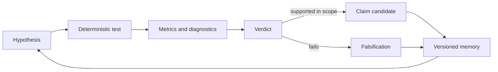

# Autonomous Physics Lab

Generate physics hypotheses. Test them with code. Preserve both wins and
falsifications.

Autonomous Physics Lab (APL) is open-source, verification-first infrastructure
for turning AI-assisted physics ideas into reproducible experiments, metrics,
limitations, and reviewable scientific memory.

APL is not a chatbot. It is a hypothesis-testing machine.

The story is simple: AI can be creative, but science needs receipts. APL is the
place where speculative physics ideas become code, tests, failures, and
versioned evidence instead of confident text.

## Start Fast

### With a coding agent

```bash
python3 scripts/apl_mission.py
```

This starts Agent First Research Mode and recommends the highest-value
reviewable scientific mission. For machine-readable context or a prompt for
Codex, Claude Code, or another coding agent:

```bash
python3 scripts/apl_mission.py --json
python3 scripts/apl_mission.py --onboarding
python3 scripts/apl_mission.py --agent-prompt
```

Full guide: [docs/use-your-agent.md](docs/use-your-agent.md)

### On your machine

```bash
git clone https://github.com/gladunrv/autonomous-physics-lab.git
cd autonomous-physics-lab

python3 -m venv .venv
source .venv/bin/activate

python -m pip install --upgrade pip
pip install -e ".[dev]"

python3 scripts/reproduce_core_results.py
python -m physics_lab.cli validate-repo .
python -m physics_lab.cli status .
```

For a full local validation pass:

```bash
python -m ruff check .
python -m pytest
python -m physics_lab.cli validate-repo . --strict --fail-on-warnings
```

## Choose Your Path

| If you are... | Start here | What you get |
| --- | --- | --- |
| A coding agent | `python3 scripts/apl_mission.py` | A current research mission, guardrails, and PR-ready task direction |
| A new user | [docs/mission-control.md](docs/mission-control.md) | A plain-language map of what APL is, what it is not, and where to begin |
| A scientist with an idea | [tasks/proposals/README.md](tasks/proposals/README.md) | A proposal path for new hypotheses, benchmarks, or tests |
| A journalist or writer | [docs/status.md](docs/status.md) | The current stage, strongest evidence, risks, and what not to overclaim |
| An outside reviewer | [docs/external-reviewer-replication-guide.md](docs/external-reviewer-replication-guide.md) | A short path to replay and inspect the strongest evidence |
| A contributor | [docs/use-your-agent.md](docs/use-your-agent.md) | Branch, task, validation, and review workflow for agent-assisted work |
| A maintainer | [docs/mission-control.md](docs/mission-control.md) | Current campaigns, risks, release gates, and contribution lanes |

## The Scientific Loop



The rule is simple: LLMs may suggest ideas, but numerical and symbolic claims
must be checked by deterministic code. Negative results are kept as first-class
scientific output.

## Current Evidence Snapshot

APL currently stores eleven canonical experiment files, including classical
mechanics benchmarks, dimensional-analysis validation, particle-mass relation
reproductions and falsifications, and the nuclear-mass baseline surface.

| Surface | Current role | Status |
| --- | --- | --- |
| Pendulum Formula Discovery | Approximation and falsification benchmark | `EXP-0001`, scoped valid candidates and failure modes |
| Damped and anharmonic oscillators | Nonlinear mechanics validation | `EXP-0002`, `EXP-0011` |
| Dimensional Analysis Validator | Formula sanity-check benchmark | `EXP-0006`, 49/50 MVP agreement |
| Particle-mass relations | Falsification-first relation testing | Charged-lepton reproduction plus neutrino, quark, and family-target falsifications |
| Nuclear Mass Surface | Current flagship validation campaign | `EXP-0012` baseline, sandbox-only follow-up evidence, no claim promotion |

These are benchmark and review artifacts, not discovery-level physics claims.
For figures and captions, see [docs/results/visual-summary.md](docs/results/visual-summary.md).
For a cautious replay path, see
[docs/external-reviewer-replication-guide.md](docs/external-reviewer-replication-guide.md).

## Why This Is Interesting

Most AI-for-science demos stop at generated ideas. APL focuses on the less
glamorous but more useful next step: making those ideas fail or survive in
public, reproducible artifacts.

That makes the project useful for several audiences:

- agents get a clear mission entrypoint and task protocol;
- new users get a runnable lab instead of a pile of claims;
- scientists get a way to submit hypotheses with validation expectations;
- journalists get a story about disciplined AI-assisted science, not an
  unsupported breakthrough narrative.

Safe headline framing: "an open-source lab for testing AI-generated physics
ideas." Unsafe framing: "AI has discovered new physics."

## Autonomous Agent Network

APL is designed for agents that do real repository work, not just chat about
science. A capable agent can:

- read the current mission;
- pick or propose a bounded task;
- generate or refine a hypothesis;
- run deterministic tests and simulations;
- preserve negative results;
- update public scientific memory;
- prepare a reviewable PR.

The protocol is built for parallel work. Several agents can run locally in
separate branches or worktrees, and larger public campaigns can split across
many agents when each one owns a clear task, dataset slice, hypothesis family,
or artifact surface.

That is the long-term bet: a public scientific memory where humans and agents
can run many small, reviewable hypothesis tests without turning the repository
into an untraceable pile of generated claims.

## Propose A Hypothesis

New scientific ideas should enter as reviewable proposals, not as anonymous
claims. A good proposal should state:

- the hypothesis or formula to test;
- the dataset, assumptions, or validation range;
- the deterministic method;
- expected metrics and failure cases;
- the interpretation ceiling if the test passes.

Start with [tasks/proposals/README.md](tasks/proposals/README.md) and
[docs/task-proposal-protocol.md](docs/task-proposal-protocol.md).

## Contribute With An Agent

APL is Agent First by default, but not agent-unbounded. Every contribution goes
through a task, branch, validation, PR, and maintainer review.

```text
mission -> task/proposal -> branch -> experiment or docs work -> validation -> PR -> review
```

Rules that matter most:

- work from one task or one proposal at a time;
- do not work directly on `main`;
- do not promote hypotheses to claims without maintainer review;
- keep outputs reproducible and linked to repository artifacts;
- preserve falsifications and limitations.

Canonical protocol: [docs/agent-task-protocol.md](docs/agent-task-protocol.md)

## Active Campaigns

| Campaign | Maturity | Best entrypoint |
| --- | --- | --- |
| Pendulum Formula Falsification | Active benchmark with canonical results | [campaign page](docs/campaigns/pendulum-formula-falsification.md) |
| Particle Mass Relations | Active falsification-first track | [campaign page](docs/campaigns/particle-mass-relations.md) |
| Dimensional Analysis Validator | Active MVP benchmark and challenge set | [campaign page](docs/campaigns/dimensional-analysis-validator.md) |
| Thought-Experiment Consistency | Planning active, no canonical run yet | [campaign page](docs/campaigns/thought-experiment-consistency.md) |
| Nuclear Mass Surface | Flagship validation campaign, sandbox-only candidates | [campaign page](docs/campaigns/nuclear-mass-surface.md) |

Mission board: [docs/current-missions.md](docs/current-missions.md)

## Repository Shape

```text
autonomous-physics-lab/
  physics_lab/      # engines, registry, schemas, workflows, CLI
  experiments/      # canonical experiment definitions
  results/          # versioned run artifacts
  hypotheses/       # proposed and tracked hypotheses
  claims/           # reviewed claim records
  knowledge/        # reusable scientific memory
  tasks/            # canonical tasks and proposals
  docs/             # protocols, campaign maps, status, review guides
  tests/            # fast validation suite
```

## Project Status

Current stage:

`v0.1-private-alpha - scientific campaign and contributor workflow validation`

APL is not public-launch ready yet. The current goal is to validate the
scientific workflow, contributor protocol, benchmark replay surface, and public
wording before any opening decision.

Status and planning:

- [docs/status.md](docs/status.md)
- [docs/mission-control.md](docs/mission-control.md)
- [docs/roadmap.md](docs/roadmap.md)
- [docs/public-release-gates.md](docs/public-release-gates.md)

## Deep Dives

- [docs/results/visual-summary.md](docs/results/visual-summary.md) - static result figures and conservative captions
- [docs/reproducibility-capsules.md](docs/reproducibility-capsules.md) - replay commands, expected metrics, and caveats
- [docs/negative-results-registry.md](docs/negative-results-registry.md) - falsifications kept visible
- [docs/result-quality-rubric.md](docs/result-quality-rubric.md) - result-quality and overclaim-risk lens
- [docs/architecture-index.md](docs/architecture-index.md) - fastest map of code and artifact structure
- [CONTEXT.md](CONTEXT.md) - single-file context bundle for chat-based LLMs
