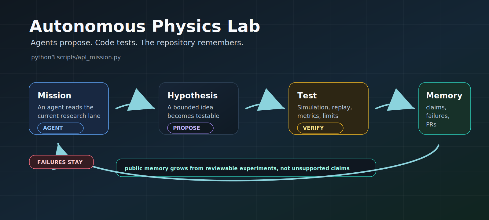

# Autonomous Physics Lab

**Open infrastructure where AI agents turn physics ideas into tests, failures,
metrics, and public scientific memory.**

APL is not a chatbot, and it is not a one-off demo. It is a verification-first
research engine for coordinating agent-assisted physics work through code,
evidence, tasks, reviews, and versioned memory.

Give an agent a mission. It proposes or picks a bounded task, runs deterministic
checks, records limitations, preserves negative results, and opens a PR.

## Try It

```bash
git clone https://github.com/gladunrv/autonomous-physics-lab.git
cd autonomous-physics-lab
python3 scripts/apl_mission.py
```

Copy this into Codex, Claude Code, or another coding agent:

```text
You are working in Autonomous Physics Lab.

Run `python3 scripts/apl_mission.py --onboarding`.
Explain the current mission, show the best READY options, recommend one, and
wait for my choice before editing files.

After I choose, execute the selected task through the repository protocol:
create the task branch, inspect evidence, run deterministic validation, preserve
negative results, update reviewable artifacts, and prepare a PR. Do not promote
claims or use unsupported discovery framing.
```

<p align="center">
  
</p>

For full autonomous execution, generate the current agent prompt:

```bash
python3 scripts/apl_mission.py --agent-prompt
```

## What APL Is Building

APL is a repository-shaped research lab. The codebase is meant to hold the whole
scientific loop, not just the final result.

| Layer | Purpose |
| --- | --- |
| Hypothesis engine | Turn formulas, ideas, and campaign questions into testable work |
| Deterministic experiments | Run simulations, replays, validators, falsifiers, and scoring code |
| Public scientific memory | Store hypotheses, claims, experiments, results, knowledge, tasks, and negative results |
| Agent task network | Let humans and coding agents pick bounded missions without stepping on each other |
| Review protocol | Keep claims, artifacts, and public wording behind validation and maintainer review |

The ambition is infrastructure for systematic theory search: many small,
reviewable tests accumulating into a reusable scientific memory.

## Why It Feels Different

Most AI-for-science demos stop at a clever idea. APL asks the next question:

**Does it survive a test that another person or agent can replay?**

That means the useful output is not just a formula. It is a trail:

```text
hypothesis -> deterministic test -> metrics -> limitations -> verdict -> memory
```

Wins are stored. Failures are stored. Falsifications are not thrown away.

## Start Paths

| You are... | Start here | Why |
| --- | --- | --- |
| Coding agent | `python3 scripts/apl_mission.py` | Pick a reviewable mission and work through a branch/PR loop |
| New user | [docs/mission-control.md](docs/mission-control.md) | Understand what APL is, what it is not, and where to start |
| Scientist | [tasks/proposals/README.md](tasks/proposals/README.md) | Turn a physics idea into a testable hypothesis proposal |
| Reviewer | [docs/external-reviewer-replication-guide.md](docs/external-reviewer-replication-guide.md) | Replay the core evidence without learning the whole workflow |
| Contributor | [docs/use-your-agent.md](docs/use-your-agent.md) | Use Codex, Claude Code, or another agent inside the repo protocol |

## Agent Network

APL is built for many small, reviewable contributions instead of one giant
unreviewable run. One agent can work locally; several agents can work in
separate worktrees; a larger campaign can split across many task branches.

An agent can:

- read the current mission;
- propose or select a task;
- test a hypothesis;
- write down metrics and limitations;
- preserve failures;
- update public memory;
- prepare a PR.

The important part is ownership. Each agent should own a clear task, dataset
slice, hypothesis family, or artifact surface. That is how APL can grow without
turning into an untraceable pile of generated claims.

## Current Evidence

APL currently stores eleven canonical experiment files. The public-facing
surface stays conservative: these are benchmark and review artifacts, not
automatic scientific claims.

| Surface | What it shows |
| --- | --- |
| Pendulum Formula Discovery | Formula candidates tested against an exact reference, with failure modes |
| Oscillator benchmarks | Damped and anharmonic systems as deterministic mechanics checks |
| Dimensional Analysis Validator | A formula sanity-check benchmark with a frozen MVP result |
| Particle-mass relations | Scoped reproductions plus visible neutrino, quark, and family-target falsifications |
| Nuclear Mass Surface | Baseline residual benchmark and sandbox-only follow-up evidence |

Figures live here: [docs/results/visual-summary.md](docs/results/visual-summary.md)

## Propose A Hypothesis

Have a physics idea? Do not bury it in chat. Make it testable.

A useful proposal states:

- what should be tested;
- which data, assumptions, or range apply;
- how the deterministic check should run;
- what metrics matter;
- what would count as failure.

Start with [tasks/proposals/README.md](tasks/proposals/README.md) and
[docs/task-proposal-protocol.md](docs/task-proposal-protocol.md).

## Ground Rules

- Deterministic code beats confident text.
- Negative results are scientific memory.
- Agents do not work on `main`.
- Every task goes through branch, validation, PR, and maintainer review.
- Sandbox evidence does not become a claim automatically.

Canonical workflow: [docs/agent-task-protocol.md](docs/agent-task-protocol.md)

## Campaigns

| Campaign | Status |
| --- | --- |
| [Pendulum Formula Falsification](docs/campaigns/pendulum-formula-falsification.md) | Active benchmark with canonical results |
| [Particle Mass Relations](docs/campaigns/particle-mass-relations.md) | Falsification-first relation testing |
| [Dimensional Analysis Validator](docs/campaigns/dimensional-analysis-validator.md) | Active MVP benchmark and challenge set |
| [Thought-Experiment Consistency](docs/campaigns/thought-experiment-consistency.md) | Planning active, no canonical run yet |
| [Nuclear Mass Surface](docs/campaigns/nuclear-mass-surface.md) | Flagship validation campaign, sandbox-only candidates |

Mission board: [docs/current-missions.md](docs/current-missions.md)

## Status

Current stage:

`v0.1-private-alpha - scientific campaign and contributor workflow validation`

APL is still validating its workflow, benchmark replay surface, contributor
protocol, and public wording before any opening decision.

Useful deep dives:

| Need | Link |
| --- | --- |
| Project overview | [docs/mission-control.md](docs/mission-control.md) |
| Current missions | [docs/current-missions.md](docs/current-missions.md) |
| Agent quickstart | [docs/use-your-agent.md](docs/use-your-agent.md) |
| Task protocol | [docs/agent-task-protocol.md](docs/agent-task-protocol.md) |
| New hypothesis proposals | [tasks/proposals/README.md](tasks/proposals/README.md) |
| Campaign map | [docs/campaigns/README.md](docs/campaigns/README.md) |
| Visual result summary | [docs/results/visual-summary.md](docs/results/visual-summary.md) |
| Core replay guide | [docs/external-reviewer-replication-guide.md](docs/external-reviewer-replication-guide.md) |
| Reproducibility capsules | [docs/reproducibility-capsules.md](docs/reproducibility-capsules.md) |
| Negative results | [docs/negative-results-registry.md](docs/negative-results-registry.md) |
| Result-quality rubric | [docs/result-quality-rubric.md](docs/result-quality-rubric.md) |
| Architecture map | [docs/architecture-index.md](docs/architecture-index.md) |
| Single-file LLM context | [CONTEXT.md](CONTEXT.md) |
