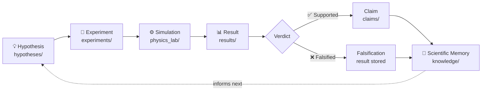
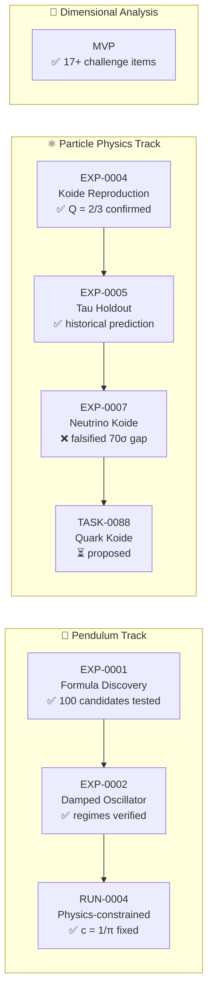
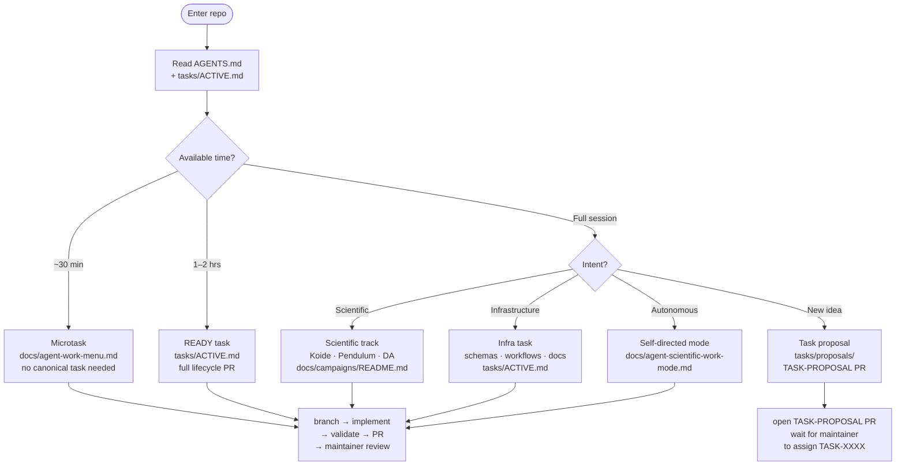

# Autonomous Physics Lab

Generate. Simulate. Falsify. Reuse.

Autonomous Physics Lab (APL) is an open-source infrastructure for generating,
testing, simulating, falsifying, and reusing physics hypotheses.

APL is not a chatbot. It is a verification-first engine for testing physics
ideas.

## How APL Works



Every claim is backed by a reproducible experiment. Every falsification is
stored, not discarded. The memory grows with each run.

## Positioning

The long-term goal is not to claim a "theory of everything" from day one.
The goal is to build infrastructure for systematic theory search in physics.

The project combines three cores:

1. A hypothesis engine for proposing and testing candidate formulas or models.
2. A version-controlled scientific memory for storing hypotheses, claims,
   experiments, and results.
3. An open agent task network so humans and external agents can contribute reproducible work.

## Original MVP

The original MVP was `Pendulum Formula Discovery`.

It should:

1. Generate exact pendulum period ratio data.
2. Fit simple approximation families.
3. Compare candidate models.
4. Score accuracy and complexity.
5. Produce a reproducible Markdown report.

## Current Benchmarks

The repository currently has four canonical experiment slices across two active
scientific tracks:

1. `EXP-0001` — `Pendulum Formula Discovery`
2. `EXP-0002` — `Damped Oscillator Regime Verification`
3. `EXP-0004` — `Charged-Lepton Koide Reproduction`
4. `EXP-0005` — `Historical Tau Holdout Prediction`

Both tracks are verification-first and store run-based artifacts under
`results/<experiment>/<run>/`.

## Current Major Results

- [Pendulum Gauntlet 100](docs/results/pendulum-gauntlet-100-summary.md):
  100 deterministic candidate formulas tested against the exact pendulum
  reference with explicit leaderboard, diagnostics, and limitation wording.
- [Koide tau holdout](docs/results/koide-tau-holdout.md): a narrow historical
  holdout benchmark that predicts tau from electron and muon inputs under the
  exact Koide assumption, compared against measured tau with uncertainty-aware
  wording.

These are scoped benchmark results with explicit limits, not discovery-level
physical conclusions, complete particle-mass explanations, or exact symbolic
proof.

## Start Here

If you are new to the repository, use this order:

1. [docs/mission-control.md](docs/mission-control.md)
2. [docs/campaigns/README.md](docs/campaigns/README.md)
3. [docs/status.md](docs/status.md)
4. [tasks/ACTIVE.md](tasks/ACTIVE.md)
5. [docs/agent-task-protocol.md](docs/agent-task-protocol.md)

This gives you the shortest path from "what is APL?" to "which campaign
already has evidence?" to "which task can I pick up safely?"

### Using a chat-based LLM instead of an agent?

Download [CONTEXT.md](CONTEXT.md) — a single-file bundle of the core
instructions, strategy, and current task board. Upload it to your chat session
to get full project context without reading multiple files.

To regenerate it locally after pulling updates:

```bash
python3 scripts/generate_context_bundle.py          # core (44 KB)
python3 scripts/generate_context_bundle.py --full   # + extended docs (~60 KB)
```

## Active Scientific Campaigns



Full campaign details:

1. [Pendulum Formula Falsification](docs/campaigns/pendulum-formula-falsification.md)
2. [Particle Mass Relations](docs/campaigns/particle-mass-relations.md)
3. [Dimensional Analysis Validator](docs/campaigns/dimensional-analysis-validator.md)
4. [Thought-Experiment Consistency](docs/campaigns/thought-experiment-consistency.md)

The pendulum and particle-mass tracks already have scoped canonical results.
The dimensional-analysis and thought-experiment tracks are still planning-first
and should not be described as finished benchmark implementations.

## Contribute with an AI coding agent



Every path ends with a PR for maintainer review — agents never merge their own work.

Invited contributors can use Codex, Claude Code, or other coding agents.
Start with [docs/private-contributor-pilot.md](docs/private-contributor-pilot.md)
for the private-alpha workflow and [AGENTS.md](AGENTS.md) for the canonical rules.

Not sure where to start? Use the **[Agent Work Menu](docs/agent-work-menu.md)**
to find safe, reviewable work sized for your session budget (30 min / 1 h / 2 h).

## Quickstart

```bash
git clone https://github.com/gladunrv/autonomous-physics-lab.git
cd autonomous-physics-lab

python3 -m venv .venv
source .venv/bin/activate

python -m pip install --upgrade pip
pip install -e ".[dev]"

python -m ruff check .
python -m pytest

python -m physics_lab.cli run examples/pendulum.yaml --output-dir /tmp/apl-pendulum
python -m physics_lab.cli run examples/damped_oscillator.yaml --output-dir /tmp/apl-damped

python -m physics_lab.cli validate-repo .
python -m physics_lab.cli status .
```

## Repository Shape

```text
autonomous-physics-lab/
  AGENTS.md
  CODEX_TASK.md
  README.md

  physics_lab/
    engines/
    registry/
    schemas/
    workflows/

  hypotheses/
  claims/
  experiments/
  results/
  knowledge/
  tasks/
  agents/
  docs/
  tests/
```

## Status

The repository is currently in:

`v0.1-private-alpha — scientific campaign and contributor workflow validation`

See [docs/status.md](docs/status.md),
[docs/roadmap.md](docs/roadmap.md), and
[docs/implementation-plan.md](docs/implementation-plan.md).

## Planning Docs

Use these files to continue the project without guessing:

- [docs/mission-control.md](docs/mission-control.md) for the fastest project-level orientation
- [docs/campaigns/README.md](docs/campaigns/README.md) for the scientific campaign map
- [docs/strategy.md](docs/strategy.md) for the current strategic compass
- [tasks/ACTIVE.md](tasks/ACTIVE.md) for the shared live task board
- [docs/agent-operating-model.md](docs/agent-operating-model.md) for multi-agent handoff and task execution
- [docs/implementation-plan.md](docs/implementation-plan.md) for phased strategy
- [docs/next-steps.md](docs/next-steps.md) for the immediate working queue
- [docs/backlog.md](docs/backlog.md) for medium-term and deferred tasks
- [docs/status.md](docs/status.md) for the current project readiness snapshot
- [docs/architecture-index.md](docs/architecture-index.md) for the fastest codebase and artifact map
- [docs/private-contributor-pilot.md](docs/private-contributor-pilot.md) for invited private contributors using coding agents
- [docs/public-release-gates.md](docs/public-release-gates.md) for the gates that must be satisfied before the repository becomes public
- [docs/github-branch-protection-plan.md](docs/github-branch-protection-plan.md) for staged PR and branch-protection setup
- [docs/release-checklist.md](docs/release-checklist.md) for public-alpha tag and release prep
- [docs/releases/v0.1-public-alpha.md](docs/releases/v0.1-public-alpha.md) for prepared release notes
- [CONTRIBUTING.md](CONTRIBUTING.md) for contributor expectations
- [docs/contributing-workflow.md](docs/contributing-workflow.md) for the repository contribution flow
- [docs/claim-promotion-policy.md](docs/claim-promotion-policy.md) for claim-status review rules
