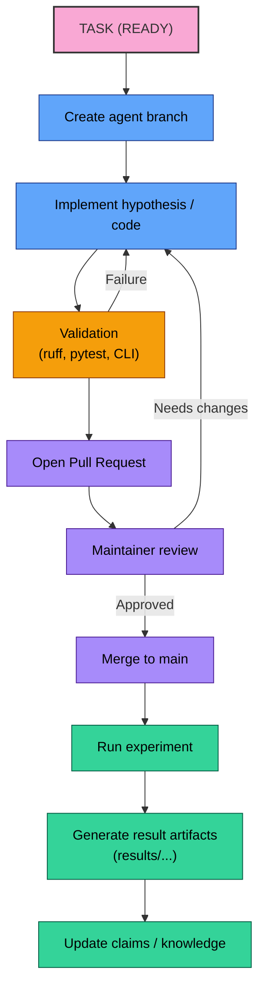

# Architecture

## APL Experiment Lifecycle



## Purpose

Autonomous Physics Lab is an open verification infrastructure for physics
hypotheses.

The system is designed around a simple rule:

Hypotheses may be proposed freely, but they only become reusable knowledge
after deterministic verification.

## Strategic Positioning

APL should be positioned as infrastructure for systematic theory search, not as
"an AI physicist" and not as a claim of solving fundamental physics directly.

The right framing is:

- open-source;
- verification-first;
- reproducible;
- public-memory oriented;
- compatible with human and agent collaboration.

## Core System Model

The long-term architecture has three cores.

### 1. Hypothesis Engine

Responsible for:

- generating or loading candidate hypotheses;
- simulating reference behavior;
- fitting approximation families;
- scoring quality;
- producing verdicts and reports.

### 2. Public Knowledge Base

Responsible for storing:

- hypotheses;
- claims;
- experiments;
- results;
- reusable knowledge notes;
- tasks;
- agent manifests.

In v0.1 this is file-based and version-controlled in Git.

### 3. Open Agent Task Network

Responsible for:

- publishing structured tasks;
- allowing humans and external agents to contribute work;
- enforcing reproducibility and evidence standards;
- linking tasks to results and verification outcomes.

## Verification Stack

Physics does not have a single formal verifier equivalent to Lean, so APL needs
a layered verification stack.

The default stack should support:

1. dimensional analysis;
2. symbolic consistency checks;
3. known-limit checks;
4. symmetry checks;
5. conservation-law checks;
6. numerical simulation;
7. benchmark comparison against known solutions;
8. comparison against experimental or reference data;
9. literature cross-check;
10. reproducible report generation.

Not every workflow will use all layers in v0.1, but the architecture should
make room for them.

## Repository Layout

```text
autonomous-physics-lab/
  README.md
  AGENTS.md
  CODEX_TASK.md

  physics_lab/
    cli.py
    engines/
      simulation.py
      formula_discovery.py
      symbolic.py
      scoring.py
      critic.py
    registry/
      hypotheses.py
      claims.py
      experiments.py
      tasks.py
    workflows/
      runner.py
    schemas/
      hypothesis.schema.json
      claim.schema.json
      experiment.schema.json
      task.schema.json
      agent.schema.json
      result.schema.json

  hypotheses/
  claims/
  experiments/
  results/
  knowledge/
  tasks/
  agents/
  examples/
  tests/
  docs/

```

## Knowledge Object Model

The system should distinguish these object types:

- Hypothesis
- Claim
- Equation
- Assumption
- Experiment
- Dataset
- Result
- Paper
- Task
- Agent
- Theory

Core relationships:

- `Hypothesis -> tested_by -> Experiment`
- `Experiment -> produced -> Result`
- `Result -> supports -> Claim`
- `Result -> falsifies -> Hypothesis`
- `Claim -> derived_from -> Paper`
- `Hypothesis -> depends_on -> Assumption`
- `Theory -> contains -> Hypothesis`
- `Task -> assigned_to -> Agent`

## First MVP Boundary

v0.1 stays intentionally narrow.

It started with one deterministic workflow and now includes two stabilized
public-alpha benchmark slices:

- `Pendulum Formula Discovery`
- `Damped Oscillator Regime Verification`

The current boundary still stays intentionally small:

- classical mechanics only;
- deterministic benchmark workflows only;
- committed canonical result artifacts for a small number of curated runs;
- public-memory objects that stay reviewable by humans and LLM contributors.

## Data Flow for v0.1

```text
Hypothesis
  -> Experiment config
  -> Exact pendulum simulator
  -> Candidate formula fitting
  -> Error and complexity scoring
  -> Verdict generation
  -> Markdown report + metrics artifact
  -> Claim update
  -> Knowledge note update
  -> New task creation
```

## Non-Goals for v0.1

Do not add yet:

- dashboards;
- web APIs;
- heavy agent frameworks;
- large-scale paper ingestion;
- database backends;
- distributed execution;
- speculative "theory of everything" messaging.

## Upgrade Path

After the pendulum MVP is stable, the next architectural extensions should be:

1. schema validation for all public objects;
2. symbolic validation and dimensional checks;
3. task registry tooling;
4. literature ingestion adapters;
5. graph/database importer;
6. multi-agent execution and review workflows.
