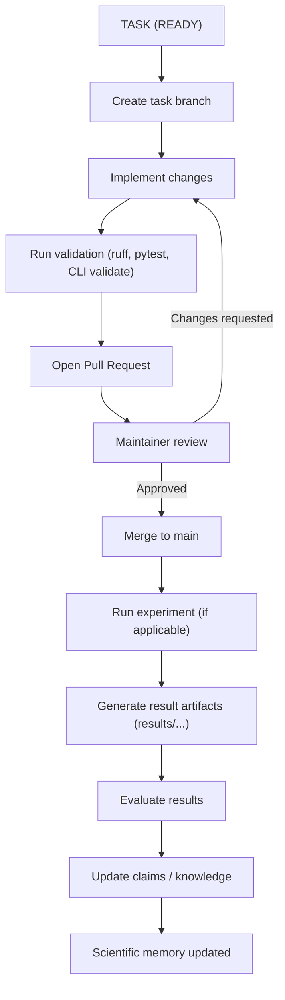

## Purpose

Autonomous Physics Lab (APL) is an open verification infrastructure for physics hypotheses.

The system is built around a strict principle:

> Hypotheses may be proposed freely, but only become reusable knowledge after deterministic verification.

---

## Strategic Positioning

APL is infrastructure for systematic theory search, not an "AI physicist" and not a system that claims direct discovery of fundamental physics.

The correct positioning is:

* open-source;
* verification-first;
* reproducible;
* public scientific memory;
* compatible with human and agent collaboration.

---

## Experiment Lifecycle (Happy Path)

The following diagram illustrates the canonical APL workflow, aligned with `docs/agent-task-protocol.md`.



### Notes

* This diagram represents the standard "happy path".
* All contributions must pass deterministic validation before review.
* Scientific results must be reproducible and linked to repository artifacts.
* Claims are updated only after validated results are produced.

---

## Core System Model

APL is organized around three core subsystems.

All workflows must follow the canonical agent-task protocol defined in
`docs/agent-task-protocol.md`.

### 1. Hypothesis Engine

Responsible for:

* generating or loading candidate hypotheses;
* simulating reference behavior;
* fitting approximation families;
* scoring model quality;
* producing verdicts and reproducible reports.

These capabilities are implemented incrementally across modules in
`physics_lab/engines`.

---

### 2. Public Knowledge Base

Responsible for storing:

* hypotheses;
* claims;
* experiments;
* results;
* reusable knowledge notes;
* tasks;
* agent manifests.

All objects are stored as version-controlled artifacts using structured schemas.

In v0.1 this system is file-based and managed through Git.

---

### 3. Open Agent Task Network

Responsible for:

* publishing structured tasks;
* enabling human and agent contributions;
* enforcing reproducibility and evidence standards;
* linking tasks to experiments and results.

Tasks are the primary coordination unit. Agents do not own roles; tasks define execution.

---

## Verification Stack

APL uses a layered verification approach.

The architecture is designed to support:

1. dimensional analysis;
2. symbolic consistency checks;
3. known-limit validation;
4. symmetry checks;
5. conservation-law checks;
6. numerical simulation;
7. benchmark comparison against known solutions;
8. comparison with experimental or reference data;
9. literature cross-check;
10. reproducible report generation.

Not every workflow uses all layers in v0.1, but the system is structured to support them incrementally.

These layers are implemented progressively within `physics_lab/engines`.

---

## Repository Layout

```text
autonomous-physics-lab/
  README.md
  AGENTS.md
  CODEX_TASK.md

  physics_lab/
    cli.py
    engines/
      simulation.py
      formula_discovery.py
      symbolic.py
      scoring.py
      critic.py
    registry/
      hypotheses.py
      claims.py
      experiments.py
      tasks.py
    workflows/
      runner.py
    schemas/
      hypothesis.schema.json
      claim.schema.json
      experiment.schema.json
      task.schema.json
      agent.schema.json
      result.schema.json

  hypotheses/
  claims/
  experiments/
  results/
  knowledge/
  tasks/
  agents/
  examples/
  tests/
  docs/
```

---

## Knowledge Object Model

APL distinguishes the following object types:

* Hypothesis
* Claim
* Equation
* Assumption
* Experiment
* Dataset
* Result
* Paper
* Task
* Agent
* Theory

### Core Relationships

* `Hypothesis -> tested_by -> Experiment`
* `Experiment -> produced -> Result`
* `Result -> supports -> Claim`
* `Result -> falsifies -> Hypothesis`
* `Claim -> derived_from -> Paper`
* `Hypothesis -> depends_on -> Assumption`
* `Theory -> contains -> Hypothesis`
* `Task -> assigned_to -> Agent`

---

## MVP Boundary (v0.1)

The current version intentionally limits scope.

Active benchmark slices:

* `Pendulum Formula Discovery`
* `Damped Oscillator Regime Verification`

Constraints:

* classical mechanics only;
* deterministic workflows only;
* a small set of curated benchmark results;
* artifacts must remain human-reviewable.

---

## Data Flow (Conceptual)

The canonical workflow is defined by the experiment lifecycle diagram.

At a conceptual level, the system operates as:

```text
Hypothesis
  -> Experiment configuration
  -> Simulation / data generation
  -> Model fitting
  -> Scoring and validation
  -> Result artifact generation
  -> Claim update
  -> Knowledge integration
```

This section complements, but does not replace, the lifecycle diagram.

---

## Non-Goals for v0.1

Do not introduce:

* dashboards;
* web APIs;
* heavy agent frameworks;
* large-scale literature ingestion;
* database backends;
* distributed execution;
* speculative "theory of everything" claims.

---

## Upgrade Path

After stabilizing current benchmarks, the system should evolve toward:

1. full schema validation for all public objects;
2. expanded symbolic and dimensional validation;
3. task registry tooling;
4. literature ingestion adapters;
5. graph/database integration;
6. multi-agent execution and review workflows.
