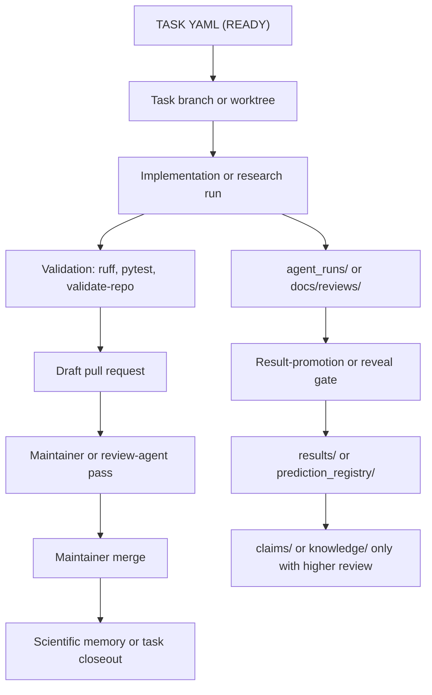

# Architecture Overview

## Purpose

Autonomous Physics Lab (APL) is verification-first infrastructure for physics
hypotheses. It is a file-based scientific engine for proposing, testing,
falsifying, reviewing, and preserving physics evidence.

APL is not a chatbot and does not treat generated prose as evidence. Numerical,
symbolic, dataset, and claim-facing statements must be backed by deterministic
code, committed artifacts, and reviewable provenance.

For fast navigation, use [Architecture Index](./architecture-index.md). For the
short layer model, use [Architecture Layers](./architecture-layers.md). This
page is the human-facing overview that ties those maps together.

## Current Posture

APL is now organized around multiple bounded research campaigns, agent-run
evidence, result-promotion gates, maintainer review helpers, and
source/readiness protocols.

The current architectural goal is not to add a dashboard, web API, database, or
large framework. The goal is to keep the repository easy for humans and agents
to inspect while preserving scientific memory in version-controlled files.

## Four-Layer Model

APL is easiest to understand as four layers:

1. **Research Agent Core** - mission control, task selection, task YAML,
   generated task views, PR review helpers, closeout, and campaign-curator
   tooling.
2. **Scientific Memory** - hypotheses, experiments, canonical results, sandbox
   agent runs, claims, knowledge notes, prediction registries, reviews, and
   negative or inconclusive evidence.
3. **Domain Campaigns** - bounded scientific surfaces such as Nuclear Mass
   Surface, Exoplanet Mass-Radius, Atomic Clock Residuals, Quantum Size Effects,
   Particle Mass Relations, and Pendulum Formula Falsification.
4. **Data / Reveal / Claim Gates** - source manifests, checksums, direct-row
   provenance, no-peek/reveal protocols, holdout policies, result-promotion
   checks, and public wording review.

This model is an orientation layer, not a request to move files. Broad
filesystem refactors should happen only when a task identifies a concrete pain
point and migration plan.

## Generated State and Agent Data Access (standing policy)

This is a general architectural principle, in force by default until a task
explicitly changes it — not a reaction to any single case.

- **Canonical source of truth lives in version-controlled source files**
  (`tasks/TASK-*.yaml`, `campaign_profiles/*.yaml`, `missions/current.yaml`,
  `campaigns/catalog.yaml`). There is exactly one source per fact.
- **Agents obtain derived or current state by executing a script entry point**
  (`apl_mission.py`, `apl_task_campaign_index.py`, …), or by reading the
  canonical source files. A script is a **single governable entry point**: it
  always reflects current state, and access rules can be updated in one place.
- **Static/generated files are produced for humans, not as an agent data
  source.** A committed generated file is a frozen copy that drifts from source
  and multiplies sources of truth, so agents must not depend on one for current
  state.
- The only committed generated files are **human-facing navigation that the
  post-merge `Sync Active Board` action auto-regenerates** (`docs/task-views/*.md`)
  or **source-coupled metadata with a CI `--check`** (`campaigns/catalog.yaml`).
  Do not introduce a new committed generated/cache file as an agent data source.

This keeps the four-layer model honest: derived views are computed on demand from
the canonical layer, never frozen into a second board the repository must keep
fresh. The full rule and rationale are in
[generated-file-policy.md](generated-file-policy.md).

## Repository Layout

The top level intentionally exposes the main scientific artifact classes. This
can look busy, but it makes evidence reviewable without a database or hidden
runtime state.

```text
autonomous-physics-lab/
  physics_lab/              Python package: CLI, engines, workflows, registries, schemas
  scripts/                  Maintainer, review, mission, snapshot, and run helpers
  tests/                    Fast deterministic tests and repository integrity checks
  examples/                 Reproducible workflow configs

  tasks/                    Canonical task contracts and task proposals
  missions/                 Mission-control policy and campaign recommendations
  agents/                   Machine-readable agent role profiles
  .github/                  CI and repository automation

  hypotheses/               Reviewed hypothesis artifacts
  experiments/              Reviewed experiment definitions
  results/                  Canonical benchmark/result packages
  claims/                   Claim records and evidence links
  knowledge/                Reusable reviewed knowledge notes
  prediction_registry/      Pre-registered prediction artifacts

  agent_runs/               Sandbox or task-scoped agent evidence bundles
  microtask_runs/           Completed scientific microtask records
  hypothesis_proposals/     Campaign-scoped hypothesis proposal artifacts
  experiment_proposals/     Campaign-scoped experiment proposal artifacts
  hypothesis_register/      Lightweight hypothesis-register entries

  campaign_profiles/        Machine-readable campaign autonomy profiles
  data/                     Curated datasets, manifests, source artifacts, checksums
  docs/                     Protocols, campaign pages, reviews, notes, release docs
  templates/                Reusable source, result, and extraction templates
```

Local or generated working directories such as `.worktrees/`, `_snapshots/`,
`.pytest_cache/`, `.ruff_cache/`, and `.pytest-basetemp/` are not part of the
canonical architecture even when they are visible in a local checkout.

## Experiment and Evidence Flow

Most work starts with a task, not an ad hoc edit. The task defines the scope,
accepted outputs, validation commands, and review expectations.



The important safety rule is separation of evidence from interpretation:
agents may publish gated evidence when the task and protocols allow it, but
claim endorsement remains review-gated.

## Core Code Surfaces

The Python package is deliberately small and file-oriented:

- `physics_lab/cli.py` exposes repository validation and workflow commands.
- `physics_lab/workflows/` contains experiment/workflow orchestration.
- `physics_lab/engines/` contains deterministic scientific calculations,
  scoring, fitting, and domain helpers.
- `physics_lab/registry/` loads, validates, reviews, indexes, and packages
  repository artifacts.
- `physics_lab/schemas/` defines JSON schemas for structured artifacts.
- `physics_lab/datasets/` contains dataset loaders and source-specific helpers
  when the logic is reusable.

`physics_lab/workflows/runner.py` should stay thin. Domain-specific science
belongs in workflow and engine modules, while repository coordination belongs in
registry modules and scripts.

## Verification Stack

APL supports layered verification:

1. dimensional analysis;
2. symbolic consistency checks;
3. known-limit validation;
4. symmetry or conservation-law checks when applicable;
5. numerical simulation;
6. benchmark comparison against known solutions;
7. dataset or source-manifest validation;
8. holdout, no-peek, or reveal-readiness checks;
9. reproducible report and metrics generation;
10. review-tier and result-promotion gates.

Not every campaign uses every layer. Campaign maturity controls what kind of
task is safe: source-gated campaigns should receive source/readiness work,
while mature benchmark campaigns can run bounded hypothesis tests.

## Scientific Object Model

APL distinguishes:

- `Hypothesis` - an unverified proposed relation, model, or diagnostic.
- `Experiment` - a deterministic test or benchmark configuration.
- `Result` - reproducible output from an experiment or gate.
- `Prediction` - a pre-registered statement awaiting reveal or scoring.
- `Claim` - a statement about nature backed by evidence and review.
- `Knowledge` - reusable reviewed information distilled from stronger evidence.
- `Task` - the execution contract for humans and agents.
- `Agent run` - sandbox or task-scoped evidence that may or may not qualify for
  promotion.

Core relationships:

```text
Task -> scopes -> Work
Hypothesis -> tested_by -> Experiment
Experiment -> produces -> Result
Result -> supports_or_falsifies -> Claim or Hypothesis
Prediction -> scored_by -> Result
Reviewed Results/Claims -> may_distill -> Knowledge
```

## Non-Goals

Do not introduce these without an explicit maintainer-approved task:

- dashboard or public API work;
- database backends;
- distributed execution frameworks;
- broad literature-ingestion automation;
- claim-promotion shortcuts;
- speculative discovery or unlimited-scope framing;
- large filesystem migrations without a concrete migration plan.

## Upgrade Path

Near-term architecture work should prefer:

1. clearer repository navigation and directory maps;
2. stronger validation for existing artifact classes;
3. smaller reviewable task and PR surfaces;
4. better campaign status and result-promotion visibility;
5. source/readiness gates before new formula-search lanes;
6. cleanup of stale docs only when a canonical replacement exists.

When in doubt, keep APL simple, file-based, deterministic, and reviewable.
