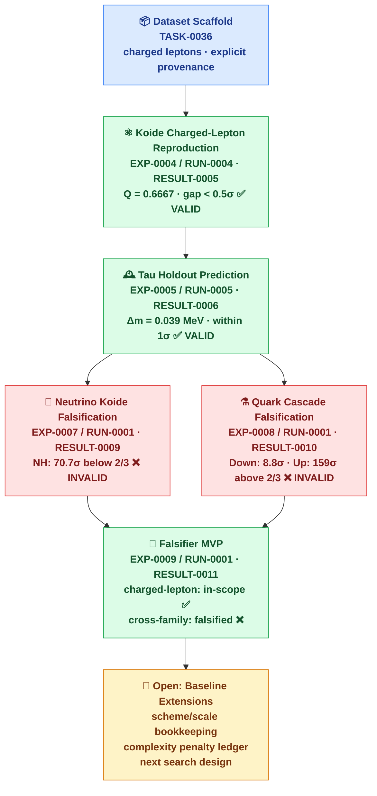

# Particle Mass Relations

## Goal

Turn Koide-like and other particle-mass relations into a falsification-first
benchmark track. The purpose is to test whether a relation stays meaningful
after explicit dataset provenance, uncertainty propagation, holdout checks,
baseline comparisons, and complexity penalties are applied.

## Campaign Map

This diagram shows the full particle-mass track as one falsification-first
story. Each node is a scoped benchmark result — not a discovery claim.

**Reading guide:**
- ✅ VALID — reproduces or predicts within stated uncertainty; narrow scope only
- ❌ INVALID — falsified under stored dataset and assumptions
- Orange — open questions and next steps
- No node represents a discovery claim or physical explanation

## Why It Matters

Particle-mass numerology is exactly the kind of domain where APL's discipline
matters most:

- numerical closeness can be impressive but misleading;
- cherry-picked triplets can look profound without surviving baseline checks;
- scheme and scale choices can change the story materially;
- holdout tests are more informative than retrospective fits.

If APL can stay honest here, its broader verification posture becomes much more
credible.

## Current Results

This campaign now has a coherent set of narrow, reproducible benchmark
surfaces:

- `TASK-0036` created the explicit particle-mass dataset scaffold.
- `TASK-0037` produced `EXP-0004/RUN-0004` (`RESULT-0005`), a charged-lepton
  Koide reproduction benchmark with uncertainty-aware wording.
- `TASK-0038` produced `EXP-0005/RUN-0005` (`RESULT-0006`), a historical tau
  holdout benchmark under the stored charged-lepton Koide assumption.
- `TASK-0093` produced `EXP-0007/RUN-0001` (`RESULT-0009`), a direct neutrino
  extension falsification under PDG 2024 / NuFIT 5.3 inputs.
- `TASK-0088` produced `EXP-0008/RUN-0001` (`RESULT-0010`), a quark-sector
  cascade falsification under the documented mixed-scale PDG dataset.
- `TASK-0039` and `TASK-0042` added search-design and numerology guardrails.
- `TASK-0040` produced `EXP-0009/RUN-0001` (`RESULT-0011`), the first
  particle-mass relation falsifier MVP with uncertainty propagation, a
  deterministic random baseline, and a fixed complexity-penalty ledger.

Current narrow evidence:

- charged-lepton Koide reproduction observed `Q = 0.6666644634145`, close to
  `2/3` within propagated uncertainty;
- tau holdout prediction differs from the measured tau mass by about
  `3.90e-02` MeV and stays within the combined one-sigma uncertainty band;
- neutrino follow-up testing keeps `Q_max` below `2/3` for both known
  orderings in the stored setup;
- quark follow-up testing keeps both tested sectors above `2/3` in the stored
  setup;
- the falsifier MVP preserves the charged-lepton in-scope reproduction while
  falsifying cross-family survival of the fixed standard Koide target across
  the encoded charged-fermion family triplets;
- `TASK-0902` pinned the Antusch-Hinze-Saad common MS-bar-at-MZ Yukawa source
  surface as metadata only; values are not yet curated, and no Koide metrics
  have been rerun on that derived scheme;
- these are scoped benchmark and falsification outputs, not explanatory claims.

Start here:

- [Koide Campaign Summary](../results/koide-campaign-summary.md)
- [Charged-Lepton Koide Reproduction](../results/koide-charged-lepton-reproduction.md)
- [Historical Tau Holdout Prediction](../results/koide-tau-holdout.md)
- [Koide Neutrino Falsification](../results/koide-neutrino-falsification.md)
- [Koide Quark Cascade Falsification](../results/koide-quark-cascade-falsification.md)
- [Particle-Mass Relation Falsifier MVP](../../results/EXP-0009/RUN-0001/report.md)
- [CLAIM-0007 Falsifier Evidence Handoff](../reviews/claim-0007-particle-mass-falsifier-evidence-handoff.md)
- [Particle common-scheme source artifact](../reviews/particle-common-scheme-source-artifact.md)
- [Negative Results Registry](../negative-results-registry.md)
- [Particle Mass Relation / Koide Track](../notes/particle-mass-relation-track.md)
- [Particle mass numerology guardrails](../notes/particle-mass-numerology-guardrails.md)

## Open Questions

- What baseline or dataset extension should come after the first falsifier MVP
  without reopening numerology loopholes?
- How should quark scheme/scale handling be encoded before any broader search?
- Which baseline families should every Koide-like triplet search beat before a
  result is considered interesting?
- How aggressive should the default complexity penalty be for tuned exponents,
  constants, or mixed-family constructions?
- Which verdict wording best preserves narrow scope for historical holdout
  benchmarks?

## Recommended Tasks

- packaging and wording work that keeps the current campaign legible without
  promoting claims;
- future data or baseline tasks that preserve explicit source policy and
  overclaim guardrails;
- maintainer Gate C review of the
  [CLAIM-0007 evidence handoff](../reviews/claim-0007-particle-mass-falsifier-evidence-handoff.md)
  before any claim-status or wording change;
- defer common-scheme row curation unless the maintainer explicitly asks for a
  source-hygiene follow-up with a clear public-science need; do not rerun Koide
  metrics or reopen broad formula search.

## Recommended Contributor Types

- particle-physics data curators;
- uncertainty-propagation and statistics contributors;
- scientific safety reviewers;
- benchmark designers comfortable with null models and baselines.

## What Not To Claim

- Do not say Koide-like relations explain the origin of particle masses.
- Do not generalize charged-lepton results across all particle families.
- Do not treat one narrow holdout as evidence of deeper structure by itself.
- Do not turn neutrino or quark falsifications into a blanket statement about
  every possible Koide-like variant.
- Do not skip source, mass-type, scheme, or scale bookkeeping.
- Do not treat fit quality alone as evidence of discovery.

## Visualization Ideas

- stage map from dataset scaffold -> reproduction -> holdout -> search ->
  falsifier;
- uncertainty-bar plot for observed `Q` versus `2/3`;
- tau predicted vs measured comparison with uncertainty bands;
- baseline-versus-relation scorecards for future search tasks;
- risk matrix showing where overclaim enters the workflow.
