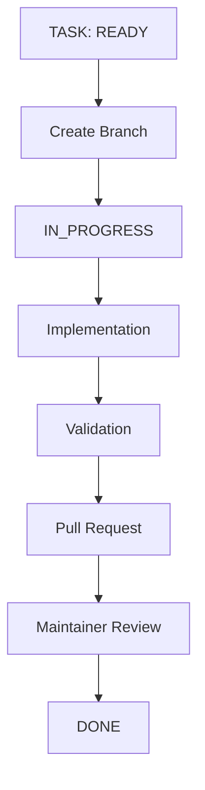

# Experiment Lifecycle Flow

http://googleusercontent.com/image_content/180

```mermaid
graph TD
    T_READY[TASK: READY] --> BR[Create Branch]
    BR --> T_IP[IN_PROGRESS]
    T_IP --> CODE[Implementation]
    CODE --> VAL[Validation]
    VAL --> PR[Pull Request]
    PR --> MAINT[Maintainer Review]
    MAINT --> DONE[DONE]

```
