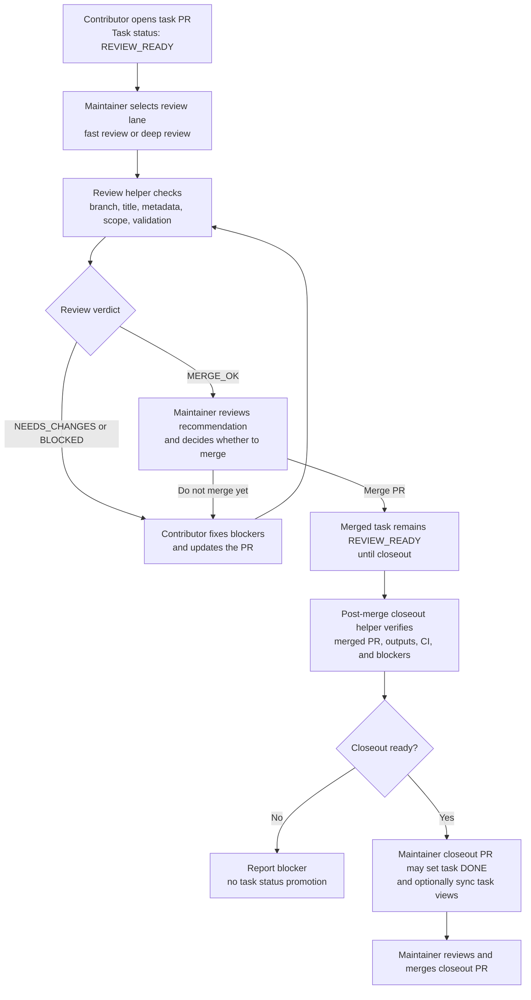

# Maintainer Review Agent

This document defines a maintainer-run review and closeout protocol for
Autonomous Physics Lab.

The maintainer review agent helps the repository administrator review pull
requests, confirm task completeness, and close merged tasks without delegating
final authority away from the maintainer.

It is a review assistant, not an autonomous governance bot.

The intended maintainer workflow is prompt-first:

- the maintainer asks the agent to review a PR;
- the agent runs the deterministic review protocol under the hood;
- the agent returns a merge recommendation plus concrete blockers and fixes for
  the developer.

## Core Rules

- The maintainer review agent may recommend `APPROVE`, `NEEDS_CHANGES`, or
  `BLOCKED`.
- The maintainer review agent may help update task state after merge.
- The maintainer review agent must not merge pull requests.
- The maintainer review agent must not promote claims automatically.
- The maintainer review agent must not rewrite scientific verdicts.
- The maintainer review agent must not regenerate or rewrite result artifacts
  unless the task explicitly requires it and the maintainer approved that work.
- The maintainer review agent must not make the repository public.

Use this protocol together with:

- [./agent-task-protocol.md](./agent-task-protocol.md)
- [./maintainer-automation-architecture.md](./maintainer-automation-architecture.md)
- [./claim-promotion-policy.md](./claim-promotion-policy.md)
- [./review-checklists/maintainer-pr-review-checklist.md](./review-checklists/maintainer-pr-review-checklist.md)
- [./review-checklists/task-closeout-checklist.md](./review-checklists/task-closeout-checklist.md)

If this agent is executed by a periodic or reusable automation rather than by
an ad hoc prompt, also use:

- [./automation/maintainer-routine-mode.md](./automation/maintainer-routine-mode.md)
- [./automation/maintainer-manual-mode.md](./automation/maintainer-manual-mode.md)
- [./automation/maintainer-action-mode.md](./automation/maintainer-action-mode.md) when the automation is allowed to perform a bounded maintainer action

The recommended first bounded action is:

- open a closeout PR for verified merged tasks;
- run this review agent on that closeout PR;
- if the verdict is `MERGE_OK`, CI is green, the PR is pure closeout
  bookkeeping, and the maintainer already authorized closeout/merge in the
  current request chain, merge the closeout PR;
- otherwise explicitly ask: `Merge closeout PR #<number>?`;
- stop unless the maintainer authorizes merge or already authorized it in this
  request chain.

## Review To Closeout Flow

This diagram shows the maintainer-facing lifecycle from contributor PR review
through post-merge task closeout. The review helper can recommend and prepare
bounded updates, but the maintainer remains the merge and scientific-authority
decision point.



## Review Lanes

Maintainer review should not use the same heavy cycle for every PR shape.

Choose one of two lanes before running the review:

- `fast review`
  for low-risk docs, planning, task-admin, proposal-only, closeout PRs, and
  microtask PRs (`microtask(<queue-id>): ...`) that touch only challenge-set
  entries, notes, or dataset audit outputs
- `deep review`
  for engines, workflows, schemas, claims, results, maintainer scripts, CI,
  automation logic, and public-facing scientific wording

### Fast Review Lane

Use this lane when all of the following are true:

- the PR is limited to docs, notes, task files, proposal files, closeout
  updates, or maintainer-admin workflow text
- no claim, result artifact, hypothesis, or experiment semantics are being
  changed beyond already-approved task scope
- no engine, workflow, schema, maintainer script, or CI surface is touched
- there is no obvious overclaim or repository-safety risk

Fast review should focus on:

1. branch and title protocol
2. task/proposal status correctness
3. accepted outputs roughly matching the PR scope
4. validation presence
5. obvious wording or governance issues

If the PR passes those checks, avoid escalating into a full deep review loop.

### Deep Review Lane

Use this lane whenever any of the following is true:

- the PR changes executable engine or workflow code
- the PR changes schemas, maintainer scripts, CI, or automation helpers
- the PR introduces or modifies claim, result, hypothesis, or experiment
  artifacts
- the PR changes public-facing scientific wording that could affect scope,
  verdict interpretation, or overclaim risk
- the PR has ambiguous task-contract fit or protected-artifact scope

Deep review should include the full deterministic helper cycle and content
verification appropriate to the changed surface.

### Batch Review (homogeneous science PRs)

During a many-agent wave, same-campaign, same-type, same-validation-surface,
disjoint-write-path PRs may be processed in one pass using the
[homogeneous science PR batch review protocol](reviews/homogeneous-science-pr-batch-review-protocol.md)
and its [operating mode](automation/homogeneous-science-pr-batch-review.md).
Batch review never relaxes per-PR gates: every PR keeps its own verdict,
validation, limitations, and review tier. Result promotion, prediction reveal
scoring, claim edits, mixed-campaign artifacts, and conflicting write surfaces
are never batched — they get individual deep review.

### Validation Mode

The pre-merge helper defaults to `ci-aware` validation for PR-number reviews.
When GitHub PR checks are already green, this avoids re-running duplicated CI
steps locally (`ruff`, fast pytest, and repository validation). It still runs
local-only review validation such as the `full_repo` pytest slice for tasks
that request a bare `python3 -m pytest`, and it does not skip task-specific
commands.

Use strict validation for extra-sensitive reviews, branch-only reviews, or any
case where the maintainer wants every task validation command re-run locally:

```bash
python3 scripts/apl_review_pr.py --pr <number> --task TASK-XXXX --validation-mode strict
```

### Finish Gate Helper

After a contributor PR has been opened as a draft, the bounded finish helper can
compose the deterministic review verdict, GitHub CI state, and ready transition:

```bash
python3 scripts/apl_pr_finish_gate.py --pr <number>
```

The helper does not merge PRs, promote claims, or relax review policy. It marks
the PR ready only when `scripts/apl_review_pr.py --pr <number>` returns
`MERGE_OK` and `gh pr checks --json` reports no failing or pending required
checks. If review or CI blocks, it keeps the PR draft and prints the next safe
command, including a failing-check inspection command when available.

### Clean PR Worktree Review

For PR-number reviews, the helper prefers the caller checkout only when it is
already on the clean PR branch. If the caller is on another branch, detached, or
dirty, it loads `headRefName` and `headRefOid` from GitHub, fetches the PR head,
and reviews from a generated detached worktree under `.worktrees/_reviews/`.
This keeps maintainer review from inheriting stale local branches, generated
view noise, or unrelated uncommitted files from the session checkout.

If GitHub metadata, fetch, or worktree creation is unavailable, the helper
returns a blocker with explicit maintainer-run fallback commands instead of
silently reviewing the wrong local checkout.

When the fallback uses a fetched `origin/pr-<number>` ref, pass the task id
explicitly:

```bash
git fetch origin pull/<number>/head:refs/remotes/origin/pr-<number>
python3 scripts/apl_review_pr.py --branch origin/pr-<number> --task TASK-XXXX --validation-mode strict
```

The helper treats that `origin/pr-*` value as a PR review ref, not as a valid
contributor branch name. It checks the ref out into a clean detached review
worktree before reading task files, so a flaky GitHub metadata lookup cannot
fall through to the caller's current checkout. If the helper cannot prove which
PR head it is reviewing, the review must stay `BLOCKED`; do not infer a merge
verdict from the current local branch.

### Advisory Quality Score

The deterministic review output includes a compact `Quality: X/10` line for
maintainer triage. This score summarizes the shape of the review surface:
risk level, blockers, required fixes, security-sensitive paths, and advisory
warnings.

The score is advisory only. It must not override `MERGE_OK`, `NEEDS_CHANGES`,
`BLOCKED`, GitHub CI, scientific guardrails, or maintainer judgment. Use it to
compare open PRs and decide where to spend attention first, not as an
automatic approval rule.

### Overclaim Severity

The deterministic review helper treats overclaim language as context-sensitive:

- positive claim phrasing is a blocker, especially in public-facing summaries,
  claims, results, reports, or review conclusions;
- guardrail, policy, checklist, or "do not use this wording" contexts should
  be surfaced as advisory warnings rather than blockers;
- advisory warnings are a signal for the maintainer or review AI agent to
  inspect the surrounding text and confirm the risky word is being used as a
  restriction, not as a scientific claim.

The review AI agent should not ignore advisory warnings. It should read nearby
context and report whether the wording is safe, ambiguous, or actually
claim-like.

### AI Co-Author Trailer Noise

AI-agent attribution belongs in PR metadata, not in git co-author trailers.
When a contributor commit, PR body, or generated review bundle contains a
`Co-authored-by` / `Co-Authored-By` trailer for an AI tool, report it as
advisory hygiene unless the PR also has another attribution or authorship
problem.

Do not block an otherwise valid PR only because historical contributor commits
contain AI co-author trailers. The maintainer can omit that trailer from the
final squash merge message. Continue to block missing or misleading
`Agent / Contributor Metadata`, because that metadata is the repository source
of truth for agent involvement.

### Scientific Artifact Classes

The deterministic review helper classifies canonical scientific-memory changes
before rendering the verdict:

- `RESULT-*` files with `review_tier: AGENT_PUBLISHED` must pass the Gate A
  publication checker and repeat the tier plus Gate A status in PR Output
  Routing.
- `PRED-*` files with `review_tier: AGENT_PUBLISHED` follow the same Gate A
  publication path for generic prediction entries.
- `AGENT_VALIDATED` artifacts must repeat the tier plus Gate B status in PR
  Output Routing; until the Gate B replay helper is wired, the review remains a
  manual maintainer inspection.
- New `CLAIM-*` files in `DRAFT` are classified separately from claim status
  transitions; transitions remain maintainer judgment in Phase 1.
- `KNOW-*` changes are maintainer-only in Phase 1.

These classes do not auto-merge or promote claims. They only prevent the review
helper from treating evidence publication, prediction registration, claim
drafting, claim endorsement, and knowledge edits as one generic artifact type.

## Mode 1: Pre-Merge Review

Use this mode for an open pull request before merge.

This mode supports:

- canonical task PRs
- task-queue PRs
- task proposal PRs

### Inputs

- PR link, PR description, or review bundle
- task id or `TASK-PROPOSAL`
- branch name
- task file path or proposal file path
- selected review lane (`fast` or `deep`) when helpful

### Required checks

1. Branch name follows one of:
   `agent/<contributor-id>/<agent-id>/task-<task-number>-<short-slug>`
   or
   `agent/<contributor-id>/<agent-id>/task-queue-<short-slug>`
   or
   `agent/<contributor-id>/<agent-id>/propose-task-<short-slug>`
   or
   `agent/<contributor-id>/<agent-id>/microtask-<microtask-id>-<short-slug>`
   or
   `agent/<contributor-id>/<agent-id>/microtask-batch-<queue-id>--<short-slug>`
2. PR title follows one of:
   `TASK-XXXX: ...`
   or
   `TASK-QUEUE: ...`
   or
   `TASK-PROPOSAL: ...`
   or
   `microtask(<queue-id>): ...`
3. PR metadata is filled in using the repository template, and the PR body
   includes the required top-level sections from
   `.github/pull_request_template.md`:
   `PR Kind`, `Primary Reference`, `Branch Name`, `Summary`, `Changed Files`,
   `Linked Repository Memory`, `Validation Commands`,
   `Scientific Claim Impact`, `Result Artifact Impact`,
   `Agent / Contributor Metadata`, and `Maintainer Review Notes`.
4. Canonical and proposal PRs: the referenced task or proposal file exists.
   Microtask PRs: no canonical task file required; queue id must match a file
   in `tasks/microtasks/`.
5. Canonical task PRs keep task status at `REVIEW_READY`; task-queue PRs
   create or update future canonical tasks that remain `PROPOSED`, `READY`, or
   `BLOCKED`; task proposal PRs keep proposal status at `PROPOSED`.
   Microtask PRs have no task-status requirement.
   If a PR only adds or updates future canonical task files in queue-allowed
   statuses, treat it as a misclassified `TASK-QUEUE` PR and fix the PR title,
   branch, and metadata rather than moving those future tasks to
   `REVIEW_READY`.
   A canonical task PR may include its own task-file lifecycle transition and
   generated navigation sync. Treat unrelated task-status changes as scope drift
   unless the maintainer explicitly requested queue triage, unblock, closeout,
   or stale-task cleanup.
   Task-queue PRs do not need to commit generated navigation; the post-merge
   `Sync Active Board` GitHub Action regenerates
   `docs/task-views/*.md` on `main`.
6. The changed files match the task or proposal scope and accepted outputs.
7. Validation commands are reported.
8. Accepted outputs are present or clearly explained when partial.
9. No claim is promoted without explicit maintainer review.
10. No result artifacts are changed unless the task explicitly requires it.
    Human task-contract wording such as "benchmark result artifacts" or
    "canonical run artifacts" counts when it clearly authorizes that scope.
    If a PR contains `AGENT_PUBLISHED` or `AGENT_VALIDATED` artifacts, verify
    that the PR body includes an output-routing summary, the correct trust
    qualifier, the intended canonical destination, and Gate A/Gate B status
    from `docs/result-promotion-protocol.md`.
11. No overclaim language is introduced.
12. Task proposal PRs do not guess canonical `TASK-XXXX` ids or edit canonical task files.
    Maintainer-directed task-queue PRs may create or update canonical task files,
    but must not treat those newly queued tasks as completed.
13. The review bundle was generated from the PR branch, not from `main`.
14. No obvious repository-safety or security risk is introduced without
    explicit maintainer awareness.
15. The selected review lane matches the actual PR surface.
16. Proposal PRs may contain multiple proposal files, but the batch should be
    intentional, coherent, and still clearly proposal-only.
17. Salvaged ideas from stale PRs should appear in a clean replacement
    `propose-task-...` PR rather than being patched onto a generic or
    mixed-context branch.
18. Task-queue PRs should not commit regenerated `docs/task-views/*.md`;
    the post-merge action syncs those human navigation views on `main`.
    Task-queue PRs also must not change canonical scientific artifacts such as
    claims, hypotheses, experiments, results, or knowledge.
19. Missing result-publication tooling, source provenance, or replay support
    must be treated as a blocked publication or follow-up task, not as a reason
    to bypass the result-promotion protocol with narrative claims.
20. Publication/legal rights gate: published does not mean redistributable.
    If a PR commits PDFs, scans, figures, screenshots, raw upstream tables,
    source-artifact payloads, or dataset rows derived from restricted sources,
    verify machine-readable license/provenance posture before recommending
    merge. Missing redistribution permission or source provenance blocks
    publication; route the PR to metadata-only handling, explicit maintainer
    permission, or source-artifact correction. See
    `docs/published-source-dataset-standard.md`.
21. Cross-platform compatibility (advisory): the PR does not introduce
    portability regressions for Linux/macOS/Windows agents — hardcoded `/tmp`,
    hardcoded `python3`, `HOME` reads, hardcoded `/` paths, `shell=True`, or a
    new bash-only critical-path script with no Python equivalent. The review
    helper surfaces these as advisory warnings (it does not auto-block); ask for
    a portable alternative when the smell is on a contributor-facing path. See
    `docs/cross-platform-compatibility.md`.
22. Generated-state architecture: if a PR adds a generated or checkable
    repository-state file, identify whether it is canonical source,
    human-facing stable navigation, or agent-facing volatile query output.
    Frequently changing agent-facing views should remain scripts/CLI output,
    snapshot sections, or CI artifacts rather than committed static files. See
    `docs/reviews/static-agent-facing-generated-index-postmortem.md`.
23. Decision-regression sanity check: if a PR correctly implements its task but
    appears to revive a recently retired architecture decision, add a duplicate
    source of truth, create a new static agent-facing state layer, or introduce
    a living campaign/mission/portfolio routing surface outside the canonical
    mission and campaign files, pause the merge path. The correct review
    response is not "the task contract allowed it" but "this needs explicit
    maintainer confirmation". If the maintainer intentionally accepts the
    tradeoff, record that confirmation in the PR body before merge. Otherwise,
    return it for task-scope correction or route it to the Architect.
24. Follow-up task handoff (advisory): if the PR body or added review notes say
    that a follow-up task, separate task, or minimal schema follow-up is needed,
    check whether the PR also creates a `TASK-QUEUE` item or a
    `tasks/proposals/` artifact. If it does not, surface an advisory warning:
    either create a formal task/proposal before the idea is lost, or state that
    the follow-up is intentionally advisory-only. Treat this as a blocker only
    when the current task's accepted outputs depend on that missing follow-up.

Branch-only review is a preflight, not a final PR-body check. If the review was
run with `--branch`, run it again with `--pr <number>` after opening the PR so
the agent can inspect the actual GitHub title, branch, metadata, and template
sections before merge.

For microtask PRs, the metadata should name the queue file and queue id
explicitly, and batch PRs should keep the branch queue id aligned with the PR
title queue id. Reviewers should also check `microtask_runs/` for duplicate
claims, duplicate completed records, stale abandoned work, and oversized batches
that should be split before merge.

Before approving a microtask PR, reviewers should run or request the effective
availability helper:

```bash
python3 scripts/apl_microtask_pr_helper.py status --queue-id <queue-id>
```

If the PR repeats a completed non-repeatable item, return `NEEDS_CHANGES`.
Repeatable items are allowed only when the PR explains novelty, metrics, and why
the new attempt is not duplicating a previous run.

### Verdicts

- `MERGE_OK`: scope, validation, review metadata, and safety checks are
  adequate for merge.
- `NEEDS_CHANGES`: work is directionally correct, but gaps remain.
- `BLOCKED`: a protocol, validation, scope, or evidence issue prevents review
  completion.

Lane mismatch rule:

- if a PR was treated as `fast review` but touches deep-review surfaces, stop
  and switch to `deep review`
- if a PR stays entirely within fast-review surfaces, do not force a full
  deep-review loop unless a real blocker appears

### Recommended output format

- `Verdict: MERGE_OK | NEEDS_CHANGES | BLOCKED`
- `Risk: low | medium | high`
- `Task: TASK-XXXX`
- `Branch: ...`
- `Changed files: ...`
- `Validation: pass | fail | not_run`
- `Security risks: [...]`
- `Blockers: [...]`
- `Required fixes: [...]`
- `Recommended action: merge | wait | request changes`

Use `Security risks` to surface repository-safety concerns even when the PR is
otherwise reviewable. Examples:

- CI workflow or maintainer script changes;
- newly introduced unsafe execution patterns;
- suspicious artifact, claim, or dependency-surface edits.

## Mode 2: Post-Merge Closeout

Use this mode only after the maintainer has already merged the PR.

### Inputs

- merged PR number or merge reference
- task id
- `main` branch state after merge

### Required checks

1. The PR was merged.
2. The task accepted outputs exist in `main`.
3. The task was `REVIEW_READY` before closeout.
4. CI passed for the merged work.
5. No unresolved follow-up blockers remain.
6. If the merged work changes the recommended execution order, release-readiness
   story, or top near-term priorities, review
   [./next-steps.md](./next-steps.md) for stale guidance before ending the
   cleanup pass.
7. If the merged work changes experiments, results, campaign profiles,
   scientific validation surfaces, mission priorities, or public-release gates,
   compare [../README.md](../README.md), [./status.md](./status.md),
   [./mission-control.md](./mission-control.md), and
   [./next-steps.md](./next-steps.md) against authoritative
   `tasks/TASK-*.yaml`, `experiments/*.yaml`, `results/*/*/result.yaml`, and
   `agent_runs/` state. Public docs sync is a closeout signal by default, not
   an automatic rewrite: update stale public docs only when the current task
   explicitly asks for public-doc sync, otherwise update an existing docs-sync
   task or record a follow-up task.
8. During larger workflow-admin or closeout batches, check whether open
   `READY`, `REVIEW_READY`, or `BLOCKED` tasks still represent real claimable
   work rather than stale or already-merged drift.
9. After applying any closeout edits, do not leave the task status, active
   board, or generated context changes only in the local worktree. Local
   closeout edits are not a completed closeout. Review `git status`/`git diff`,
   run the required validation and context refresh, then prepare the closeout
   commit, push the branch, open the closeout PR, run this review agent on that
   PR, and continue until the closeout PR is merged or a concrete blocker is
   recorded. If tooling or permissions prevent any publication step, report the
   blocker with exact maintainer-run commands; do not stop with only
   uncommitted local changes.
   Prefer the closeout scaffold/preflight helper instead of a short ad hoc
   `gh pr create --body ...` flow:

   ```bash
   python3 scripts/apl_closeout_pr_helper.py scaffold \
     --closed-task TASK-XXXX \
     --contributor-id <contributor-id> \
     --github-username <github-username> \
     --agent-id <agent-id> \
     --agent-tool <agent-tool> \
     --human-reviewer <human-reviewer> \
     --slug <closeout-slug> \
     --description "mark task done" \
     --include-task-views \
     --include-context
   ```

   To generate a body file directly for `gh pr create --body-file`, add
   `--body-only`:

   ```bash
   python3 scripts/apl_closeout_pr_helper.py scaffold \
     --closed-task TASK-XXXX \
     --contributor-id <contributor-id> \
     --github-username <github-username> \
     --agent-id <agent-id> \
     --agent-tool <agent-tool> \
     --human-reviewer <human-reviewer> \
     --slug <closeout-slug> \
     --description "mark task done" \
     --include-task-views \
     --include-context \
     --body-only > /tmp/apl-closeout-pr-body.md
   ```

   If `--agent-tool` is omitted, the helper infers it from `--agent-id`
   for known tools such as `codex` and `claude`. Review/preflight should flag
   obvious mismatches, for example branch `agent/.../claude/...` with
   `Agent tool: Codex`.

   Then run preflight before opening the PR:

   ```bash
   python3 scripts/apl_closeout_pr_helper.py preflight \
     --branch agent/<contributor-id>/<agent-id>/closeout-<closeout-slug> \
     --title "TASK-CLOSEOUT: <short title>" \
     --body-file /tmp/apl-closeout-pr-body.md
   ```
10. After the closeout PR is open and the review agent reports `MERGE_OK` with
    green CI, do not end with a passive status update. If the maintainer already
    authorized closeout/merge in the current request chain and the PR is pure
    closeout bookkeeping, merge it immediately. Otherwise ask the maintainer a
    clear yes/no question: `Merge closeout PR #<number>?` The expected
    closeout outcome is either a merged closeout PR or an explicit blocker,
    not a local diff waiting for a later reminder.

### Allowed actions

- set task status to `DONE`
- in normal operation, **do not** run
  `python3 -m physics_lab.cli sync-active-board .` from the closeout PR;
  the post-merge `Sync Active Board` GitHub Action regenerates
  ([./task-views/research.md](./task-views/research.md),
  [./task-views/support.md](./task-views/support.md), and
  [./task-views/release.md](./task-views/release.md)) automatically on
  `main` after the closeout merges. Run the command by hand only for
  explicit audits (set `APL_ENFORCE_BOARD_STALENESS=1` to surface staleness
  as `ERROR` during the audit) or when the action is temporarily disabled.
  When you do run it, treat it as a dedicated board-sync step so generated
  task navigation reflects current task
  statuses without becoming a conflict surface in every per-task closeout PR
- update [./next-steps.md](./next-steps.md) when the recorded immediate queue
  is stale after the merged work
- update [./status.md](./status.md) and
  [./mission-control.md](./mission-control.md) when authoritative experiment,
  result, campaign, or mission state changed
- update [../README.md](../README.md), [./status.md](./status.md),
  [./mission-control.md](./mission-control.md), or
  [./next-steps.md](./next-steps.md) only when the current task explicitly
  includes public-doc sync; otherwise add or update a follow-up task
- add a short closeout note when helpful
- add an entry to [./multi-agent-dry-run.md](./multi-agent-dry-run.md) when the
  merged PR is part of a dry run or contributor pilot
- flag stale open tasks for follow-up closeout, reopening, or curation when a
  cleanup pass reveals that the board no longer matches reality
- unblock directly dependent tasks by moving them from `BLOCKED` to `READY`
  when the merged task wave has satisfied their explicit prerequisites. This
  should be automatic only for safe, deterministic blockers such as
  `Remain BLOCKED until TASK-XXXX and TASK-YYYY are DONE`; source-access,
  external-data, waiver, artifact-existence, or scientific-judgment blockers
  must remain blocked until a maintainer decision or a dedicated readiness task.
  The closeout PR title or body must say this is an unblock, and the unblocked
  task must remain reviewable work rather than a claim, result, or promotion
- close stale invalid tasks as `REJECTED`, or replaced-but-still-useful task
  history as `SUPERSEDED`, when the maintainer has approved that cleanup; this is optional
  queue hygiene, not a required closeout step

Pure closeout bookkeeping means task status transitions, generated task
navigation (`docs/task-views/*.md`), generated
context/snapshot files, closeout notes, dependent-task unblocks, optional
stale-task closures, and closeout-agent instructions. Do not
auto-merge closeout PRs that touch claims, results, experiments, hypotheses,
scientific verdicts, public-release state, or other protected scientific
artifacts unless the maintainer explicitly authorizes that exact merge after
review.

### Not allowed

- merge pull requests
- delete branches
- promote claims
- rewrite result artifacts
- change scientific verdicts
- make the repository public

## Deterministic Helper

The agent may use the scripts below internally when following this protocol.
The maintainer does not need to remember the scripts if they prefer prompt-only
usage.

The helper is organized into explicit review layers:

- `review_git.py` collects local git and diff facts without deciding policy.
- `review_policy.py` parses branch and PR-title protocol lanes and exposes
  isolated policy helpers for task, proposal, closeout, and microtask reviews.
- `review_checks.py` evaluates content, protected-artifact, claim-promotion,
  overclaim, and repository-safety rules.
- `maintainer_review.py` orchestrates those layers and renders the final review
  or closeout report.

When adding new protocol rules, prefer extending the narrow layer that owns the
rule and adding regression coverage there before changing report orchestration.

### Pre-merge review helper

```bash
python3 scripts/apl_review_pr.py --pr 18
python3 scripts/apl_review_pr.py --pr <number> --task TASK-XXXX
python3 scripts/apl_review_pr.py --pr <number> --task TASK-XXXX --validation-mode strict
python3 scripts/apl_review_pr.py --branch agent/<contributor-id>/<agent-id>/task-<task-number>-<short-slug> --task TASK-XXXX
```

### Post-merge closeout helper

```bash
python3 scripts/apl_closeout_task.py --task TASK-XXXX --pr <number>
python3 scripts/apl_closeout_task.py --task TASK-XXXX --pr <number> --apply
python3 scripts/apl_closeout_task.py --task TASK-XXXX --pr <number> --apply --sync-board
```

Default behavior:

- `--apply` updates the canonical task YAML to `DONE`
- `--sync-board` is optional and should usually be reserved for a dedicated or
  serialized board-sync step rather than every per-task closeout PR
- if the merged PR or the applied board-sync step touched `CONTEXT.md` source
  files, the helper should suggest rerunning
  `python3 scripts/generate_context_bundle.py` in a later maintainer branch
- if the merged PR touched scientific state or its task payload references
  experiment/result/campaign/mission changes, the helper should emit a public
  docs drift checklist for `README.md`, `docs/status.md`,
  `docs/mission-control.md`, and `docs/next-steps.md`
- closeout helpers may automatically update task status, generated task
  navigation (`docs/task-views/*.md`), and `CONTEXT.md`;
  they should treat public narrative docs as check-and-follow-up surfaces
  unless an explicit docs-sync task authorizes editing them
- after applying closeout edits, the helper should remind the operator to
  publish the local closeout diff through a closeout commit and PR, or ask the
  maintainer to do it, so task-state changes do not remain only local

### Automated safe auto-closeout (post-merge)

The post-merge `Sync Active Board` GitHub Action also auto-closes the **safe**
subset of merged tasks: it runs
`python scripts/apl_closeout_sweep.py --auto-safe`, flips the safe subset
`REVIEW_READY -> DONE`, and folds those flips into its direct
`[skip-board-sync]` board-sync commit on `main`. The closeout content was
already vetted by the pre-merge review agent plus green CI, so this only
mechanizes the status flip; safety is a tested deterministic guard, not a
watching period.

A task is **auto-safe** only when ALL hold:

- it is `REVIEW_READY` with a verified merged canonical PR;
- it is not opted out via `closeout: review` (the per-task opt-out field);
- its merged PR touched no protected scientific artifact (`claims/`, `results/`,
  `prediction_registry/`, `experiments/`, `knowledge/`);
- it does **not** unblock any other task (no `BLOCKED` task references it).

Everything else — result-bearing, follow-up-spawning, unblocking, and
`closeout: review` tasks, plus all deterministic dependent-unblocks — stays on
the **review path** for a maintainer or Scientific Curator decision; the action
never auto-unblocks. The auto-closeout runs only on `main`, keeps the
`[skip-board-sync]` recursion guard, and is meaningful only on a green main.
The `full_repo` signal is load-bearing here: per
[`docs/ci-full-repo-policy.md`](ci-full-repo-policy.md) a risk-based PR gate plus
a nightly watchdog keep `full_repo` status honest, and commit-safe auto-closeout
must fall back to **report-only** when the latest `full_repo` status is red,
stale, or unknown. Manual closeout via the helpers below remains available, and a
wrong status flip is a trivially revertible commit.

### Closeout sweep helper

Use this helper to find tasks that are still `REVIEW_READY` but already have a
merged canonical task PR in local `main` history.

It performs a minimal closeout-protocol gate before calling something a
closeout candidate. It does not just trust that a PR was merged.

The sweep may use merge history as a first-pass discovery source, but action
mode must not trust merge commit text alone as the task-to-PR source of truth.
Before a candidate can be treated as verified for closeout preparation, the
automation must also confirm the binding through GitHub PR metadata, such as:

- the PR title still resolves to the same `TASK-XXXX`; and/or
- the PR head branch still resolves to the same canonical task id.

If GitHub PR metadata cannot be loaded, the candidate must not advance to
closeout preparation.

```bash
python3 scripts/apl_closeout_sweep.py
```

Expected behavior:

- on a non-`main` or dirty branch, candidates will usually stay blocked with a
  clear reason;
- on a clean `main` checkout, verified tasks can become ready closeout
  candidates for the next action step;
- if GitHub PR metadata is unavailable or does not match the expected task id,
  the candidate must stay blocked or needs-attention rather than advancing to
  an automatic closeout PR.

### Task-claim issue closeout helper

Task-claim GitHub issues are coordination markers. They must not outlive the
canonical task after closeout, or onboarding agents will think a finished task
is still occupied.

After a closeout sweep or merged closeout PR, run:

```bash
python3 scripts/apl_close_task_claim_issues.py
```

Expected behavior:

- issues whose canonical `TASK-XXXX` is already `DONE` are safe closeout
  candidates;
- issues whose task is still `REVIEW_READY` are reported as "task closeout
  first" and must not be auto-closed;
- issue detection must handle both labeled `task-claim` issues and unlabeled
  issue bodies/titles that include `Task ID: TASK-XXXX`;
- use `--apply` only after reviewing the printed closeable list.

For a quick local closeout snapshot, run:

```bash
python3 scripts/apl_task_closeout_check.py --task TASK-XXXX
```

This helper is intentionally lightweight. It reports the task file path, task
status, accepted outputs, warnings, and suggested
closeout actions. It does not edit files.

Use `--suggest` for additional closeout suggestions without applying changes.

## Repository Snapshot Location

When the maintainer asks for a repository snapshot, use the default project-local
location:

```bash
./scripts/apl_snapshot.sh
```

The snapshot must be written under `_snapshots/` in the repository checkout so
the maintainer can find it immediately. `APL_SNAPSHOT_DIR=/tmp/...` is allowed
only for disposable smoke tests of the snapshot script; do not use it for the
final snapshot handoff.

## Context Bundle

After major batches of merges, regenerate the single-file context bundle so
it stays current for chat-LLM users and agents reading `CONTEXT.md`:

```bash
python3 scripts/generate_context_bundle.py
git add CONTEXT.md && git commit -m "chore: regenerate context bundle"
git push origin main
```

The generator is intentionally idempotent for timestamp-only differences. If
the only possible change is the `Generated:` line, it leaves `CONTEXT.md`
untouched so snapshot and review runs do not create a false dirty worktree.
Treat any remaining `CONTEXT.md` diff after regeneration as meaningful source
drift that should be reviewed before PR merge or closeout.

Run this after:
- merging several tasks in a batch;
- updating `docs/strategy.md` or `docs/mission-control.md`;
- significant changes to generated `docs/task-views/*.md` beyond a routine board sync.

## Maintainer Prompts

### Pre-merge review

```text
Review PR #<number> according to docs/maintainer-review-agent.md.
Task: TASK-XXXX.
Use the review bundle and PR metadata.
Return MERGE_OK / NEEDS_CHANGES / BLOCKED.
Include risk, security risks, blockers, and required fixes for the developer.
Do not edit files.
```

### Pre-merge review for a task proposal

```text
Review PR #<number> according to docs/maintainer-review-agent.md.
Task: TASK-PROPOSAL.
Check branch, proposal file, PR title, proposal scope, review bundle, and overclaim risk.
Return MERGE_OK / NEEDS_CHANGES / BLOCKED.
Do not create a canonical TASK id unless I explicitly ask.
Do not edit files.
```

### Post-merge closeout

```text
Run task closeout for TASK-XXXX according to docs/maintainer-review-agent.md.
Check that the PR is merged and accepted outputs exist in main.
If valid, update task status to DONE.
Do not run `python3 -m physics_lab.cli sync-active-board .` in the closeout
PR; the post-merge `Sync Active Board` GitHub Action handles regeneration
on main automatically. Run that command by hand only for explicit audits or
when the action is temporarily disabled.
```
