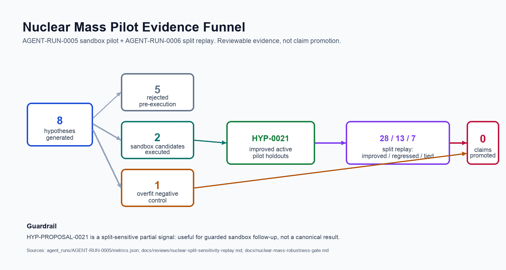

# Nuclear Mass Pilot Evidence Summary

**Task:** `TASK-0174`
**Source run:** `AGENT-RUN-0005`
**Split replay:** `AGENT-RUN-0006`
**Campaign:** Nuclear Mass Surface
**Boundary:** sandbox-only evidence

This summary packages the first autonomous nuclear-mass residual pilot as a
repository-facing evidence card. It is meant to make the workflow legible for
contributors and reviewers, not to promote a scientific claim.

## Headline

APL agents generated a bounded batch of nuclear-mass residual hypotheses,
rejected most proposals before execution, ran a small sandbox comparison, and
kept both the promising candidate and the overfit negative control in public
scientific memory.

No claim, canonical result, accepted knowledge note, or dataset was promoted.

## Funnel Metrics

| Stage | Count | Evidence boundary |
| --- | ---: | --- |
| Hypotheses generated | 8 | Proposal batch only |
| Rejected pre-execution | 5 | Reasons preserved |
| Positive or comparator sandbox candidates executed | 2 | Sandbox-only |
| Overfit negative controls executed | 1 | Negative evidence |
| Candidates improving all active pilot holdouts | 1 | Internal holdouts only |
| Claims promoted | 0 | Promotion blocked |

The executed sandbox set had three total executions: two residual-correction
candidates plus one explicit overfit negative control.

## Executed Candidate Reading

| Candidate | Role | Pilot verdict | Holdout reading |
| --- | --- | --- | --- |
| `HYP-PROPOSAL-0020` | compact shell-aware comparator | `PARTIALLY_VALID` | improved three active slices, regressed the random split |
| `HYP-PROPOSAL-0021` | shell-aware plus odd-A damping | `VALID_IN_RANGE` in pilot only | improved all four active pilot holdouts |
| `HYP-PROPOSAL-0022` | quadratic asymmetry negative control | `OVERFITTED` | improved oxygen-chain only, regressed heavy magic and neutron-rich slices |

The strongest pilot signal is `HYP-PROPOSAL-0021`, but its current status is
sandbox-only partial evidence after replay.

## Primary Holdout Highlights

For `HYP-PROPOSAL-0021`, negative deltas improve over the frozen
`RESULT-0015` baseline:

| Holdout | Delta MAE (MeV) | Delta RMSE (MeV) |
| --- | ---: | ---: |
| `random_stratified` | `-0.255` | `0.098` |
| `oxygen_chain` | `-0.681` | `-0.684` |
| `magic_heavy_region` | `-0.242` | `-0.341` |
| `neutron_rich_edge` | `-0.162` | `-0.222` |

This made `HYP-PROPOSAL-0021` the only executed candidate that improved every
active pilot holdout slice.

## Split Replay

`AGENT-RUN-0006` replayed the same candidate under alternative same-shape
splits.

Across 48 light/medium/heavy holdout configurations:

- improved MAE on `28/48`;
- regressed MAE on `13/48`;
- tied MAE on `7/48`;
- median `delta_mae_mev`: `-0.135`;
- worst `delta_mae_mev`: `0.948`;
- pilot split rank: `18/48` by MAE delta.

The honest reading is split-sensitive partial signal. It is interesting enough
for guarded follow-up, but not stable enough for claim promotion.

## Rejected Before Execution

| Proposal | Reason |
| --- | --- |
| `HYP-PROPOSAL-0023` | chain-specific oxygen latch risk |
| `HYP-PROPOSAL-0024` | direct heavy-row memorization risk |
| `HYP-PROPOSAL-0025` | complexity and discontinuity budget too high |
| `HYP-PROPOSAL-0026` | advanced-model comparison deferred |
| `HYP-PROPOSAL-0027` | live time-split fetch blocked by pinned-source policy |

These rejections are part of the result. The agent loop is useful only if weak,
duplicative, or policy-risky hypotheses are filtered before sandbox execution.

## What This Supports

This evidence card supports the narrower claim that the APL workflow can:

- generate a bounded hypothesis batch;
- reject weak candidates before execution;
- run sandbox comparisons against a frozen baseline;
- preserve overfit negative controls;
- replay promising candidates under split-sensitivity pressure;
- keep claim promotion at zero without maintainer review.

## What This Does Not Support

This evidence card does not support:

- "APL found a nuclear mass formula";
- "AI discovered a shell correction";
- "HYP-PROPOSAL-0021 is a canonical result";
- "post-AME2020 behavior has been tested";
- "retrospective time-split evidence is strict blind prediction."

## Source Artifacts

- `agent_runs/AGENT-RUN-0005/metrics.json`
- `agent_runs/AGENT-RUN-0005/report.md`
- `docs/reviews/autonomous-nuclear-mass-pilot-01.md`
- `agent_runs/AGENT-RUN-0006/metrics.json`
- `docs/reviews/nuclear-split-sensitivity-replay.md`
- `docs/nuclear-mass-robustness-gate.md`
