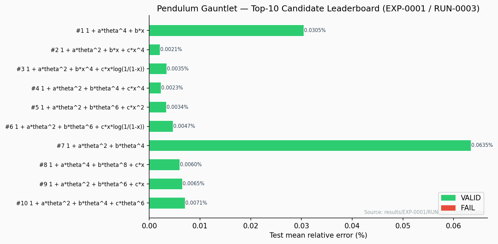
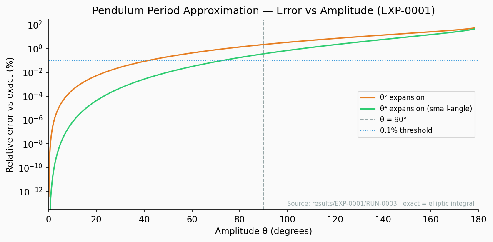
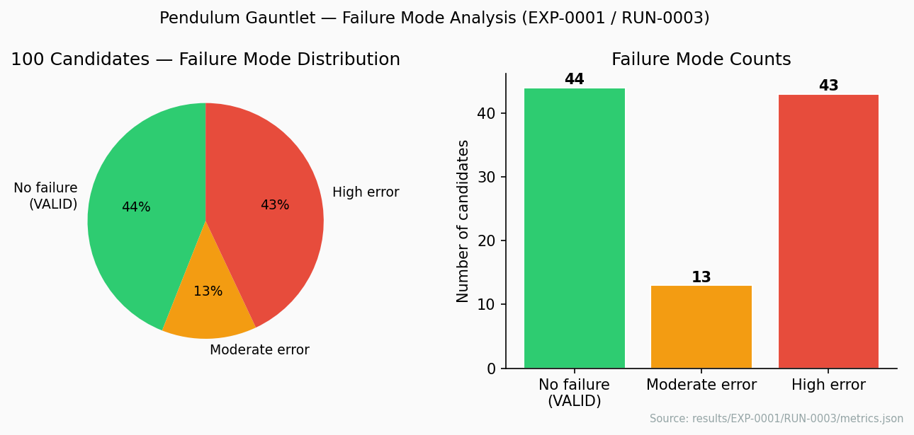
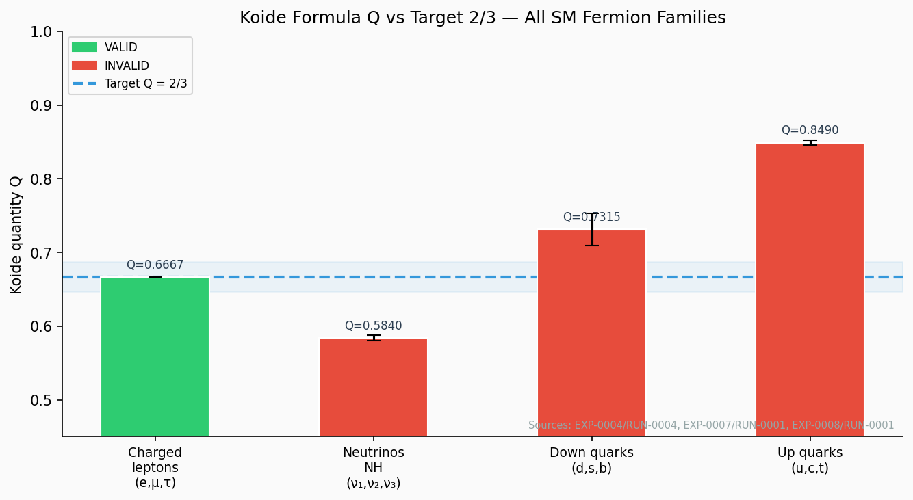
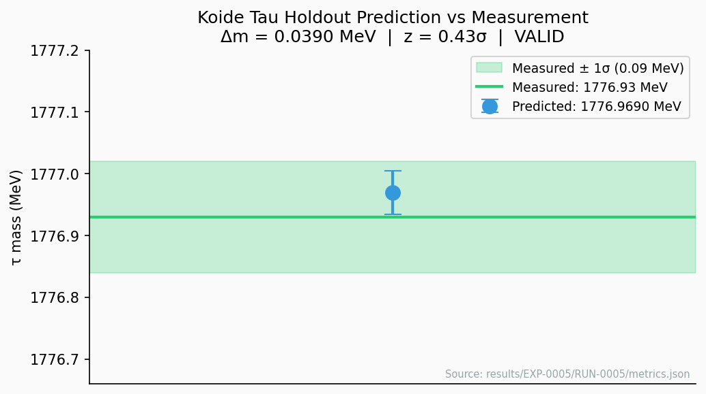
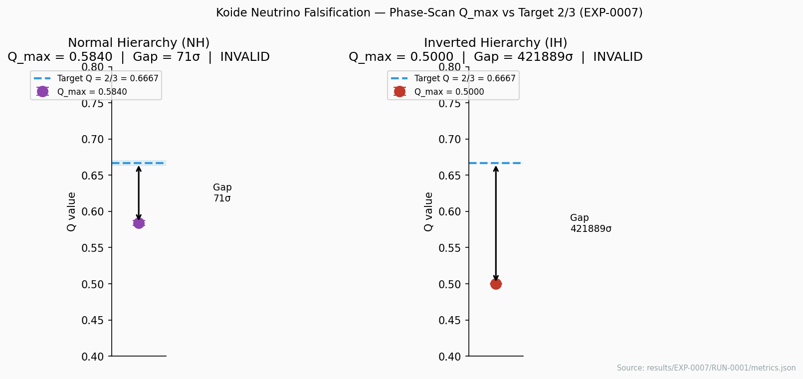
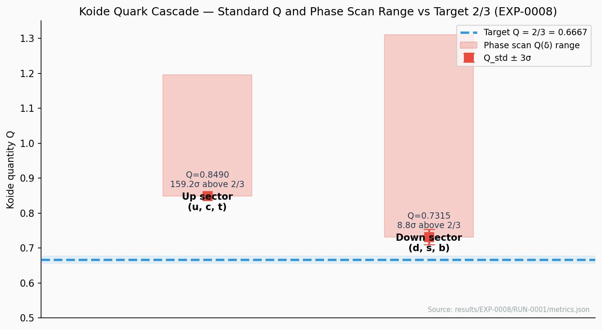
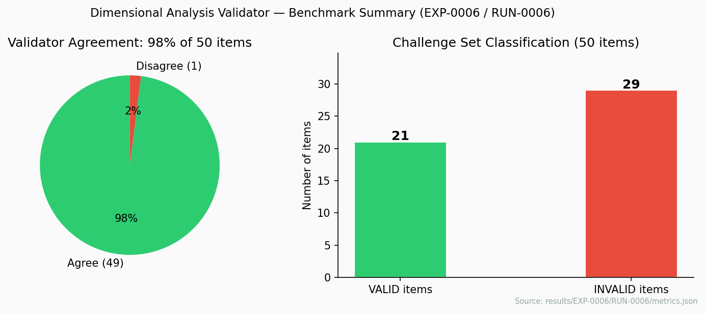

# APL v0.2 Visual Result Summary

Static figures generated from canonical result artifacts by
`scripts/generate_result_figures.py`. All captions are conservative and
non-explanatory. No figures license claim promotion.

Use this page as a visual index, not as standalone evidence. Each figure points
back to a canonical result artifact or review note. If a caption sounds
interesting, follow the source link before repeating the result publicly.

## How To Read These Figures

| Visual type | What it can show | What it cannot show |
| --- | --- | --- |
| Error curves and leaderboards | Whether a benchmarked approximation or candidate works inside a stated range. | A universal law or explanation outside the benchmark. |
| Falsification plots | Where a tempting relation fails under the committed data and assumptions. | A general impossibility result for every possible variant. |
| Source or campaign notes | What evidence exists and what remains blocked. | A claim that the campaign has produced a validated result. |

For the current research frontier, Nuclear, Quantum, Atomic-Clock, and
Exoplanet surfaces are better read through their campaign pages and review
artifacts than through a single static figure.

---

## Pendulum Formula Falsification

### Gauntlet Leaderboard — Top 10 Candidates



Top-10 formulas from the 100-candidate pendulum gauntlet (EXP-0001 / RUN-0003),
ranked by composite score. 44 of 100 candidates earned VALID verdicts in range.
Source: `results/EXP-0001/RUN-0003/metrics.json`

### Period Approximation — Error vs Amplitude



Relative error of standard small-angle expansions (θ² and θ⁴ terms) versus the
exact elliptic-integral period, plotted across the full amplitude range. Shows
where approximations break down.
Source: exact elliptic integral (scipy) + EXP-0001 evaluation range.

### Failure Mode Distribution



Distribution of failure modes across all 100 gauntlet candidates: 44 no-failure
(VALID), 13 moderate error, 43 high error.
Source: `results/EXP-0001/RUN-0003/metrics.json`

---

## Particle Mass Relations — Koide Track

### Q Values Across All SM Fermion Families



Koide quantity Q compared to target 2/3 for all four SM fermion family triplets.
Charged leptons: VALID (Q ≈ 0.6667). Neutrinos, up quarks, down quarks: INVALID.
Sources: `results/EXP-0004/RUN-0004`, `results/EXP-0007/RUN-0001`,
`results/EXP-0008/RUN-0001`

### Tau Holdout Prediction



Koide-formula prediction of the tau mass from electron and muon masses only,
compared against the PDG 2024 measured value. Δm = 0.039 MeV, z = 0.43σ, VALID.
Source: `results/EXP-0005/RUN-0005/metrics.json`

### Neutrino Falsification



Phase-scan Q_max for neutrino mass triplets under Normal Hierarchy (NH) and
Inverted Hierarchy (IH), compared to target 2/3. Both hierarchies fall short
by 70.7σ (NH) and 421,889σ (IH). Verdict: INVALID.
Source: `results/EXP-0007/RUN-0001/metrics.json`

### Quark Cascade Gap



Standard Koide Q and phase-scan range for up-type (u,c,t) and down-type (d,s,b)
quark triplets. Both sectors exceed 2/3: up quarks by 159.2σ, down quarks by
8.8σ. Phase scan cannot reach 2/3 (Q_min = Q_std analytically). Verdict: INVALID.
Source: `results/EXP-0008/RUN-0001/metrics.json`

---

## Dimensional Analysis Validator

### Benchmark Summary



50-item dimensional analysis challenge set: validator agrees with expected
classification on 49/50 items (98%). 21 VALID formulas, 29 INVALID formulas
in the challenge set.
Source: `results/EXP-0006/RUN-0006/metrics.json`

---


## Nuclear Mass Surface

### Baseline And Sandbox Evidence

No static nuclear-mass figure is generated by `scripts/generate_result_figures.py`
yet. That is intentional for now: the Nuclear campaign is more about source
discipline, prospective registry handling, and stress-review boundaries than a
single public chart. The current public-facing summary should cite
[`nuclear-mass-baseline-summary.md`](./nuclear-mass-baseline-summary.md),
[`nuclear-mass-pilot-summary.md`](./nuclear-mass-pilot-summary.md), and
[`nuclear-mass-robustness-gate.md`](../nuclear-mass-robustness-gate.md) instead.

`EXP-0012` is a frozen baseline residual benchmark. `AGENT-RUN-0005` is
sandbox-only pilot evidence. `AGENT-RUN-0007` is an `INCONCLUSIVE`
source-manifest-only guard, not an active time-split benchmark result. The
row-level post-AME2020 sequence is `TASK-0196` holdout data before `TASK-0197`
retrospective time-split scoring, and it does not promote claims automatically.
The `PRED-0001` through `PRED-0068` registry entries are prospective forecasts
for future reveal comparison, not current result figures or success metrics.
The post-`PRED-0062` registry state and later shell-axis mini-wave are
summarized in
[`nuclear-prediction-registry-status-after-pred-0062.md`](../reviews/nuclear-prediction-registry-status-after-pred-0062.md)
and
[`nuclear-shell-axis-prospective-mini-wave-review.md`](../reviews/nuclear-shell-axis-prospective-mini-wave-review.md).
The compact internal scout evidence card is
[`nuclear-scout-evidence-card.md`](./nuclear-scout-evidence-card.md); it
separates baseline, sandbox scout, negative, and prospective registry layers
without validated-result framing.

---

## Reproduction

```bash
python3 scripts/generate_result_figures.py
```

Requires: `matplotlib`, `scipy`, `numpy` (plus `physics_lab` package).
All inputs are canonical result artifacts in `results/`. Figures are
written to `docs/figures/`.

## Limitations

- Figures show central values and uncertainty bands from canonical result YAML/JSON;
  they do not add new analysis.
- Pendulum error curve uses the standard small-angle expansion terms, not the
  gauntlet's best-fit formula coefficients (which are not stored analytically).
- No interactive or dashboard plots.
- Captions must not be used as standalone evidence without citing the full result
  artifact.
