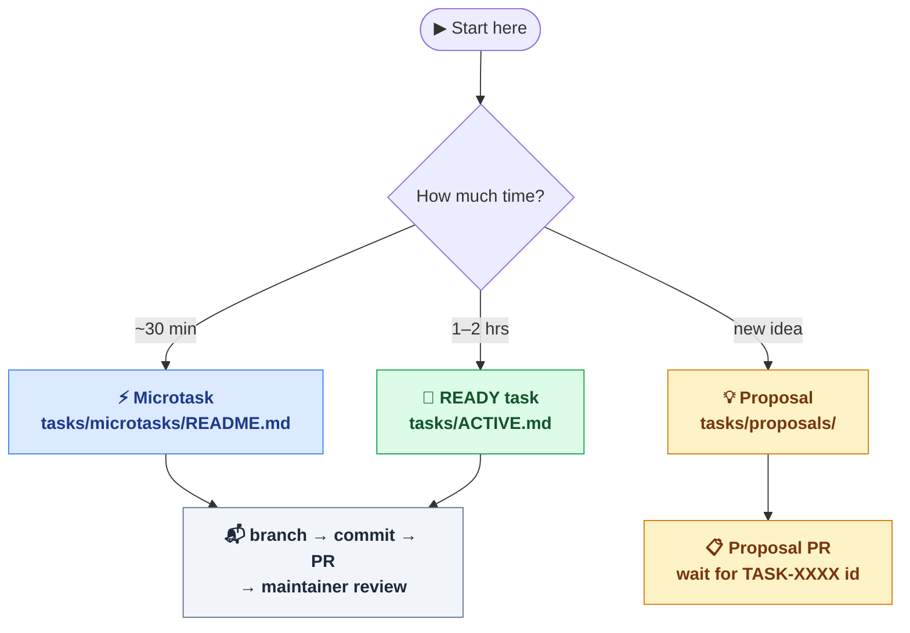
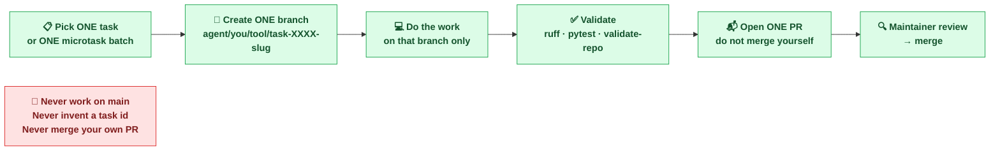
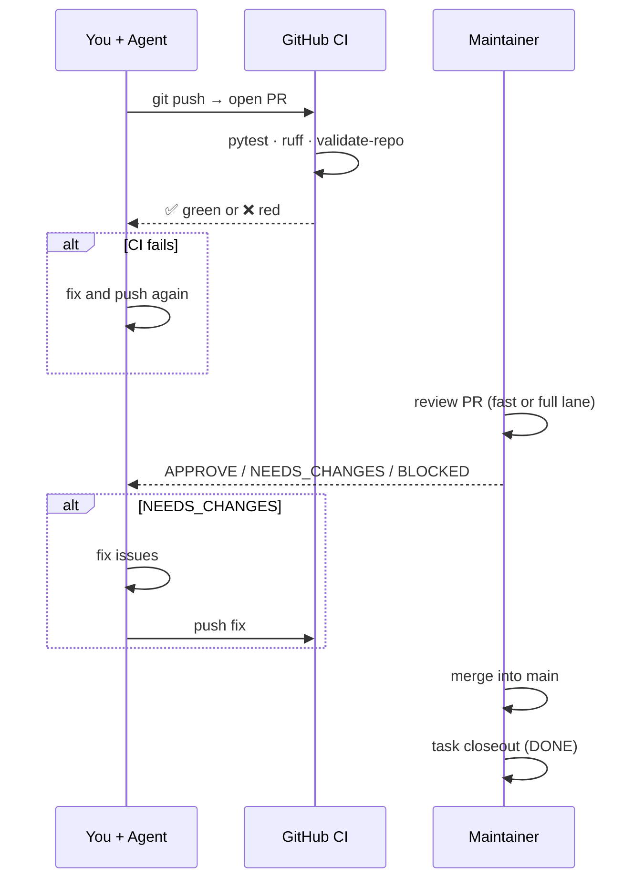

# Use Your Agent

## Purpose

This guide is the contributor-facing entrypoint for people who want to explore
APL with Codex, Claude Code, or another coding agent.

The goal is not to let an agent improvise physics claims. The goal is to let
an agent help with reproducible, reviewable work inside the repository's
protocol.

## Quickstart: How To Choose Your Contribution Path

Use this diagram to find the right starting point for your session budget:



**Rule of thumb:**
- Microtask — one item from a campaign queue, under 30 minutes, narrow scope.
- READY task — one atomic task from `tasks/ACTIVE.md`, 1-2 hours, broader scope.
- Proposal — new idea without a canonical `TASK-XXXX` id yet; use `tasks/proposals/`.

## One-Task One-Branch Discipline

Every contribution must follow this flow — no exceptions:



**Branch format:** `agent/<contributor-id>/<agent-id>/task-<number>-<short-slug>`

Example: `agent/akutenyov/claude/task-0120-use-your-agent-quickstart-diagrams`

## What the Review Cycle Looks Like

After you push your branch and open a PR, here is what happens:



**Key points:**
- CI runs automatically on every push — check Actions tab on GitHub.
- Maintainer review happens after CI is green.
- You never merge your own PR.
- Task moves to `DONE` only after maintainer closeout.

## Before You Start

Read these first:

1. [README.md](../README.md)
2. [docs/mission-control.md](./mission-control.md)
3. [tasks/ACTIVE.md](../tasks/ACTIVE.md)
4. [docs/agent-task-protocol.md](./agent-task-protocol.md)
5. [docs/agent-catalog.md](./agent-catalog.md)

If you want a shorter session with safe work, also open:

- [docs/agent-work-menu.md](./agent-work-menu.md)
- [tasks/microtasks/README.md](../tasks/microtasks/README.md)

## What Your Agent Can Help With

Good starting work:

- documentation and onboarding improvements;
- packaging current result surfaces more clearly;
- one small scientific microtask batch from a single campaign;
- validation, wording, and contributor-workflow tasks.

Avoid starting with:

- broad engine rewrites;
- public-launch claims;
- unscoped formula speculation;
- multiple unrelated tasks in one branch.

## Two Safe Ways To Contribute

### 1. Pick One READY Task

Open [tasks/ACTIVE.md](../tasks/ACTIVE.md) and choose one task with:

- `status: READY`
- atomic scope
- no obvious overlap with another open PR

Then follow the branch-first workflow from
[docs/agent-task-protocol.md](./agent-task-protocol.md).

### 2. Use Spare Budget on Microtasks

If you have a shorter session, use:

- [tasks/microtasks/README.md](../tasks/microtasks/README.md)
- [docs/agent-scientific-work-mode.md](./agent-scientific-work-mode.md)

Stick to one campaign queue at a time and keep the output narrow.

## Minimum Rules Your Agent Must Follow

- do not work directly on `main`
- do not invent a new task id
- do not promote a claim without maintainer review
- do not rewrite canonical `results/` artifacts casually
- do not say "AI resolved physics"
- do not use "proof" or discovery-framing language for benchmark results
- do not hide limitations

## Practical Prompt Pattern

If you are using a coding agent, a good starting prompt is:

```text
Read AGENTS.md, docs/agent-task-protocol.md, tasks/ACTIVE.md, and the canonical task file for TASK-XXXX. Work on a task branch, keep wording verification-first, run the required validation commands, and prepare a PR-ready change without promoting claims.
```

If you are using microtasks, replace the `TASK-XXXX` part with the queue file
and microtask ids you want the agent to complete.

## What a Good Agent Output Looks Like

A good contribution should leave behind:

- a clear branch tied to one task;
- changed files that match the task scope;
- explicit validation results;
- limitation wording where needed;
- a reviewable PR body using the repository template.

## Where To Ask the Agent To Start

Best first destinations:

- [docs/mission-control.md](./mission-control.md)
- [docs/results/visual-summary.md](./results/visual-summary.md)
- [docs/results/koide-campaign-summary.md](./results/koide-campaign-summary.md)
- [docs/negative-results-registry.md](./negative-results-registry.md)
- [tasks/ACTIVE.md](../tasks/ACTIVE.md)

These give the agent a better current snapshot than asking it to infer project
state from old commits.

## Final Reminder

Agents are useful here because they can help execute the workflow, not because
they replace deterministic validation or maintainer judgment.

Use the agent to create momentum. Keep the repository, the artifacts, and the
claims as the source of truth.
