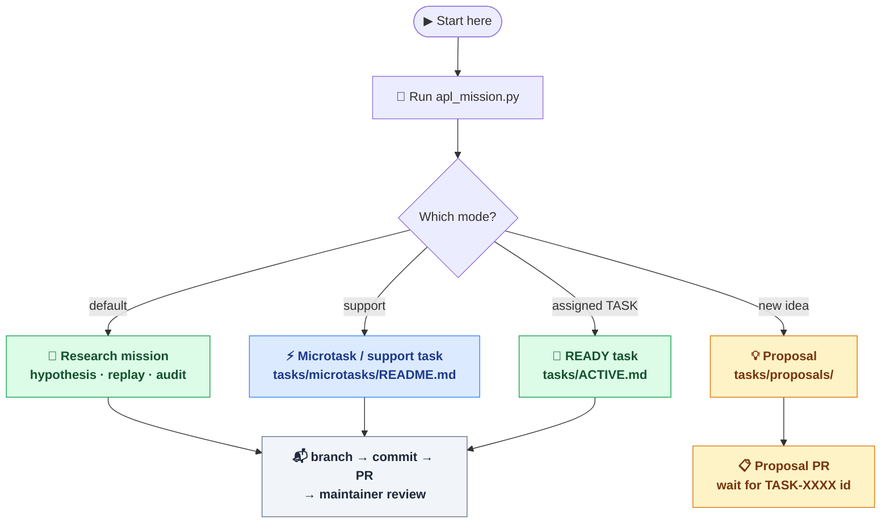
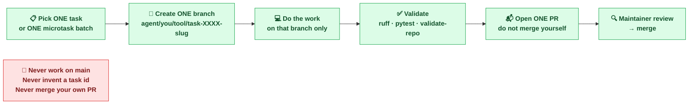
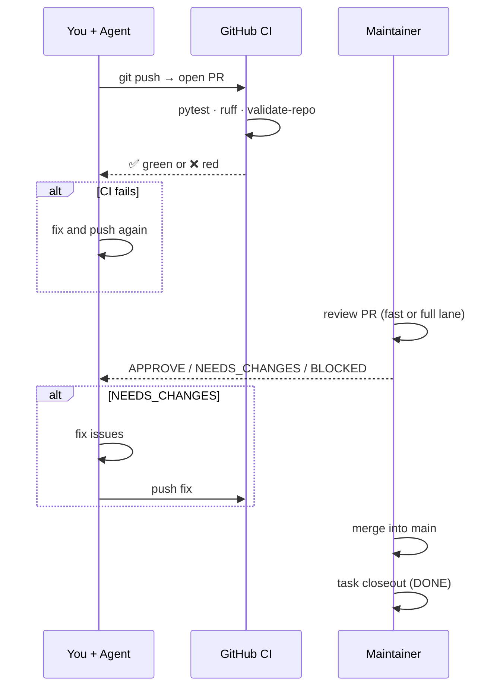

# Use Your Agent

## Purpose

This guide is the contributor-facing entrypoint for people who want to explore
APL with Codex, Claude Code, or another coding agent.

The goal is not to let an agent improvise physics claims. The goal is to let
an agent help with reproducible, reviewable work inside the repository's
protocol.

## Quickstart: Start In Research Mode

Run the mission entrypoint first:

```bash
python3 scripts/apl_mission.py
```

This starts **Research Mode** by default. It recommends the highest-value
scientific mission and gives guardrails for reviewable sandbox work.

For a coding agent, use:

```bash
python3 scripts/apl_mission.py --json
python3 scripts/apl_mission.py --agent-prompt
```

Use support mode only when you intentionally want docs, tests, packaging,
microtasks, or other non-research work:

```bash
python3 scripts/apl_mission.py --mode support
```

Use maintainer mode for review and closeout assistance:

```bash
python3 scripts/apl_mission.py --mode maintainer
```

The default contribution path is now mission-first:



**Rule of thumb:**
- Research mission — default path for capable coding agents; test, replay, or
  audit hypotheses and produce PR-ready artifacts.
- Microtask — support path for one queue item, under 30 minutes, narrow scope.
- READY task — assigned task from `tasks/ACTIVE.md`, 1-2 hours, broader scope.
- Proposal — new idea without a canonical `TASK-XXXX` id yet; use `tasks/proposals/`.

## One-Task One-Branch Discipline

Every contribution must follow this flow — no exceptions:



**Branch format:** `agent/<contributor-id>/<agent-id>/task-<number>-<short-slug>`

Example: `agent/akutenyov/claude/task-0120-use-your-agent-quickstart-diagrams`

## What the Review Cycle Looks Like

After you push your branch and open a PR, here is what happens:



**Key points:**
- CI runs automatically on every push — check Actions tab on GitHub.
- Maintainer review happens after CI is green.
- You never merge your own PR.
- Task moves to `DONE` only after maintainer closeout.

## Before You Start

Read these first:

1. [README.md](../README.md)
2. Run `python3 scripts/apl_mission.py --json`
3. [docs/current-missions.md](./current-missions.md)
4. [docs/mission-control.md](./mission-control.md)
5. [tasks/ACTIVE.md](../tasks/ACTIVE.md)
6. [docs/agent-task-protocol.md](./agent-task-protocol.md)
7. [docs/agent-catalog.md](./agent-catalog.md)

If you want a shorter session with safe work, also open:

- [docs/agent-work-menu.md](./agent-work-menu.md)
- [tasks/microtasks/README.md](../tasks/microtasks/README.md)

## What Your Agent Can Help With

Good starting work:

- research replay, split-sensitivity checks, and adversarial audits;
- bounded sandbox hypothesis tests under an approved campaign;
- negative result preservation and PR-ready result drafts;
- documentation and onboarding improvements when support mode is selected;
- validation, wording, and contributor-workflow tasks.

Avoid starting with:

- broad engine rewrites;
- public-launch claims;
- unscoped formula speculation;
- multiple unrelated tasks in one branch.

## Safe Ways To Contribute

### 1. Start From A Research Mission

Run:

```bash
python3 scripts/apl_mission.py
```

Follow the recommended mission unless the maintainer assigned something more
specific. Keep work sandbox-only and reviewable.

### 2. Pick One READY Task

Open [tasks/ACTIVE.md](../tasks/ACTIVE.md) and choose one task with:

- `status: READY`
- atomic scope
- no obvious overlap with another open PR

Then follow the branch-first workflow from
[docs/agent-task-protocol.md](./agent-task-protocol.md).

### 3. Use Support Mode For Microtasks

If you have a shorter support session, use:

- `python3 scripts/apl_mission.py --mode support`
- [tasks/microtasks/README.md](../tasks/microtasks/README.md)
- [docs/agent-scientific-work-mode.md](./agent-scientific-work-mode.md)

Stick to one campaign queue at a time and keep the output narrow.

## Before Reviewing Core Results

If your first goal is to verify the current major benchmark surface rather
than start new task work, run the bounded replay script:

```bash
python3 scripts/reproduce_core_results.py
```

It regenerates the selected public-facing core results into `/tmp`, writes a
summary file, and leaves canonical `results/` artifacts untouched. See
[docs/reproducibility-capsules.md](./reproducibility-capsules.md) for expected
metrics, caveats, and the intentionally skipped Muon g-2 stress-test lane.

## Minimum Rules Your Agent Must Follow

- do not work directly on `main`
- do not invent a new task id
- do not promote a claim without maintainer review
- do not rewrite canonical `results/` artifacts casually
- do not say "AI resolved physics"
- do not use "proof" or discovery-framing language for benchmark results
- do not hide limitations

## Practical Prompt Pattern

If you are using a coding agent, a good starting prompt is:

```text
You are working in Autonomous Physics Lab.

Start in Agent First Research Mode. Read AGENTS.md and docs/agent-task-protocol.md,
then run `python3 scripts/apl_mission.py --json`. Choose the recommended
research mission unless the maintainer gave a stricter task. Use the
recommended `task_id` to create a canonical task branch before editing files.
Execute the full loop autonomously: inspect
evidence, test or audit the hypothesis, preserve negative results, update
sandbox/review artifacts, run validation, generate a review bundle, and prepare
a PR. Keep outputs sandbox-only unless a canonical task explicitly allows
promotion. Do not promote claims, rewrite canonical results, or use
breakthrough-style wording.
```

If you are using support mode, run `python3 scripts/apl_mission.py --mode support`
and give the agent the selected task or queue item.

## What a Good Agent Output Looks Like

A good contribution should leave behind:

- a clear branch tied to one task;
- changed files that match the task scope;
- explicit validation results;
- limitation wording where needed;
- a reviewable PR body using the repository template.

## Where To Ask the Agent To Start

Best first destinations:

- `python3 scripts/apl_mission.py`
- [docs/current-missions.md](./current-missions.md)
- [docs/mission-control.md](./mission-control.md)
- [docs/results/visual-summary.md](./results/visual-summary.md)
- [docs/results/koide-campaign-summary.md](./results/koide-campaign-summary.md)
- [docs/negative-results-registry.md](./negative-results-registry.md)
- [tasks/ACTIVE.md](../tasks/ACTIVE.md)

These give the agent a better current snapshot than asking it to infer project
state from old commits.

## Final Reminder

Agents are useful here because they can help execute the workflow, not because
they replace deterministic validation or maintainer judgment.

Use the agent to create momentum. Keep the repository, the artifacts, and the
claims as the source of truth.
